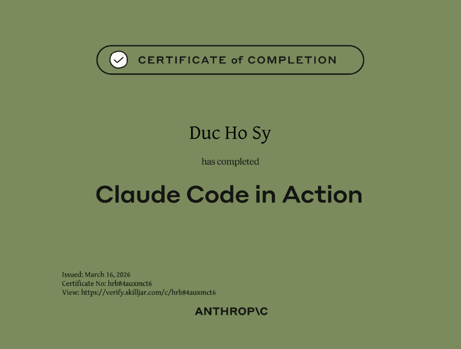

# Claude Code — Học gì để dùng thật tốt trong thời đại AI Agent?

- 🎯 Bài viết này dành cho developer muốn sử dụng Claude Code hiệu quả — không chỉ "gõ prompt rồi nhận code", mà thật sự kiểm soát được AI agent trong quy trình phát triển phần mềm.

## Mục lục

[1. Tại sao lại là AI Agent — và tại sao là bây giờ?](#1)

[2. Claude Code — Nó khác gì và tại sao mình chọn nó?](#2)

[3. Thoát khỏi vòng lặp Vibe Coding](#3)

[4. Danh sách nội dung cần học để dùng Claude Code hiệu quả](#4)

[5. Khóa học miễn phí từ Anthropic](#5)

---

<a name="1"></a>

## 📌 1. Tại sao lại là AI Agent — và tại sao là bây giờ?

- Xu hướng phát triển phần mềm đang dịch chuyển từ **"AI hỗ trợ gợi ý code"** sang **"AI agent tự lập kế hoạch và thực thi"**.
  - Trước đây: autocomplete, gợi ý snippet → developer vẫn phải làm mọi thứ.
  - Bây giờ: AI agent đọc codebase, chạy test, sửa lỗi, tạo PR — developer chuyển sang vai trò **điều phối**.

- 💡 Một vài con số đáng chú ý:
  - Gartner ghi nhận lượng tìm kiếm về multi-agent system tăng **1.445%** chỉ trong 1 năm (Q1/2024 → Q2/2025).
  - ~40% phần mềm doanh nghiệp dự kiến được xây dựng bằng natural language prompts vào 2026.
  - AI agent được nhúng vào 80% ứng dụng enterprise workplace.

- ⚠️ Điều này không có nghĩa developer hết việc. Ngược lại — vai trò thay đổi:
  - Từ "người viết code" → "người điều phối agent viết code".
  - Kỹ năng mới cần học: cách prompt hiệu quả, cách review AI output, cách thiết kế workflow cho agent.
  - Developer nào đầu tư sớm vào structured workflow với AI agent sẽ có lợi thế năng suất vượt trội.

---

<a name="2"></a>

## 📌 2. Claude Code — Nó khác gì và tại sao mình chọn nó?

### Claude Code làm được gì?

- Claude Code là **AI coding agent chạy trên terminal** (CLI-native), không phải extension hay IDE fork.
- Nó không chỉ gợi ý code — nó **tự thực thi**:
  - Đọc và phân tích codebase.
  - Tạo, sửa, xóa file.
  - Chạy command, test, build.
  - Spawn nhiều sub-agent song song (lên đến 10 agent cùng lúc).
  - Tương tác với các công cụ bên ngoài qua MCP (Model Context Protocol).

### So sánh nhanh với các công cụ phổ biến (đầu 2026)

| Tiêu chí           | Claude Code                                          | Cursor                           | GitHub Copilot                  | Windsurf             |
| ------------------ | ---------------------------------------------------- | -------------------------------- | ------------------------------- | -------------------- |
| **Giao diện**      | Terminal (CLI)                                       | IDE (VS Code fork)               | VS Code extension               | IDE (VS Code fork)   |
| **Agent tự chủ**   | ✅ Mạnh — tự chạy command, sửa file, spawn sub-agent | Có agent mode, chủ yếu trong IDE | Agent mode đang phát triển      | "Cascade" flow-based |
| **MCP**            | ✅ First-class, 200+ server                          | Hỗ trợ                           | Hạn chế                         | Hỗ trợ               |
| **Project memory** | CLAUDE.md — đọc mỗi phiên                            | .cursorrules                     | .github/copilot-instructions.md | Cascade memory       |
| **Context window** | 200K (hỗ trợ đến 1M)                                 | Tùy model                        | Tùy model                       | Tùy model            |
| **Giá**            | ~$17-100+/tháng (API-based)                          | ~$16/tháng                       | ~$10-39/tháng                   | Có free tier         |

### Tại sao mình chọn Claude Code?

- ⚠️ **Claude Code chỉ là một lựa chọn** — không phải lựa chọn duy nhất. Cursor, Copilot, Windsurf đều là công cụ tốt trong context riêng của chúng.

- Nhưng với cá nhân mình, sau khi dùng qua Copilot và tìm hiểu các công cụ khác, Claude Code hiện tại **ổn nhất** vì:
  - **Agentic thật sự**: không chỉ gợi ý — nó tự chạy, tự sửa, tự test. Mình giao task, nó làm.
  - **CLI-native**: không cần mở IDE nặng. Phù hợp với workflow terminal-first.
  - **CLAUDE.md**: cơ chế "project memory" đơn giản nhưng mạnh — agent hiểu context dự án ngay từ đầu mỗi session.
  - **MCP ecosystem**: kết nối được với Slack, Jira, Google Drive, database... mở rộng khả năng agent vượt xa việc "chỉ viết code".
  - **Hướng đến AI Agent**: Claude Code được thiết kế từ đầu cho workflow agentic, không phải "thêm agent mode sau" như một số tool khác.

- 💡 Nếu bạn là người thích làm việc trong IDE với UI trực quan → Cursor có thể phù hợp hơn. Không có công cụ nào "tốt nhất cho tất cả" — chỉ có công cụ phù hợp nhất với workflow của bạn.

---

<a name="3"></a>

## 📌 3. Thoát khỏi vòng lặp Vibe Coding

### Vibe Coding là gì — và tại sao nó là bẫy?

- Vòng lặp "Vibe Coding" là cách dùng AI mà nhiều người mắc phải khi mới bắt đầu:

  ```
  Prompt AI → Nhận code → Chạy thử → Gặp lỗi → Prompt lại → Lặp lại...
  ```

- ❌ Vấn đề: vòng lặp này **tốn token, tốn thời gian, và code chất lượng kém**. AI không hiểu rõ bạn muốn gì, bạn cũng không kiểm soát được AI đang làm gì.

- 💡 Developer giỏi không phải người prompt hay nhất — mà là người **thiết kế workflow** để AI không cần đoán.

### Ba trụ cột để thoát vòng lặp Vibe Coding

- ```
  ┌─────────────────────────────────────────────────┐
  │           Workflow AI Coding hiệu quả           │
  ├─────────────────┬───────────────┬───────────────┤
  │ 1️⃣ Đồng thuận   │ 2️⃣ Quy trình │  3️⃣ Bộ nhớ    │
  │  trước khi code │  chất lượng   │  dài hạn      │
  │                 │  cao          │               │
  │  OpenSpec       │  Superpowers  │  Beads        │
  │  CLAUDE.md      │  TDD / YAGNI  │  CLAUDE.md    │
  │  Plan Mode      │  Agent Skills │  Git-native   │
  └─────────────────┴───────────────┴───────────────┘
  ```

**1️⃣ Đồng thuận trước khi code — "Spec first, code second"**

- Thay vì prompt thẳng → dùng **OpenSpec** để tạo spec trước.
  - Phase 1 — Propose: bạn mô tả yêu cầu, AI tạo proposal + checklist.
  - Phase 2 — Apply: AI implement theo checklist đã thống nhất.
  - Phase 3 — Archive: lưu lại kết quả để tham khảo.
- Kết hợp với **Plan Mode** của Claude Code — yêu cầu agent lập kế hoạch trước, bạn review xong mới cho thực thi.
- ✅ Kết quả: AI hiểu rõ bạn muốn gì, code đúng hướng ngay từ lần đầu.

**2️⃣ Áp đặt quy trình chất lượng cao**

- **Superpowers** — framework dạy AI agent tuân thủ kỷ luật engineering:
  - Phải hiểu requirement trước khi code.
  - Chia nhỏ task, viết test trước (TDD), tuân thủ YAGNI và DRY.
  - Không nhảy thẳng vào code khi chưa có plan.
- Kết hợp với **Agent Skills** (CLAUDE.md) để định nghĩa các quy tắc riêng cho dự án.
- ✅ Kết quả: AI không "tự do sáng tạo" mà làm việc trong khung kỷ luật bạn thiết lập.

**3️⃣ Duy trì bộ nhớ cho dự án dài ngày**

- AI agent có context window hữu hạn. Session mới = bắt đầu lại từ đầu.
- **Beads** (by Steve Yegge) giải quyết vấn đề này:
  - Lưu task graph có dependency vào Git.
  - "Memory decay" thông minh — tóm tắt task cũ để tiết kiệm context.
  - Agent pick up đúng chỗ cần làm tiếp, không cần brief lại.
- Kết hợp với **CLAUDE.md** — file hướng dẫn project được đọc mỗi session.
- ✅ Kết quả: agent duy trì sự liên tục xuyên suốt dự án, không mất context.

---

<a name="4"></a>

## 📌 4. Danh sách nội dung cần học để dùng Claude Code hiệu quả

### Learning map — Từ cơ bản đến nâng cao

- ```
  Level 1: Nền tảng (bắt buộc)
  ├── Claude Code Basics
  ├── CLAUDE.md & Project Memory
  └── Prompt Engineering cho Agent

  Level 2: Workflow (khuyến khích)
  ├── Plan Mode & Spec-driven Development (OpenSpec)
  ├── Agent Skills
  └── Hooks & Custom Automation

  Level 3: Mở rộng (nâng cao)
  ├── MCP — Model Context Protocol
  ├── Multi-agent & Sub-agents
  ├── Beads — Memory cho dự án dài
  └── Superpowers — Kỷ luật engineering cho agent

  Level 4: Xây dựng (cho người muốn đi xa hơn)
  ├── Claude API & Anthropic SDK
  ├── Xây dựng AI Agent riêng
  └── Claude Agent SDK
  ```

### Chi tiết từng nội dung

- 1️⃣ [Nền tảng — Phải nắm trước khi làm bất cứ gì](https://sy-duc.github.io/vuepress-blog/blog-posts/hidden/claude-code-in-action.html)

- 2️⃣ [Giới thiệu về Agent Skills](https://sy-duc.github.io/vuepress-blog/blog-posts/hidden/agent-skills.html)

- 3️⃣ [Mở rộng Claude Code với MCP Servers](https://sy-duc.github.io/vuepress-blog/blog-posts/hidden/model-context-protocol.html)

- 4️⃣ [OpenSpec — Cách làm việc có kỷ luật](https://sy-duc.github.io/vuepress-blog/blog-posts/hidden/open-spec.html)

- 5️⃣ [Mở rộng — Khi cần nhiều hơn "chỉ viết code"](https://sy-duc.github.io/vuepress-blog/blog-posts/hidden/claude-code-in-action.html)
  - Beads — Memory cho dự án dài
  - Superpowers — Kỷ luật engineering cho agent

---

<a name="5"></a>

## 📌 5. Khóa học miễn phí từ Anthropic

- ✅ Anthropic cung cấp nhiều khóa học miễn phí, có chứng chỉ:
  - **Claude Code in Action** — thực hành Claude Code trong workflow dev.
  - **Building with Claude API** — xây app với Claude API.
  - **Introduction to Model Context Protocol (MCP)** — xây MCP client/server.
  - **Claude 101** — kiến thức cơ bản về Claude.
  - **AI Fluency: Framework & Foundations** — nền tảng về AI.

- ⚠️ Lưu ý: chứng chỉ Anthropic là dạng hoàn thành khóa học + bài đánh giá, không phải kỳ thi có giám sát như AWS SAA.
  - 

- 🔗 Link đăng ký: [Anthropic Skilljar](https://anthropic.skilljar.com/)

---

## Tổng kết

- 💡 **Insight quan trọng nhất**: Claude Code (hay bất kỳ AI coding tool nào) chỉ mạnh khi bạn biết cách **thiết kế workflow** cho nó. Prompt hay không bằng process tốt.

- Hướng phát triển phần mềm đang nghiêng mạnh về AI Agent. Đầu tư thời gian học cách làm việc hiệu quả với chúng không phải là optional — mà đang dần trở thành **core skill** của developer.

- ⚠️ Giới hạn: mình cũng mới dùng Claude Code, các nhận xét trong bài dựa trên trải nghiệm cá nhân + tham khảo, chưa phải kết luận sau thời gian dài kiểm chứng. Nếu bạn có kinh nghiệm khác — rất hoan nghênh góp ý.
