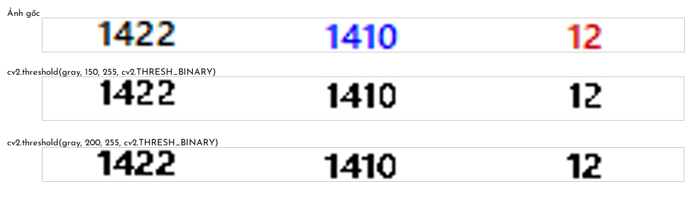
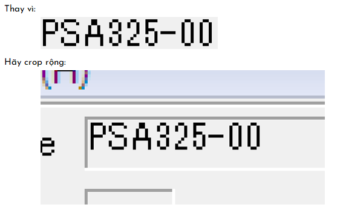
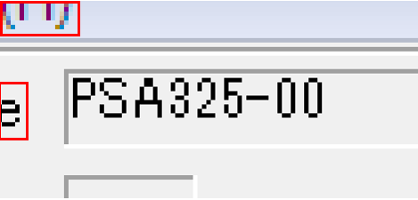
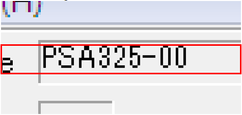
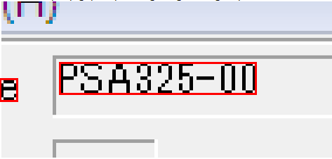
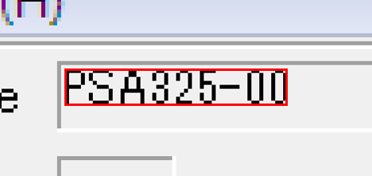
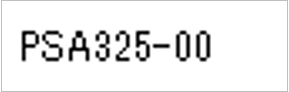

# Độ chính xác & Performance OCR với Tesseract

Tesseract là một OCR engine mạnh mẽ nhưng kết quả phụ thuộc rất nhiều vào chất lượng ảnh đầu vào và cách cấu hình.

Bài viết này tổng hợp các yếu tố quan trọng ảnh hưởng đến accuracy và performance, cùng các kỹ thuật tối ưu thực tế.

[1. Yếu tố ảnh hưởng đến độ chính xác (Accuracy)](#1)

[2. Yếu tố ảnh hưởng đến hiệu năng (Performance)](#2)

[3. Trade-off Accuracy vs Performance](#3)

<a name="1"></a>

## 📌 1. Yếu tố ảnh hưởng đến độ chính xác (Accuracy)

### 1️⃣ Tiền xử lý ảnh (Image Preprocessing)

- ● Đây là bước quan trọng nhất. Mục tiêu là làm rõ ký tự, giảm nhiễu, chuẩn hóa kích thước.

- ● Các kỹ thuật thường dùng:

#### ❶ Chuyển ảnh sang Grayscale

- 🎯 Mục đích: loại bỏ thông tin màu, chỉ giữ cường độ sáng (luminance).

- 👀 Khi nào dùng: hầu hết mọi trường hợp OCR.

- ✅ Ưu điểm:

  - ✦ Giảm kích thước dữ liệu (1 kênh thay vì 3 kênh).

  - ✦ Tăng tốc xử lý các bước tiếp theo.

- 🚀 Cách sử dụng:
  ```python
  gray = cv2.cvtColor(img, cv2.COLOR_BGR2GRAY)
  ```

#### ❷ Nhị phân hóa (Binarization)

- 🎯 Mục đích: biến ảnh grayscale thành 2 giá trị pixel (đen và trắng).

- 👀 Khi nào dùng:

  - ✦ Văn bản có độ tương phản vừa phải.

  - ✦ Muốn loại bỏ nhiễu nền.

  - ✦ Rất quan trọng trong kỹ thuật Template Matching (sẽ đề cập phía sau).

- ✅ Ưu điểm: giúp ký tự trở nên nổi bật.

- ❌ Nhược điểm: nếu ngưỡng sai → chữ sẽ bị mất nét.

- 🚀 Cách sử dụng:

  ```python
  retval, dst = cv2.threshold(src, thresh, maxval, type)
  ```

  - Trong đó:

    - ✧ `src`: Ảnh đầu vào (phải là ảnh sau khi chuyển sang grayscale).
    - ✧ `thresh`: Ngưỡng để so sánh độ sáng của pixel (0 → đen, 255 → trắng).
    - ✧ `maxval`: Giá trị pixel sau khi qua ngưỡng (thường là 255 để thành màu trắng).
    - ✧ `type`: Cách áp dụng ngưỡng (cv2.THRESH_BINARY, cv2.THRESH_BINARY_INV, v.v.). Có thể cộng thêm cv2.THRESH_OTSU để OpenCV tự chọn ngưỡng tối ưu.
    - ✧ `retval`: Nếu dùng Otsu → chính là giá trị ngưỡng tối ưu mà OpenCV tìm được. Nếu không dùng Otsu → nó chính là thresh bạn truyền vào.
    - ✧ `dst`: Ảnh kết quả đã nhị phân hóa.

  - ✦ Ví dụ:

    - 

  - ✦ Otsu Thresholding (tự tìm ngưỡng tối ưu):

    ```python
    _, thresh = cv2.threshold(gray, 0, 255, cv2.THRESH_BINARY + cv2.THRESH_OTSU)
    ```

  - ✦ Adaptive Threshold (tìm ngưỡng cho từng vùng nhỏ, tốt cho ảnh ánh sáng không đều):
    ```python
    thresh = cv2.adaptiveThreshold(
      gray, 255, cv2.ADAPTIVE_THRESH_GAUSSIAN_C,
      cv2.THRESH_BINARY, 11, 2
    )
    ```

#### ❸ Khử nhiễu (Denoising)

- 🎯 Mục đích: loại bỏ các chấm, đường nhiễu không liên quan.

- 🚀 Cách sử dụng:

  - ✧ Median Blur (giữ được biên của ký tự tốt hơn):

    ```python
    denoised = cv2.medianBlur(thresh, 3)
    ```

  - ✧ Morphological Operations:
    ```python
    cv2.morphologyEx(..., cv2.MORPH_OPEN, kernel)  # loại bỏ nhiễu nhỏ
    # hoặc
    cv2.morphologyEx(..., cv2.MORPH_CLOSE, kernel) # nối các nét chữ bị đứt
    ```

#### ❹ Phóng to ảnh (Scaling)

- 🎯 Mục đích: Tesseract xử lý tốt hơn khi ký tự cao khoảng 20–30 px.

- 👀 Khi nào dùng: ký tự quá nhỏ, mờ.

- ✅ Ưu điểm: giúp OCR bắt nét chữ tốt hơn.

- ❌ Nhược điểm: nếu scale ảnh quá to → chậm và có thể tạo nhiễu mới.

- 🚀 Cách sử dụng:
  ```python
  scaled = cv2.resize(img, None, fx=1.5, fy=1.5, interpolation=cv2.INTER_CUBIC)
  ```

#### ❺ Crop vùng OCR

- 🎯 Mục đích: chỉ giữ phần chứa văn bản, bỏ vùng không liên quan.

- 👀 Khi nào dùng: ảnh cố định → biết trước tọa độ vùng cần OCR.

- ✅ Ưu điểm:

  - ✧ Giảm thời gian OCR.

  - ✧ Tăng độ chính xác (ít nhiễu nền hơn).

- ❌ Nhược điểm: nếu ảnh bị thay đổi → khó xác định trước tọa độ vùng OCR (có thể xử lý bằng việc thêm cấu hình trong file config).

- 🚀 Cách sử dụng:
  ```python
  x, y, w, h = roi  # tọa độ vùng OCR
  cropped = img[y:y+h, x:x+w]
  ```

#### ❻ Padding/trim viền trắng cho vùng ảnh OCR

- 🎯 Mục đích: thêm/bớt viền trắng xung quanh vùng cần đọc giá trị.

- 👀 Khi nào dùng:
  - ✧ Vùng cần đọc giá trị hẹp → khó crop, hoặc crop dễ bị nhiễu bởi vùng khác.

  - ✧ Vùng cần đọc giá trị có thể bị xê dịch tọa độ, không cố định.

- ✅ Ưu điểm:

  - ✧ Giúp Tesseract nhận diện tốt hơn khi xung quanh giá trị có các viền trắng đều, vừa đủ (không quá lớn cũng không quá nhỏ).

- 🚀 Cách sử dụng:
  - ➀ Để khắc phục tình trạng vùng giá trị có thể bị xê dịch tọa độ → crop rộng vùng OCR:

    
  
  - ➁ Loại bỏ noise sau khi crop vùng OCR:
    - ✦ Do việc nới rộng vùng OCR dẫn đến vùng này có thể chứa các vùng ký tự khác không mong muốn gây nhiễu (gọi là noise).
      - Các border, hay các ký tự highlight trong ví dụ dưới đây được coi là noise:
        
        

      - → Cần xử lý loại bỏ noise để tăng độ chính xác khi OCR

    - ✦ Phương pháp loại bỏ noise:
      - ✧ Xác định vùng chứa giá trị chính (main content), loại bỏ các vùng còn lại.

      - ✧ Tùy trạng thái hiện tại mà cần chọn chiến lược xác định vùng chứa main content phù hợp, ví dụ như:
        - Phân tích mật độ nội dung: quét từng dòng pixel, vùng nội dung chính có thể là vùng có tỷ lệ pixel có `nội dung / tổng pixel` trên dòng lớn nhất.

        - Phân tích tỷ lệ threshold: thường vùng giá trị chính sẽ có font chữ đậm. Vùng có threshold bé (ký tự mờ) có thể là noise.

        - Nhóm các vùng liên tiếp: tìm các nhóm dòng liên tiếp có nội dung → Loại bỏ nhóm quá nhỏ (< 3-5 dòng).

      - ✧ Với ví dụ trên, chiến lược hợp lý nhất là:
        - **Phase 1 - Vertical filtering (chiều dọc)**
          - Lấy vùng liên tiếp có nội dung trên dòng và gần trung tâm nhất (theo chiều dọc) → Xác định trước Y-range chứa main content.

            

        - **Phase 2 - Horizontal filtering (chiều ngang)**
          - Scan các vùng có nội dung trong Y-range đã filtered tại Phase 1.

          - Nhóm các X-range liên tiếp có nội dung (có tolerance - dung sai tránh khoảng cách nhỏ giữa 2 ký tự):

            

          - Chọn nhóm X-range gần trung tâm nhất (theo chiều ngang) → Xác định X-range chứa main content.

            

      - ✧ Ngoại lệ:
        - Nhiều vùng cách đều tâm: Cần có quy tắc ưu tiên chọn vùng (nhiều chữ hơn/bên trái/phải/trên/dưới, v.v.) tùy theo trường hợp của bạn.

        - Vùng noise nhỏ ở chính giữa: Có 1 chấm đen nhỏ (noise) ngay ở tâm ảnh, và text thật ở xa hơn → Lọc bỏ vùng quá nhỏ trước khi so sánh khoảng cách.

        - Không tìm thấy nội dung: Ảnh toàn trắng hoặc chất lượng quá tệ, không detect được text nào → Trả về toàn bộ ảnh gốc, tránh crash chương trình.
      
  - ➂ Padding/trim các khoảng trắng để đưa giá trị cần OCR vào trung tâm ảnh

    

#### 🏁 Các kỹ thuật khác:

- Bên cạnh các kỹ thuật thường dùng, các kỹ thuật khác có thể kể đến như:

  - ✧ Deskew → chỉnh nghiêng văn bản.

  - ✧ Contrast & Brightness Adjustment → Cân bằng sáng và tăng tương phản.

#### 💡 Kinh nghiệm:

- ✔️ Tùy thuộc chất lượng ảnh ban đầu mà lựa chọn chiến lược tiền xử lý ảnh phù hợp. Không phải cứ áp dụng nhiều kỹ thuật là tốt.

- ✔️ Thường nên kết hợp Grayscale → Binarization → Denoise → Scale trước khi OCR.

- ✔️ Với ảnh có chất lượng tốt và chữ rõ, resize trước threshold thường tốt hơn để giữ nét.

- ✔️ Với ảnh kém chất lượng hoặc khi muốn xử lý nhanh, threshold trước resize cũng rất phổ biến và đơn giản.

- ✔️ Ảnh đầu vào tốt → OCR dễ đọc đúng ngay cả khi không tinh chỉnh nhiều tiền xử lý.

- ✔️ Nên thêm logic lưu ảnh sau khi tiền xử lý để dễ theo dõi trực tiếp chất lượng ảnh sau khi áp dụng hoặc thay đổi các kỹ thuật tiền xử lý ảnh khác nhau.

### 2️⃣ Cấu hình PSM (Page Segmentation Mode)

- PSM quyết định cách Tesseract chia ảnh thành các khối văn bản.

| Page Segmentation Mode |                       Giải thích                        |
| :--------------------: | :-----------------------------------------------------: |
|        --psm 3         | Tự động phân tích bố cục (layout) của văn bản trong ảnh |
|        --psm 6         | Một khối văn bản đơn giản → phù hợp cho đoạn text nhỏ.  |
|        --psm 7         |                    Một dòng văn bản.                    |
|        --psm 8         |                     Một từ duy nhất                     |
|        --psm 10        |                   Một ký tự duy nhất                    |
|        --psm 11        |           Hàng văn bản ngắn theo chiều ngang            |
|        --psm 12        |            Hàng văn bản ngắn theo chiều dọc             |

#### 🚀 Cách sử dụng:

- ❶ Python (pytesseract):

  ```python
  config = "--psm 7 -l vie"
  text = pytesseract.image_to_string(img, config=config)
  ```

- ❷ Tesseract CLI (gọi từ Python):

  ```python
  import subprocess

  subprocess.run([
    r"C:\Program Files\Tesseract-OCR\tesseract.exe",
    "sample.png", "output",
    "--psm", "7",
    "-l", "vie"
  ])
  ```

#### 💡 Kinh nghiệm:

- ✔️ PSM thường dùng kết hợp whitelist để giới hạn ký tự nhận dạng.

- ❌ Sai PSM = OCR loạn layout, Tesseract có thể nhận sai dòng, cắt chữ, hoặc bỏ sót. Ví dụ khi ảnh chỉ có một từ/ký tự nhưng lại để chế độ toàn trang.

### 3️⃣ Whitelist & Blacklist ký tự

- ● Whitelist (danh sách trắng) và Blacklist (danh sách đen) là hai tùy chọn trong Tesseract giúp giới hạn tập ký tự mà engine sẽ nhận dạng.

  - ❶ Whitelist: chỉ nhận dạng những ký tự bạn cho phép.

  - ❷ Blacklist: loại bỏ những ký tự bạn không muốn xuất hiện trong kết quả.

#### 👀 Khi nào nên dùng:

- ➀ OCR số serial / mã hóa học sinh → chỉ cần số.

  ```bash
  -c tessedit_char_whitelist=0123456789
  ```

- ➁ OCR biển số xe → chỉ nhận chữ in hoa và số.

  ```bash
  -c tessedit_char_whitelist=ABCDEFGHIJKLMNOPQRSTUVWXYZ0123456789
  ```

- ➂ OCR văn bản tiếng Anh → loại bỏ ký tự đặc biệt, chỉ nhận a–z, A–Z.

#### ✅ Ưu điểm:

- ✧ Giảm lỗi nhận dạng khi ảnh có nhiều ký tự nhiễu.

- ✧ Tăng tốc vì Tesseract bỏ qua các ký tự không cần thiết.

#### 🚀 Cách sử dụng:

- ❶ Python (pytesseract):

  ```python
  config = "--psm 7 -c tessedit_char_whitelist=0123456789"
  text = pytesseract.image_to_string(img, config=config)
  ```

- ❷ Python (pytesseract):

  ```python
  import subprocess

  subprocess.run([
    r"C:\Program Files\Tesseract-OCR\tesseract.exe",
    "sample.png", "output",
    "-c", "tessedit_char_whitelist=0123456789",
    "--psm", "7"
  ])
  ```

#### 💡 Kinh nghiệm:

- ✦ Whitelist & Blacklist không sửa kết quả sai — nó chỉ loại bỏ hoặc giới hạn tập ký tự để giảm xác suất sai.

- ✦ Nếu ảnh bị mờ hoặc ký tự khó phân biệt, Tesseract vẫn có thể nhận sai trong phạm vi whitelist.

- ✦ Nên kết hợp với PSM phù hợp và tiền xử lý ảnh để đạt kết quả tốt nhất.

- ✦ Whitelist quá chặt = giảm độ linh hoạt của OCR:

  - ✧ Không ép quá chặt whitelist nếu ảnh chất lượng thấp

  - ✧ Khi ảnh chất lượng thấp (nhiễu, mờ, méo, bóng tối không đều), các ký tự có thể biến dạng rất nhiều hoặc bị nhiễu.

  - ✧ Tesseract dựa vào xác suất nhận dạng từng ký tự (confidence), nếu ký tự có dạng hơi giống ký tự khác (ví dụ số "1" trông như chữ "l" hoặc số "7" mờ giống số "1"), Tesseract sẽ phải chọn ký tự trong whitelist hoặc bỏ qua (trả về None).

  - 👉 Kết quả sẽ là không đọc được ký tự nào thay vì đọc nhầm ký tự khác.

### 4️⃣ Chiến lược fallback

- ● Khi ảnh đầu vào có nhiều biến thể về chất lượng, kích thước, font, hoặc bố cục, một cấu hình duy nhất (PSM, scale, threshold) thường không cho kết quả tối ưu trong mọi trường hợp.

- ● Chiến lược fallback là cách:

  - ➀ Thử OCR với nhiều cấu hình khác nhau (ví dụ: PSM = 6, 7, 8; scale ×1.5, ×2; threshold Otsu, Adaptive).

  - ➁ Lấy kết quả từ TSV output để xem confidence (độ tin cậy) của từng ký tự / dòng.

  - ➂ Chọn kết quả có độ tin cậy (confidence) trung bình cao nhất làm kết quả cuối cùng.

#### ✅ Ưu điểm:

- ✦ Tăng xác suất có được kết quả chính xác, đặc biệt cho ảnh xấu.

- ✦ Không bị phụ thuộc hoàn toàn vào một cấu hình duy nhất.

- ✦ Có thể mở rộng thử nhiều kỹ thuật tiền xử lý khác nhau.

#### ❌ Nhược điểm:

- ✦ Số cấu hình thử càng nhiều → độ chính xác cao hơn nhưng thời gian xử lý lâu hơn.

### 5️⃣ Training Tesseract với dữ liệu thực tế

- Dữ liệu OCR thực tế thường khác xa tập huấn luyện mặc định của Tesseract (font lạ, ký tự đặc biệt, chữ viết tay, ảnh mờ).

- 💡 Khi sử dụng các kỹ thuật nâng cao độ chính xác khi OCR phía trên mà không hiểu quả, giải pháp là [Huấn luyện Tesseract](https://sy-duc.github.io/vuepress-blog/blog-posts/ai/ocr-training-tesseract.html) (training AI OCR) với bộ dữ liệu ảnh–label của riêng bạn.

### 6️⃣ Kỹ thuật Hybrid OCR

- ● Thường thì nếu OCR dữ liệu tiêu chuẩn (ảnh rõ, font thông dụng), cấu hình + tiền xử lý hợp lý đã đủ.

- ● Tuy nhiên, trong một số trường hộ ảnh quá nhiễu, đây gần như là chiến lược cuối cùng có thể nghĩ đến khi đã áp dụng cả 5 cách trên nhưng không cho được kết quả chính xác hoặc không ổn định.

#### ❶ Kết hợp Tesseract với các engine OCR khác (Google Vision, EasyOCR, PaddleOCR, v.v.)

- Cách tiếp cận:

  - ✦ Chạy ảnh qua nhiều engine, so sánh confidence và chọn kết quả tốt nhất (giống fallback nhưng đa engine).

  - ✦ Phân loại trước khi OCR: Dùng AI/ML nhận diện loại văn bản, rồi chọn engine phù hợp (ví dụ: Tesseract cho scan tài liệu, PaddleOCR cho ảnh biển hiệu).

- ✅ Ưu điểm: giảm điểm yếu của từng engine, tăng độ chính xác tổng thể.

- ⚠️ Kỹ thuật này mình cũng chưa thử bao giờ, sau này có cơ hội sẽ thử xem thế nào và có bài viết hướng dẫn chi tiết.

#### ❷ Kết hợp Template Matching & OCR

- [Template Matching](https://sy-duc.github.io/vuepress-blog/blog-posts/ai/ocr-template-matching.html) là kỹ thuật trong OpenCV dùng để tìm vị trí của một mẫu (template) trong một ảnh lớn bằng cách so khớp pixel.

  - ✦ Template Matching không phải OCR, nó chỉ cho biết vị trí và kích thước vùng khớp, không “đọc” được nội dung chữ.

  - ✦ Nếu kết hợp với OCR, ta có thể tăng độ chính xác:

    - ✧ Ví dụ trường hợp giá trị đặc biệt, khó OCR (số "1" trông như chữ "l" hoặc số "7" mờ giống số "1") thì sẽ Template Matching trước, OCR sau, hoặc ngược lại.

    - ✧ Hoặc xác định chính xác vùng cần OCR bằng Template Matching trước khi chạy Tesseract.

  - ✦ Trong nhiều trường hợp, chỉ với Template Matching là đủ để xác định chính xác giá trị trên ảnh kèm theo độ ổn định & tốc độ đáng kinh ngạc.

<a name="2"></a>

## 📌 2. Yếu tố ảnh hưởng đến hiệu năng (Performance)

### 1️⃣ Giảm kích thước ảnh

- Là kỹ thuật tiền xử lý ảnh nhằm tăng độ chính xác khi OCR, giảm kích thước ảnh hay crop vùng OCR còn hiệu quả khi xét đến yếu tốt hiệu năng.

#### 🚀 Nguyên lý:

- Tesseract phải xử lý toàn bộ số pixel trong ảnh → ảnh càng lớn thì thời gian xử lý càng lâu.

- ❌ Layout phức tạp (bảng biểu, nhiều cột, hình ảnh xen kẽ) → OCR mất thời gian phân tích layout.

#### 💡 Kinh nghiệm:

- ✔️ Với layout cố định, nên crop trước thay vì để Tesseract tự tìm.

  ```python
  cropped_img = img[y:y+h, x:x+w]
  ```

### 2️⃣ Chất lượng & độ phân giải ảnh (Image Quality & Resolution)

#### 🚀 Nguyên lý:

- Tesseract hoạt động tốt nhất với ảnh ~300 DPI.

- ❌ Ảnh quá cao DPI (>600) không tăng nhiều độ chính xác nhưng làm chậm xử lý.

#### 💡 Kinh nghiệm:

- ✔️ Luôn chuẩn hóa ảnh về DPI ~300, grayscale + tăng contrast, lọc nhiễu trước khi OCR.

### 3️⃣ Giảm số lần gọi Tesseract

#### 🚀 Nguyên lý:

- ❌ Mỗi lần gọi pytesseract.image_to_string() hoặc Tesseract CLI đều khởi động tiến trình mới, load model, phân tích ảnh → tốn thời gian.

#### 💡 Kinh nghiệm:

- ✔️ Luôn cố gắng gom nhiều vùng OCR vào một ảnh nếu có thể, sau đó tách kết quả sau một lần xử lý.

- ✔️ Trường hợp các vùng cần OCR ở xa nhau khó crop thành chỉ 1 ảnh → ghép các vùng vào một ảnh lớn và OCR một lần.

- ✔️ Nếu các vùng cần OCR không khác nhau về cách tiền xử lý → nên ghép ảnh rồi mới tiền xử lý để:

  - ✧ Giảm thời gian xử lý: Chỉ tiền xử lý 1 lần thay vì nhiều lần.

  - ✧ Nhất quán: Cùng điều kiện tiền xử lý cho tất cả vùng số liệu.

  - ✧ Tuy nhiên, trường hợp tiền xử lý các vùng cần OCR khác nhau → nên tiền xử lý xong mới ghép ảnh để tăng tính linh hoạt và giảm rủi ro lỗi OCR do nền khác nhau.

### 4️⃣ Tối ưu I/O (Input/Output Optimization)

#### 🚀 Nguyên lý:

- Việc đọc/ghi file ảnh từ ổ đĩa (disk) chậm hơn nhiều so với xử lý trên RAM.

#### 💡 Kinh nghiệm:

- ✔️ Tránh lưu ảnh tạm ra file rồi OCR → dùng numpy array trực tiếp.

- ✔️ Dùng in-memory processing (OpenCV đọc ảnh từ RAM → truyền thẳng vào pytesseract).

- ✔️ Giảm truy cập file hệ thống nhiều lần, nhất là khi ảnh nằm trên network share.

  ```python
  # Thay vì cv2.imwrite() -> rồi OCR
  text = pytesseract.image_to_string(cropped_img)
  ```

#### 🔥 Chú ý:

- Với nguyên lý trên, ta thấy:

  - ● Pytesseract sẽ nhanh hơn Tesseract CLI cho từng lần gọi đơn lẻ do:

    - ✧ Tiết kiệm 15-30ms từ file I/O operations (tránh gọi cv2.imwrite).
    - ✧ Không có process startup overhead.

  - ● Nhưng trong môi trường đa tiến trình (multi-process) lâu dài:

    - ✧ Tesseract CLI ổn định hơn về memory.
    - ✧ Ít risk về thread safety issues.
    - ✧ Tự động cleanup resources.

### 5️⃣ Song song hóa (Parallelization)

#### 🚀 Nguyên lý:

- OCR nhiều ảnh/vùng có thể chạy song song trên nhiều CPU core.

#### 💡 Kinh nghiệm:

- ✔️ Sử dụng threading hoặc multiprocessing trong Python.

- ✔️ Phân chia ảnh/vùng OCR cho nhiều tiến trình để chạy đồng thời.

- ✔️ Với Tesseract CLI, có thể chạy nhiều process độc lập.

#### 🔥 Chú ý:

- Trong bài viết về [Ứng dụng bài toán thực tế](https://sy-duc.github.io/vuepress-blog/blog-posts/ai/ocr-template-matching.html) sẽ đề cập chi tiết hơn.

### 6️⃣ Cache kết quả (Result Caching)

#### 🚀 Nguyên lý:

- Nếu ảnh hoặc vùng OCR không thay đổi → không cần OCR lại.

#### 💡 Kinh nghiệm:

- ✔️ Tính hash của vùng ảnh (MD5/SHA1) → nếu hash trùng với kết quả trước đó → lấy từ cache.

- ✔️ Lưu kết quả OCR vào dictionary hoặc file JSON.

- ✔️ Hữu ích khi ảnh bị OCR nhiều lần nhưng dữ liệu không thay đổi (ví dụ: màn hình tĩnh).

  ```python
  import hashlib

  def get_image_hash(img):
      return hashlib.md5(img.tobytes()).hexdigest()

  cache = {}
  img_hash = get_image_hash(cropped_img)
  if img_hash in cache:
      text = cache[img_hash]
  else:
      text = pytesseract.image_to_string(cropped_img)
      cache[img_hash] = text
  ```

#### 🔗 Chi tiết cách triển khai Cache xem [tại đây](https://sy-duc.github.io/vuepress-blog/blog-posts/ai/ocr-cache-tesseract.html).

### 🔥 Tóm tắt

| #   | Phương pháp                         | Mô tả                                                                                                           | Ví dụ áp dụng                                         | Ước lượng cải thiện tốc độ                          |
| --- | ----------------------------------- | --------------------------------------------------------------------------------------------------------------- | ----------------------------------------------------- | --------------------------------------------------- |
| 1   | **Giảm kích thước ảnh**             | Giảm độ phân giải ảnh về mức tối thiểu cần thiết để OCR vẫn đọc được rõ nét.                                    | Ảnh 4000×3000 → resize xuống 1000×750.                | **20–40%** (giảm pixel xử lý)                       |
| 2   | **Giảm số lần gọi Tesseract**       | Gom nhiều vùng OCR vào 1 ảnh lớn rồi gọi OCR một lần thay vì nhiều lần.                                         | 5 vùng OCR riêng lẻ → ghép thành 1 ảnh duy nhất.      | **30–50%** (giảm overhead khởi tạo process)         |
| 3   | **Tối ưu I/O**                      | Giảm thời gian đọc/ghi file, ưu tiên xử lý ảnh trực tiếp trong RAM (dùng `cv2.imdecode`, `PIL.Image` từ bytes). | OCR ảnh từ socket stream mà không lưu file tạm.       | **10–25%** (tùy tốc độ ổ cứng)                      |
| 4   | **Song song hóa (Parallelization)** | Chạy nhiều tiến trình OCR cùng lúc cho các ảnh/vùng khác nhau.                                                  | Dùng `concurrent.futures.ProcessPoolExecutor`.        | **50–200%** (nếu CPU đa nhân)                       |
| 5   | **Cache kết quả OCR**               | Nếu ảnh/vùng OCR không đổi, lưu kết quả để dùng lại thay vì OCR lại.                                            | Hash ảnh làm key cache.                               | **100%** (bỏ hoàn toàn thời gian OCR cho ảnh trùng) |
| 6   | **Tiền xử lý thông minh**           | Chỉ tiền xử lý phần cần OCR, tránh áp dụng filter tốn tài nguyên không cần thiết.                               | Chỉ threshold vùng chứa chữ, bỏ qua background.       | **5–15%**                                           |
| 7   | **Sử dụng mô hình phù hợp**         | Dùng traineddata nhẹ hoặc fine-tune cho tập dữ liệu cụ thể để giảm thời gian phân tích.                         | Dùng `digits.traineddata` thay cho `eng.traineddata`. | **10–30%**                                          |
| 8   | **Giảm số ngôn ngữ**                | Chỉ load ngôn ngữ OCR cần thiết thay vì nhiều ngôn ngữ cùng lúc.                                                | `--lang eng` thay vì `--lang eng+vie+fra`.            | **15–25%**                                          |
| 9   | **Tránh OCR phần ảnh trống**        | Phát hiện vùng không có chữ bằng threshold/contour trước khi OCR.                                               | Dùng `cv2.findContours` loại bỏ vùng trắng.           | **10–20%**                                          |

<a name="3"></a>

## 📌 3. Trade-off Accuracy vs Performance

| Tối ưu cho   | Kỹ thuật đề xuất                                     | Ảnh hưởng phụ                                 |
| ------------ | ---------------------------------------------------- | --------------------------------------------- |
| Độ chính xác | Tiền xử lý ảnh, PSM đúng, whitelist, model fine-tune | Tốc độ giảm                                   |
| Tốc độ       | Cắt vùng OCR, resize hợp lý, batch processing        | Accuracy có thể giảm nếu cắt/resize quá nhiều |

- ● Độ chính xác phụ thuộc chủ yếu vào chất lượng ảnh và config PSM/whitelist.

- ● Tốc độ phụ thuộc vào kích thước vùng OCR và số lần gọi Tesseract.

- ● Nên tìm điểm cân bằng dựa trên yêu cầu thực tế: cần chính xác cao hay xử lý nhanh.
