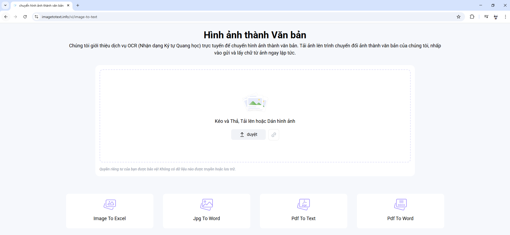

# Giới thiệu OCR

[1. OCR là gì?](#1)

[2. Phân loại công nghệ OCR](#2)

## 📌 1. OCR là gì?

- OCR (Optical Character Recognition) là công nghệ giúp máy tính nhận dạng và trích xuất văn bản từ hình ảnh hoặc tài liệu scan.

- Các ứng dụng phổ biến:
  - Quét tài liệu, số hóa văn bản
  - Đọc dữ liệu từ ảnh sản phẩm
  - Tự động hoá quy trình kiểm tra, nhập liệu

## 📌 2. Phân loại công nghệ OCR

### 1️⃣ OCR truyền thống (Classical OCR – cOCR)

#### 🟢 Đặc điểm chính:
- Dựa vào các thuật toán xử lý ảnh + so khớp mẫu (pattern matching) hoặc phân tích hình dạng ký tự (feature extraction).

- Không có khả năng học hoặc thích nghi nếu gặp font chữ lạ, bố cục phức tạp.

#### 🧠 Công nghệ nền:
- Binarization: chuyển ảnh thành trắng đen.

- Segmentation: tách dòng, từ, ký tự.

- Template Matching / Heuristic Rules: so sánh ký tự ảnh với tập ký tự mẫu.

#### 🔧 Công cụ tiêu biểu:
- Tesseract OCR (v3.x)

#### ✅ Ưu điểm:
- Nhẹ, nhanh, dễ nhúng vào hệ thống cục bộ.

- Phù hợp với ảnh chất lượng cao, định dạng rõ ràng (form in sẵn, chữ đánh máy).

#### ❌ Hạn chế:
- Dễ lỗi nếu ảnh mờ, méo, font lạ, có nhiễu.

- Gặp khó khăn với bố cục phức tạp (nhiều cột, bảng biểu).

- Không xử lý được chữ viết tay (handwriting).

### 2️⃣ OCR dựa trên AI (AI-based OCR)

#### 🟢 Đặc điểm chính:
- Sử dụng các mô hình AI tiên tiến để nhận dạng hình ảnh trực tiếp thành văn bản, bỏ qua các bước truyền thống như tách ký tự.

- Một số hệ thống còn kết hợp NLP (Natural Language Processing) để tăng độ chính xác ngữ nghĩa.

#### 🧠 Công nghệ nền:
- End-to-end text recognition: từ ảnh đầu vào → trực tiếp ra chuỗi văn bản

- Scene text detection: nhận dạng chữ trong ảnh thật (street view, biển số, ảnh chụp đời thực).

- CTC (Connectionist Temporal Classification), Seq2Seq, Vision Transformers.

#### 🔧 Công cụ tiêu biểu:
- Google Cloud Vision OCR

- AWS Textract

- Microsoft Azure OCR

- EasyOCR, PaddleOCR

- Tesseract v4+ (đã tích hợp LSTM – một dạng AI OCR)

#### ✅ Ưu điểm:
- Độ chính xác cao, đặc biệt với ảnh chụp thực tế hoặc font đa dạng.

- Có thể xử lý bố cục phức tạp, nhiều cột, nhiều vùng.

- Một số có khả năng đọc handwriting.

#### ❌ Hạn chế:
- Nặng, cần GPU hoặc phụ thuộc vào cloud.

- Khó tùy biến (nếu dùng API).

- Chi phí cao (nếu dùng dịch vụ thương mại).

### So sánh nhanh:

|         Tiêu chí         |      OCR truyền thống     |      AI-based OCR      |
| :------------------: | :-----------------: | :-----------------: |
|    Tạo dữ liệu có cấu trúc    | Không, chỉ có văn bản thô  | Có  |
|  Xử lý bố cục phức tạp | Yếu  | Mạnh |
|    Độ chính xác    | Tốt với ảnh chuẩn  | Cao, kể cả ảnh khó  |
| Xử lý handwriting | Không | Có thể |
| Hiệu năng / tốc độ | Nhanh, nhẹ | Chậm, tốn nhiều tài nguyên |
| Triển khai | Cục bộ dễ, offline | Thường cần cloud hoặc GPU |
| Chi phí | Thấp | Cao |
