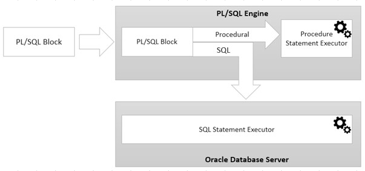

# Làm quen với PL/SQL

[1. Giới thiệu về PL/SQL](#1)

[2. Cú pháp cơ bản trong PL/SQL](#2)

[3. Cấu trúc điều khiển](#3)

[4. Xử lý ngoại lệ](#4)

<a name="1"></a>

## 📌 1. Giới thiệu về PL/SQL

### 🔹 PL/SQL là gì?

- SQL thì không lạ lẫm gì, là viết tắt của Structural Query Language (ngôn ngữ truy vấn có cấu trúc). Vậy PL trong PL/SQL là gì?

- PL ở đây là Procedural Language extensions (phần mở rộng ngôn ngữ thủ tục).

- PL/SQL (Procedural Language/SQL) là một phần mở rộng của SQL do Oracle phát triển, giúp viết các chương trình điều khiển logic, xử lý dữ liệu một cách mạnh mẽ trong Oracle Database.

- PL/SQL là một ngôn ngữ bậc cao, có thể xem nó như là một ngôn ngữ lập trình:
  - Cho phép khai báo hằng số và biến, thủ tục và các hàm, kiểu dữ liệu và biến của các kiểu dữ liệu, điều kiện, vòng lặp, và các trigger.
  - Có thể sử lý các ngoại lệ (lỗi tại thời gian chạy).
  - Mảng cũng được hỗ trợ nâng cấp để sử dụng cho các tập hợp trong PL/SQL.

### 🔹 Lưu ý về PL/SQL

- PL/SQL là ngôn ngữ nhúng, không thể hoạt động độc lập. Bản thân nó chỉ có thể thực thi trong hệ cơ sở dữ liệu Oracle. Do vậy, đừng nhầm lẫn nó với các ngôn ngữ lập trình khác như Java, C++.

- So sánh PL/SQL với SQL thuần:
  | SQL (thuần) | SQL (thuần) |
  | :------------: | :-------------: |
  | Chỉ có thể thực hiện các câu lệnh đơn như SELECT, INSERT, UPDATE, DELETE | Có thể viết chương trình với logic phức tạp: vòng lặp, điều kiện, xử lý ngoại lệ |
  | Không hỗ trợ biến | Hỗ trợ khai báo và sử dụng biến |
  | Chạy từng câu lệnh SQL riêng lẻ | Có thể chạy nhiều câu SQL cùng một lúc trong một chương trình |
  | Không hỗ trợ xử lý ngoại lệ | Có cơ chế xử lý ngoại lệ mạnh mẽ |

### 🔹 Kiến trúc PL/SQL

PL/SQL sẽ chịu trách nhiệm biên dịch code chúng ta viết thành byte-code.

Một đoạn code từ PL/SQL block được gửi tới PL/SQL Engine, đoạn code sẽ được biên dịch và thực thi ở Oracle Database Server.



### 🔹 Ưu nhược điểm của PL/SQL

- Ưu điểm:

  ✔️ Tùy vào trường hợp cụ thể, PL/SQL đem lại một hiệu suất tốt hơn

  ✔️ PL/SQL hỗ trợ OOP (hướng đối tượng), cho phép kế thừa, v.v.

  ✔️ PL/SQL hỗ trợ nhiều công cụ phát triển Web (Web application)

- Nhược điểm:

  ❌ Không có tính năng debug, phải debug bằng mắt chứ PL/SQL không hỗ trợ

### 🔹 Thành phần trong PL/SQL

- **Anonymous Block (Khối ẩn danh)**: Một đoạn mã PL/SQL không có tên, chỉ thực thi một lần và không được lưu trong database.
- **Stored Procedure (Thủ tục lưu trữ)**: Một nhóm câu lệnh SQL và PL/SQL được lưu trong database và có thể được gọi lại nhiều lần.
- **Function (Hàm)**: Giống như stored procedure, nhưng bắt buộc phải trả về một giá trị duy nhất.
- **Package (Gói)**: Tập hợp các function, procedure, biến và kiểu dữ liệu được nhóm lại để dễ quản lý.
- **Trigger**: Một đoạn PL/SQL tự động thực thi khi có sự kiện xảy ra (INSERT, UPDATE, DELETE).
- **Cursor (Con trỏ)**: Dùng để duyệt qua từng dòng dữ liệu của một tập kết quả truy vấn.

### 🔹 Môi trường thực thi

Để có thể tiếp cận nhanh với PL/SQL cần có một công cụ lập trình.

Khác với SQLServer hoặc MySQL có gói download mà khi cài đặt xong nó có sẵn công cụ trực quan để làm việc. Với Oracle sau khi cài đặt xong, cần cài đặt thêm một công cụ trực quan khác.

Một vài lựa chọn cho công cụ sử dụng như:

- [Oracle SQL Developer](http://www.oracle.com/technetwork/developer-tools/sql-developer/overview/index.html): Oracle cung cấp miễn phí một công cụ trực quan Oracle SQL Developer, download tại:

- [PL/SQL Developer](http://www.allroundautomations.com/plsqldev.html): Đây là một phần mềm thương mại. So sánh với các phần mềm trên có thể thấy nó là tốt nhất.

<a name="2"></a>

## 📌 2. Cú pháp cơ bản trong PL/SQL

### 🔹 Cấu trúc PL/SQL

Mỗi chương trình PL/SQL đều tuân theo một cấu trúc cơ bản, bao gồm 3 phần chính:

```sql
DECLARE
    -- Phần khai báo (tùy chọn)
    -- Khai báo biến, hằng số, con trỏ...
BEGIN
    -- Phần xử lý chính (bắt buộc)
    -- Viết các câu lệnh SQL, vòng lặp, điều kiện...
EXCEPTION
    -- Phần xử lý ngoại lệ (tùy chọn)
    -- Bắt lỗi và xử lý lỗi
END;
```

Ví dụ đơn giản:

```sql
BEGIN
    DBMS_OUTPUT.PUT_LINE('Hello, PL/SQL!');
END;
/
```

➡️ Giải thích:

- BEGIN ... END; đánh dấu phần chương trình chính.
- DBMS_OUTPUT.PUT_LINE('Hello, PL/SQL!'); in ra màn hình một thông báo.
- / dùng để thực thi đoạn mã PL/SQL trên SQL\*Plus hoặc SQL Developer.

### 🔹 Comment trong PL/SQL

PL/SQL hỗ trợ hai kiểu comment:

- Comment một dòng: --
- Comment nhiều dòng: /_ ... _/

```sql
BEGIN
    -- Đây là comment một dòng
    DBMS_OUTPUT.PUT_LINE('Hello, PL/SQL!');

    /* Đây là comment nhiều dòng
       Có thể viết nhiều dòng bên trong */
    NULL;
END;
/
```

### 🔹 Kiểu dữ liệu trong PL/SQL

#### 1️⃣ Kiểu dữ liệu số (Numeric Data Types)

| Kiểu dữ liệu  |                                   Mô tả                                   |
| :-----------: | :-----------------------------------------------------------------------: |
| NUMBER(p, s)  | Số có độ chính xác cố định, p là tổng số chữ số, s là số chữ số thập phân |
|    INTEGER    |                 Tương đương NUMBER(38, 0), lưu số nguyên                  |
| BINARY_FLOAT  |              Kiểu số thực (dấu phẩy động, độ chính xác đơn)               |
| BINARY_DOUBLE |              Kiểu số thực (dấu phẩy động, độ chính xác kép)               |

```sql
DECLARE
    v_num NUMBER(10,2) := 1234.56;
    v_int INTEGER := 100;
BEGIN
    DBMS_OUTPUT.PUT_LINE('Number: ' || v_num);
    DBMS_OUTPUT.PUT_LINE('Integer: ' || v_int);
END;
```

#### 2️⃣ Kiểu dữ liệu ký tự (Character Data Types)

|      Kiểu dữ liệu      |                        Mô tả                        |
| :--------------------: | :-------------------------------------------------: |
|        CHAR(n)         |            Chuỗi ký tự cố định độ dài n             |
|      VARCHAR2(n)       | Chuỗi ký tự có độ dài thay đổi (tối đa 32,767 byte) |
|          CLOB          |       Lưu trữ chuỗi văn bản lớn (tối đa 4GB)        |
| NCHAR(n), NVARCHAR2(n) |   Tương tự CHAR và VARCHAR2, nhưng hỗ trợ Unicode   |

```sql
DECLARE
    v_name VARCHAR2(50) := 'Hello PL/SQL';
BEGIN
    DBMS_OUTPUT.PUT_LINE(v_name);
END;
```

#### 3️⃣ Kiểu dữ liệu ngày và thời gian (Date and Time Data Types)

|          Kiểu dữ liệu          |                            Mô tả                            |
| :----------------------------: | :---------------------------------------------------------: |
|              DATE              | Lưu ngày và giờ (bao gồm năm, tháng, ngày, giờ, phút, giây) |
|           TIMESTAMP            |   Giống DATE, nhưng có thể có độ chính xác đến mili-giây    |
|    TIMESTAMP WITH TIME ZONE    |                  Lưu timestamp kèm múi giờ                  |
| TIMESTAMP WITH LOCAL TIME ZONE |    Tự động chuyển đổi timestamp theo múi giờ người dùng     |
|     INTERVAL YEAR TO MONTH     |          Lưu khoảng cách thời gian theo năm/tháng           |
|     INTERVAL DAY TO SECOND     |    Lưu khoảng cách thời gian theo ngày, giờ, phút, giây     |

```sql
DECLARE
    v_date DATE := SYSDATE;
    v_timestamp TIMESTAMP := SYSTIMESTAMP;
BEGIN
    DBMS_OUTPUT.PUT_LINE('Current Date: ' || TO_CHAR(v_date, 'YYYY-MM-DD HH24:MI:SS'));
    DBMS_OUTPUT.PUT_LINE('Current Timestamp: ' || TO_CHAR(v_timestamp, 'YYYY-MM-DD HH24:MI:SS.FF'));
END;
```

#### 4️⃣ Kiểu dữ liệu Boolean (Boolean Data Type)

Chỉ có TRUE, FALSE, hoặc NULL.

```sql
v_flag BOOLEAN := TRUE;
```

#### 5️⃣ Kiểu dữ liệu con trỏ (Cursor Data Type)

Dùng để lưu trữ kết quả truy vấn. (Sẽ tìm hiểu kỹ hơn ở các phần sau)

```sql
DECLARE
    CURSOR emp_cursor IS SELECT emp_name FROM employees;
    v_emp_name employees.emp_name%TYPE;
BEGIN
    OPEN emp_cursor;
    FETCH emp_cursor INTO v_emp_name;
    CLOSE emp_cursor;
    DBMS_OUTPUT.PUT_LINE('Employee: ' || v_emp_name);
END;
```

#### 6️⃣ Kiểu dữ liệu tập hợp (Collection Data Types)

Dùng để lưu trữ danh sách giá trị. (Sẽ tìm hiểu kỹ hơn ở các phần sau)

```sql
DECLARE
    TYPE NumArray IS VARRAY(5) OF NUMBER;
    v_numbers NumArray := NumArray(10, 20, 30, 40, 50);
BEGIN
    DBMS_OUTPUT.PUT_LINE(v_numbers(1)); -- Output: 10
END;
```

#### 7️⃣ Kiểu dữ liệu LOB (Large Object Data Types)

Dùng để lưu trữ dữ liệu lớn.

| Kiểu dữ liệu |                              Mô tả                              |
| :----------: | :-------------------------------------------------------------: |
|     BLOB     |              Lưu trữ dữ liệu nhị phân (ảnh, video)              |
|     CLOB     |                Lưu trữ văn bản lớn (tối đa 4GB)                 |
|    NCLOB     |               Tương tự CLOB, nhưng hỗ trợ Unicode               |
|    BFILE     | Lưu trữ đường dẫn file bên ngoài (không lưu trực tiếp trong DB) |

### 🔹 Khai báo biến

Biến trong PL/SQL phải được khai báo trước khi sử dụng.

Cú pháp:

```sql
variable_name datatype [DEFAULT value];
```

Ví dụ:

```sql
DECLARE
    v_name VARCHAR2(50);
    v_salary NUMBER := 5000;
BEGIN
    DBMS_OUTPUT.PUT_LINE('Lương: ' || v_salary);
END;
/
```

🔥 Để gán giá trị cho biến:

- Dùng := (gán trực tiếp)
  ```sql
  v_salary := 6000;
  ```
- Dùng SELECT INTO (lấy từ database)
  ```sql
  SELECT salary INTO v_salary FROM employees WHERE emp_id = 1;
  ```
- Dùng DEFAULT khi khai báo
  ```sql
  v_bonus NUMBER DEFAULT 1000;
  ```

🔥 %TYPE – Dùng kiểu dữ liệu của cột trong bảng: Thay vì khai báo kiểu dữ liệu cố định, ta có thể dùng %TYPE để kế thừa kiểu dữ liệu từ bảng:

```sql
CURSOR emp_cursor IS SELECT emp_name FROM employees;
v_emp_name employees.emp_name%TYPE;
```

🔥 Hằng số (Constant): Dùng CONSTANT để tạo giá trị không đổi.

```sql
PI_VALUE CONSTANT NUMBER := 3.14159;
```

### 🔹 Toán tử trong PL/SQL

- Toán tử số học:

  | Toán tử |   Ý nghĩa   |
  | :-----: | :---------: |
  |    +    |    Cộng     |
  |    -    |     Trừ     |
  |   \*    |    Nhân     |
  |    /    |    Chia     |
  |   MOD   | Chia lấy dư |

- Toán tử so sánh:

  |  Toán tử   |      Ý nghĩa      |
  | :--------: | :---------------: |
  |     =      |       Bằng        |
  | != hoặc <> |       Khác        |
  |     >      |      Lớn hơn      |
  |     <      |      Nhỏ hơn      |
  |     >=     | Lớn hơn hoặc bằng |
  |     <=     | Nhỏ hơn hoặc bằng |

## 📌 3. Cấu trúc điều khiển

### 🔹 Cấu trúc điều kiện (IF ... ELSE)

```sql
IF condition THEN
    -- Thực thi nếu điều kiện đúng
ELSIF another_condition THEN
    -- Thực thi nếu điều kiện này đúng
ELSE
    -- Thực thi nếu tất cả điều kiện trên đều sai
END IF;
```

### 🔹 Cấu trúc điều kiện (CASE)

#### 1️⃣ Dạng CASE đơn giản (Simple CASE)

```sql
CASE expression
    WHEN value1 THEN result1
    WHEN value2 THEN result2
    ...
    ELSE default_result
END;
```

#### 2️⃣ Dạng CASE tìm kiếm (Searched CASE)

```sql
CASE
    WHEN condition1 THEN result1
    WHEN condition2 THEN result2
    ...
    ELSE default_result
END;
```

### 🔹 Cấu trúc vòng lặp

#### 1️⃣ Vòng lặp LOOP (Vô hạn, cần EXIT)

```sql
DECLARE
    v_count NUMBER := 1;
BEGIN
    LOOP
        DBMS_OUTPUT.PUT_LINE('Lần lặp: ' || v_count);
        v_count := v_count + 1;
        EXIT WHEN v_count > 5; -- Thoát khi v_count > 5
    END LOOP;
END;
```

#### 2️⃣ Vòng lặp WHILE

```sql
WHILE v_count <= 5 LOOP
    DBMS_OUTPUT.PUT_LINE('Lần lặp: ' || v_count);
    v_count := v_count + 1;
END LOOP;
```

#### 3️⃣ Vòng lặp FOR

```sql
FOR i IN 1..5 LOOP
    DBMS_OUTPUT.PUT_LINE('Lần lặp: ' || i);
END LOOP;
```

## 📌 4. Xử lý ngoại lệ

### 🔹 Cú pháp

```sql
DECLARE 
  <declarations section> 
BEGIN 
  -- Code có thể gây lỗi
EXCEPTION 
  WHEN exception1 THEN  
    -- Exception1 handling statements  
  WHEN exception2  THEN  
    -- Exception2 handling statements  
  ........ 
  WHEN others THEN 
    -- Other exception handling statements 
END;
```

#### 1️⃣ Ví dụ bắt lỗi chung (WHEN OTHERS)

```sql
DECLARE
  v_number NUMBER;
BEGIN
  v_number := 10 / 0; -- Lỗi chia cho 0
EXCEPTION
  WHEN OTHERS THEN
    DBMS_OUTPUT.PUT_LINE('Đã xảy ra lỗi!');
END;
```

#### 2️⃣ Ví dụ bắt lỗi cụ thể

```sql
DECLARE
  v_number NUMBER;
BEGIN
  v_number := 10 / 0; -- Lỗi chia cho 0
EXCEPTION
  WHEN ZERO_DIVIDE THEN
    DBMS_OUTPUT.PUT_LINE('Lỗi chia cho 0');
  WHEN OTHERS THEN
    DBMS_OUTPUT.PUT_LINE('Lỗi không xác định');
END;
```

### 🔹 Raise Exception

Chúng ta có thể nêu ra các ngoại lệ một cách rõ ràng bằng cách sử dụng lệnh RAISE:

```sql
DECLARE 
  exception_name EXCEPTION; -- Khai báo một ngoại lệ của riêng mình
BEGIN 
  IF condition THEN 
    RAISE exception_name; 
  END IF; 
EXCEPTION 
  WHEN exception_name THEN 
    statement; 
END;
```

### 🔹 Các ngoại lệ do hệ thống xác định

Một số ngoại lệ có sẵn trong PL/SQL:

|        Ngoại lệ         |                                Mô tả                                |
| :---------------------: | :-----------------------------------------------------------------: |
|    ACCESS_INTO_NULL     |        Gọi phương thức trên một đối tượng chưa được khởi tạo        |
|     CASE_NOT_FOUND      |    Không có trường hợp nào phù hợp trong CASE (và không có ELSE)    |
|   COLLECTION_IS_NULL    |        Cố gắng tham chiếu một collection chưa được khởi tạo         |
|   CURSOR_ALREADY_OPEN   |             Mở một con trỏ (cursor) đã được mở trước đó             |
|    DUP_VAL_ON_INDEX     |         Vi phạm ràng buộc UNIQUE trên cột khi chèn dữ liệu          |
|     INVALID_CURSOR      |         Cố gắng thao tác trên con trỏ (cursor) không hợp lệ         |
|     INVALID_NUMBER      |  Chuyển đổi kiểu dữ liệu số không hợp lệ (ví dụ: TO_NUMBER('abc'))  |
|      LOGIN_DENIED       |             Sai username hoặc password khi kết nối CSDL             |
|      NO_DATA_FOUND      |    Không có dữ liệu nào được tìm thấy trong truy vấn SELECT INTO    |
|      NOT_LOGGED_ON      |          Cố gắng thao tác trên database khi chưa đăng nhập          |
|      PROGRAM_ERROR      |           Lỗi nội bộ của PL/SQL (không mong muốn xảy ra)            |
|    ROWTYPE_MISMATCH     |         Kiểu dữ liệu của một hàng không khớp với biến nhận          |
|      SELF_IS_NULL       | Gọi phương thức trên một instance chưa được khởi tạo của một object |
|      STORAGE_ERROR      |                 Hết bộ nhớ hoặc lỗi cấp phát bộ nhớ                 |
| SUBSCRIPT_BEYOND_COUNT  |       Chỉ mục (index) vượt quá số phần tử có trong collection       |
| SUBSCRIPT_OUTSIDE_LIMIT |         Chỉ mục (index) ngoài phạm vi hợp lệ của collection         |
|    SYS_INVALID_ROWID    |                     Giá trị ROWID không hợp lệ                      |
|   TIMEOUT_ON_RESOURCE   |              Quá thời gian chờ khi truy cập tài nguyên              |
|      TOO_MANY_ROWS      |       Truy vấn SELECT INTO trả về nhiều hơn một dòng dữ liệu        |
|       VALUE_ERROR       |     Lỗi khi gán giá trị không hợp lệ vào biến (ví dụ: tràn số)      |
|       ZERO_DIVIDE       |                           Lỗi chia cho 0                            |
