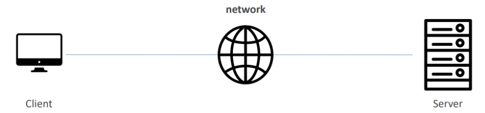
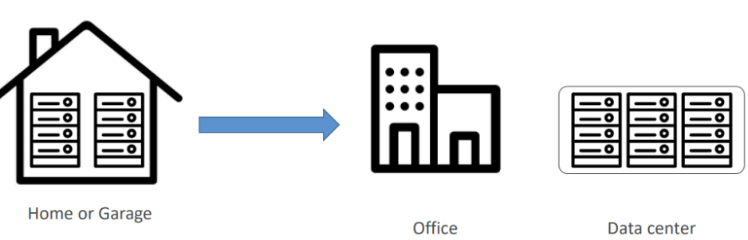
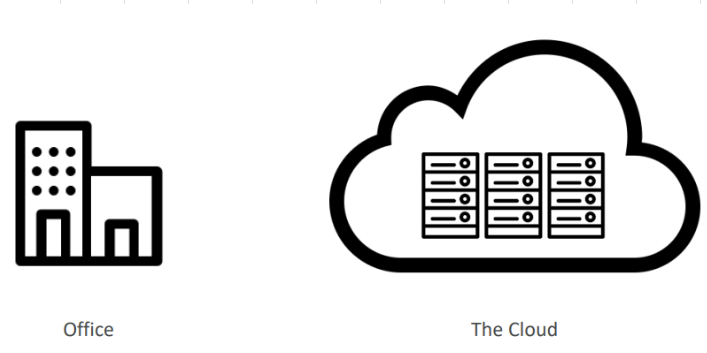
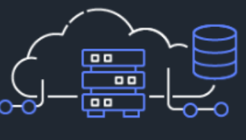
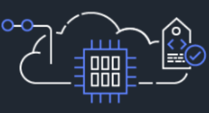

# Giới thiệu về Cloud Computing (Điện toán đám mây)

[1. Cloud Computing là gì?](#1)

[2. Các mô hình triển khai của Cloud](#2)

[3. Đặc điểm của Cloud Computing](#3)

[4. Giá trị của Cloud Computing](#4)

[5. Các loại Cloud Computing](#5)

## 📌 1. Cloud Computing là gì?

### 🔹 Đầu tiên, chúng ta nhắc lại cách mà một websites làm việc:

#### 1️⃣ Client
- Là thiết bị mà người dùng sử dụng để truy cập website, ví dụ như máy tính, điện thoại, hoặc máy tính bảng.

- Khi người dùng thực hiện một hành động trên trình duyệt, một request sẽ được gửi đi đến server để lấy dữ liệu cần thiết.

#### 2️⃣ Network
- Là cầu nối giữa client và server. Khi request được gửi đi từ client, nó sẽ đi qua nhiều thiết bị mạng (routers, switches, etc.) để đến đích.

#### 3️⃣ Server

- Là nơi lưu trữ website và các tài nguyên liên quan (files, databases, APIs).

- Khi server nhận được yêu cầu từ client, nó sẽ xử lý và trả về response (phản hồi) chứa dữ liệu cần thiết.

### 🔹 Các vấn đề với phương pháp tiếp cận truyền thống:

#### 1️⃣ Chi phí cao (High Costs)

- Chi phí đầu tư ban đầu: phần cứng, phần mềm, không gian đặt server.

- Chi phí bảo trì, điện năng, làm mát, nhân lực kỹ thuật.

#### 2️⃣ Khả năng mở rộng hạn chế (Scaling is limited)

- Khi nhu cầu tăng, bạn cần đầu tư thêm máy chủ mới.

- Khi nhu cầu giảm, cũng không thể dễ dàng giảm bớt số lượng tài nguyên đã mua, gây lãng phí.

#### 3️⃣ Điều gì xảy ra nếu chẳng may động đất, sóng thần, mất điện, hỏa hoạn, v.v.

- Máy chủ bị hỏng hoặc gặp sự cố, doanh nghiệp có thể phải đối mặt với thời gian gián đoạn dịch vụ.

### 🔹 Cloud Computing – Điện toán đám mây:

Cloud computing ra đời để giải quyết các vấn đề trên.

**Điện toán đám mây (Cloud computing)** là mô hình cung cấp tài nguyên máy tính như lưu trữ, máy chủ, cơ sở dữ liệu, mạng, và các dịch vụ phần mềm qua internet thay vì thông qua các máy chủ vật lý hoặc phần cứng cục bộ.

👉 Chúng ta không cần phải tự quản lý hạ tầng, thay vào đó sử dụng tài nguyên của nhà cung cấp đám mây (như AWS).

## 📌 2. Các mô hình triển khai của Cloud

### 🔹 Private Cloud

- Được sử dụng bởi một tổ chức duy nhất, không công khai.

- Kiểm soát hoàn toàn, đáp ứng nhu cầu kinh doanh cụ thể.

- Bảo mật cho ứng dụng nhạy cảm.

- Bên cung cấp dịch vụ: IBM – Cloud, Rackspace, v.v.

### 🔹 Public Cloud

- Do nhà cung cấp dịch vụ Cloud bên thứ 3 sở hữu, vận hành và phân phối qua Internet.

- Bên cung cấp dịch vụ: Azure, Google Cloud, AWS (Amazone Web Services)

  

### 🔹 Hybrid Cloud

- Giữ một số máy chủ tại cơ sở và mở rộng một số lên Cloud.

- Kiểm soát các tài sản nhạy cảm trong cơ sở hạ tầng riêng của bạn mà vẫn có linh hoạt và hiểu quả chi phí từ Cloud.

## 📌 3. Đặc điểm của Cloud Computing

### 1️⃣ On-demand self service - Tự phục vụ theo yêu cầu

- Người dùng (Users) có thể cung cấp tài nguyên (provision resources) và sử dụng mà không cần tương tác của con người (human interaction) từ nhà cung cấp dịch vụ (the service provider).

### 2️⃣ Broad network access - Truy cập mạng rộng

- Tài nguyên có sẵn (Resources available) trên mạng (network) và có thể được truy cập (accesss) bởi nhiều nền tảng máy khách (client platforms) khác nhau.

### 3️⃣ Multi-tenancy and resource pooling - Đa thuê bao và gộp tài nguyên

- Nhiều khách hàng có thể chia sẻ cùng một cơ sở hạ tầng (infrastructure) và ứng dụng (applications) với tính bảo mật (security) và quyền riêng tư (privacy).

- Nhiều khách hàng được phục vụ từ cùng một tài nguyên vật lý (physical resources).

### 4️⃣ Rapid elasticity and scalability - Tính đàn hồi và khả năng mở rộng

### 5️⃣ Measured service - Dịch vụ được đo lường

- Mức sử dụng (Usage) được đo lường (measured), người dùng trả đúng cho những gì họ đã sử dụng.

## 📌 4. Giá trị của Cloud Computing

### 1️⃣ Flexibility - Linh hoạt

- Bạn có thể cung cấp chính xác loại tài nguyên điện toán mà bạn cần và thay đổi loại tài nguyên khi cần.

### 2️⃣ Cost Efficiency - Chi phí hiểu quả

- Trả tiền khi sử dụng, cho những gì bạn sử dụng (pay-as-you-go).

### 3️⃣ Scalability - Khả năng mở rộng

- Đáp ứng tải lớn hơn bằng cách làm cho phần cứng mạnh hơn hoặc mở rộng thêm.

### 4️⃣ Elasticity - Đàn hồi

- Mở rộng khi cần và thu hẹp khi không cần.

### 5️⃣ Global Reach - Tầm hoạt động toàn cầu

- AWS có các trung tâm dữ liệu trên toàn thế giới, giúp ứng dụng có thể hoạt động nhanh và ổn định ở nhiều nơi.

- Bạn có thể truy cập nhiều tài nguyên tùy ý, gần như ngay lập tức.

### 6️⃣ Security - Bảo mật cao

- AWS cung cấp các công cụ và dịch vụ bảo mật mạnh mẽ để bảo vệ dữ liệu.

### 7️⃣ High-availability and fault-tolerance - Khả năng sẵn sàng cao và khả năng chịu lỗi

- Đảm bảo dịch vụ luôn có thể hoạt động với thời gian ngừng hệ thống thấp nhất.

- Không bị ảnh hưởng khi một thành phần trong hệ thống bị hỏng.

## 📌 5. Các loại Cloud Computing

### 1️⃣ Infrastructure as a Service (IaaS) - Cơ sở hạ tầng dưới dạng dịch vụ

- Cung cấp mạng, bao gồm máy chủ ảo (VM), không gian lưu trữ.

### 2️⃣ Platform as a Service (PaaS) - Nền tảng dưới dạng dịch vụ (PaaS)

- Người dùng chỉ cần tập trung vào phát triển và triển khai ứng dụng mà không cần lo lắng về quản lý cơ sở hạ tầng.

### 3️⃣ Software as a Service (SaaS) - Phần mềm dưới dạng dịch vụ

- Sản phẩm hoàn thiện được nhà cung cấp dịch vụ vận hành và quản lý.

- Ví dụ như: Gmail, Google Drive, Microsoft Office 365, v.v.
