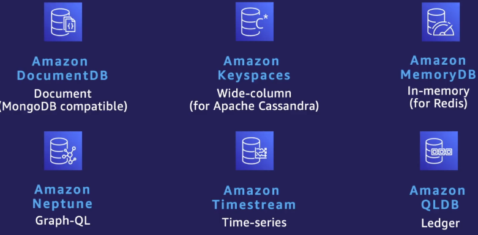
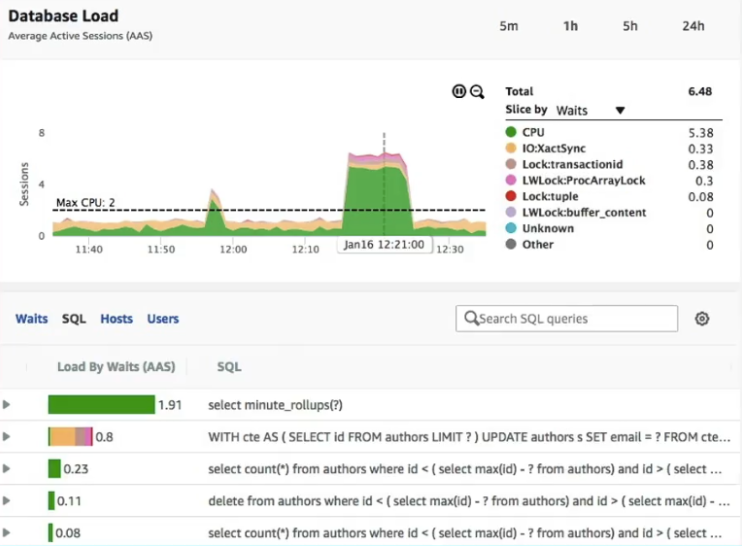

# Các dịch vụ Database - Amazone RDS

[1. Tổng quan về các dịch vụ Database](#1)

[2. Giới thiệu Amazone RDS](#2)

[3. RDS Multi-AZ & Read Replica](#3)

[4. RDS Backup](#4)

[5. Giới thiệu Aurora](#5)

## 📌 1. Tổng quan về các dịch vụ Database

- ● Cách cơ bản nhất để chạy một hệ cơ sở dữ liệu hay Database trên AWS là tự cài đặt và vận hành trên máy ảo EC2.

  - Tuy nhiên, nó rất tốn kém công sức và đòi hỏi nhiều kỹ năng chuyên môn và không mang lại nhiều ý nghĩa cho việc kinh doanh.

- ● AWS cung cấp các dịch vụ cơ sở dữ liệu được quản lý bởi AWS để giúp khách hàng nhanh chóng xây dựng và triển khai ứng dụng, tập trung nguồn lực vào các tác vụ mang lại nhiều giá trị hơn.

### Các dịch vụ cơ sở dữ liệu tiêu biểu:

#### 1️⃣ Amazone RDS (Relational Database Service)

- Là dịch vụ hỗ trợ hệ cơ sở dữ liệu quan hệ (relational)

#### 2️⃣ Amazone DynamoDB

- Dịch vụ hỗ trợ hệ cơ sở dữ liệu phi quan hệ (key-value)

#### 3️⃣ Amazon Elassticache

- Dịch vụ hỗ trợ hệ cơ sở dữ liệu In-memory, chuyên dùng cho các loại dữ liệu tạm thời, đòi hỏi tốc độ truy cập rất cao.

### Các dịch vụ cơ sở dữ liệu khác:

- Bên cạnh các dịch vụ cơ bản nêu trên, AWS hỗ trợ các dịch vụ cơ sở dữ liệu khác nhau tối ưu cho nhiều loại ứng dụng khác nhau:

  

## 📌 2. Giới thiệu Amazone RDS

- Là một dịch vụ Database được quản trị bởi AWS hỗ trợ các hệ cơ sở dữ liệu quan hệ phổ biến:

  

- Ưu điểm:

  - ✔️ Tự động quản lý cơ sở hạ tầng, backup, và scale.

  - ✔️ Tính năng multi-AZ replication, failover tự động, và backup tự động (sẽ đề cập bên dưới).

## 📌 3. Giám sát RDS database

- Giám sát là một phần quan trọng trong việc vận hành và sử dụng hệ cơ sở dữ liệu, giúp ta biết tình trạng hoạt động, sớm phát hiện các vấn đề phát sinh.

- RDS tích hợp các chức năng giám sát đầy đủ ở các mức: hạ tầng, hệ điều hành và hệ cơ sở dữ liệu.

### 1️⃣ Amazon CloudWatch

- Được AWS tích hợp giảm sát ở mức hạ tầng để thu thập thông tin liên quan đến mức độ sử dụng tài nguyên, bao gồm:
  - Mức tiêu hao CPU/ Memory/ số lượng lượt đọc ghi vào ổ đĩa (IOPS)/ băng thông mạng (network).

### 2️⃣ Amazon RDS Enhanced Monitoring

- Được AWS tích hợp giảm sát ở mức hệ điều hành để giám sát các thông số cụ thể về khối lượng tài nguyên sử dụng của mỗi Process/ Thread bên trong máy chủ RDS.

### 3️⃣ Amazon RDS Performance Insights

- Được AWS tích hợp giảm sát ở mức hệ cơ sở dữ liệu để giảm sát mức độ tiêu hao tài nguyên của từng câu truy vấn SQL hay của từng người dùng, từng máy chủ.

  👉 Từ đó tìm ra cấu phần hoạt động chưa hiệu quả để tối ưu.

- 

  - Trong ví dụ trên, chúng ta thấy có 1 câu SQL gây tiêu hao rất nhiều tài nguyên CPU.

    👉 Cần tập trung tối ưu câu truy vấn này.

## 📌 4. RDS Multi-AZ & Read Replica

### 1️⃣ Multi-AZ (Multi-Availability Zone Deployment)

- 🎯 Mục đích:

  - ✔️ Đảm bảo tính sẵn sàng cao (high availability) và khôi phục sau thảm họa (disaster recovery) cho cơ sở dữ liệu.

  - ✔️ Không cải thiện hiệu suất đọc/ghi, mà chỉ tập trung vào việc duy trì hoạt động liên tục của cơ sở dữ liệu khi có sự cố xảy ra.

- 🚀 Cách hoạt động:

  - ✧ Khi kích hoạt tính năng Multi-AZ, RDS sẽ tự động tạo một bản sao dự phòng (standby) của cơ sở dữ liệu trong một Availability Zone (AZ) khác.

  - ✧ Bản sao dự phòng này được duy trì đồng bộ với phiên bản chính thông qua cơ chế replication đồng bộ.

  - ✧ Nếu có sự cố xảy ra với phiên bản chính (ví dụ lỗi phần cứng, bảo trì, hoặc AZ bị sự cố):

    👉 RDS sẽ tự động chuyển đổi (failover) sang bản sao dự phòng mà không mất dữ liệu. RDS sẽ tự động tạo ra một máy chủ bản sao mới để làm dự bị cho hệ cơ sở dữ liệu chính mới này.

- ● Multi-AZ có thể bật tắc dễ dàng trên AWS Console.

  - Nếu không có kinh phí chạy Multi-AZ thường xuyên, có thể tạm thời bật/tắt tính năng này.

- ● Do chúng ta không thể truy cập hay đọc/ghi trên databse dự bị nên Multi-AZ không giúp cải thiện hiệu suất đọc/ghi được mà chỉ tập trung vào tính sẵn sàng.

  👉 Nếu muốn tăng hiệu suất và khả năng chịu tải, ta sử dụng tính năng Read Replica.

### 2️⃣ Read Replica

- 🎯 Mục đích:

  - ✔️ Mở rộng hiệu suất đọc (read scaling) và phân phối tải đọc của cơ sở dữ liệu bằng cách tạo các bản sao cơ sở dữ liệu phục vụ riêng cho việc đọc.

  - ✔️ Được sử dụng để cải thiện hiệu suất khi có nhiều truy vấn đọc từ cơ sở dữ liệu.

- 🚀 Cách hoạt động:

  - ✧ Định kỳ hàng ngày, RDS sẽ thực hiện 1 lệnh full snapshot toàn bộ dữ liệu, sau đó mỗi 5 phút RDS sẽ thực hiện 1 lần backup transaction logs.

  - ✧ Để khôi phục dữ liệu tại một thời điểm, RDS sẽ sử dụng bản full snapshot gần nhất trước đó, rồi chạy lại các transaction logs trong ngày cho đến thời điểm cần phục hồi.

  - ✧ Với database có Multi-AZ, RDS sẽ backup trên máy chủ dự bị để hạn chế ảnh hưởng trên database chính

  - ✧ Với database không có Multi-AZ, RDS sẽ snapshot hàng ngày vào thời điểm do chúng ta chỉ định.

    👉 Nên cấu hình khoảng thời gian này vào thời điểm ít người truy cập để tránh làm ảnh hưởng đến hiệu năng của database

- ● Do hạn chế của automatic backup là thời gian lưu trữ tối đa 35 ngày

  - 👉 DS cung cấp tính năng Snapshot:

    - ✧ Đây là tính năng sao chụp lại toàn bộ dữ liệu trong database tại một thời điểm nhất định.

    - ✧ Có thể kích hoạt Snapshot vào bất kể thời điểm nào chúng ta muốn.

    - ✧ Có thể kích hoạt thủ công hoạt sử dụng công cụ để tự động kích hoạt định kỳ.

  - Các bản Snapshot này sau đó sẽ chuyển vào S3 để lưu trữ, giúp đảm bảo độ bền dữ liệu và tối ưu chi phí.

## 📌 5. Giới thiệu Aurora

- ● Các hệ cơ sở dữ liệu quan hệ truyền trống trên RDS có thể đáp ứng cho nhiều trường hợp sử dụng khác nhau.

  - Tuy nhiên, chúng được thiết kế để hoạt động trên môi trường truyền thống nên chưa tận dụng hết sức mạnh của đám mây.

- ● AWS tạo ra hệ cơ sở dữ liệu quan hệ Aurora được tối ưu hóa cho đám mây, cung cấp hiệu năng tương đương hệ cơ sở dữ liệu thương mại, nhưng mức giá chỉ tương được hệ cơ sở dữ liệu mã nguồn mở.

- ● Aurora tương thích với PostgreSQL và MySQL. Nếu ứng dụng chúng ta đang sử dụng Postgres hoặc MySQL thì có thể chuyển trực tiếp sang Aurora để giảm chi phí mà vẫn giúp tăng hiệu năng và gần như không cần chỉnh sửa lại ứng dụng.

- ✅ Đặc điểm nổi bật của Amazon Aurora:

  - ➀ Hiệu năng cao

    - ✧ Aurora nhanh hơn gấp 5 lần so với MySQL tiêu chuẩn và gấp 3 lần so với PostgreSQL tiêu chuẩn nhờ vào kiến trúc lưu trữ được tối ưu hóa.

    - ✧ Khi ghi dữ liệu vào Aurora, nó sẽ tự động chia nhỏ dữ liệu ra thành các đoạn 10GB.

    - ✧ Mỗi 10GB dữ liệu sẽ được lưu trữ trên 6 vùng lưu trữ (gọi là protection groups (PG)) chia đều trên 3 AZ (tương đương 2 bản trên mỗi AZ).

    - ✧ Chúng ta càng có nhiều dữ liệu, Aurora càng phân tán dữ liệu trên nhiều thiết bị khác nhau.

    - 👉 Điều này giúp Aurora có khả năng mở rộng thiết bị lưu trữ cực lớn, nâng hiệu năng lên rất cao.

  - ➁ Khả năng mở rộng tự động:
    - Aurora tự động mở rộng kích thước lưu trữ lên đến 128TB mà không cần can thiệp thủ công.

|    Đặc điểm     |                  Amazon Aurora                   |             RDS (MySQL/PostgreSQL)              |
| :-------------: | :----------------------------------------------: | :---------------------------------------------: |
|    Hiệu suất    |    Nhanh hơn MySQL 5 lần và PostgreSQL 3 lần     | Tương đương với bản MySQL/PostgreSQL tiêu chuẩn |
|  Tính sẵn sàng  |         Sao chép dữ liệu 6 lần qua 3 AZs         | Multi-AZ có 1 bản sao dự phòng trong 1 AZ khác  |
| Tự động mở rộng | Tự động mở rộng dung lượng lưu trữ lên đến 128TB | Dung lượng mở rộng thủ công, giới hạn thấp hơn  |
|  Read Replica   |            Tối đa 15 bản sao chỉ đọc             |            Tối đa 5 bản sao chỉ đọc             |
| Global Database |     Hỗ trợ nhiều vùng với độ trễ dưới 1 giây     |     Không hỗ trợ tính năng Global Database      |
|     Sao lưu     |  Multi-AZ với khả năng sao chép dữ liệu tức thì  |            Multi-AZ sao chép đồng bộ            |
