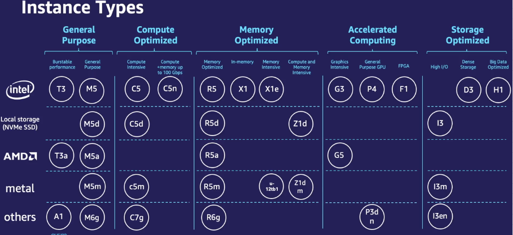
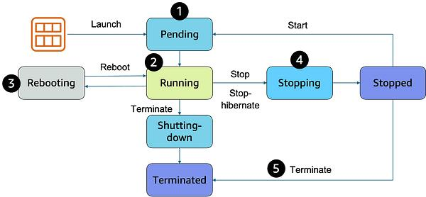
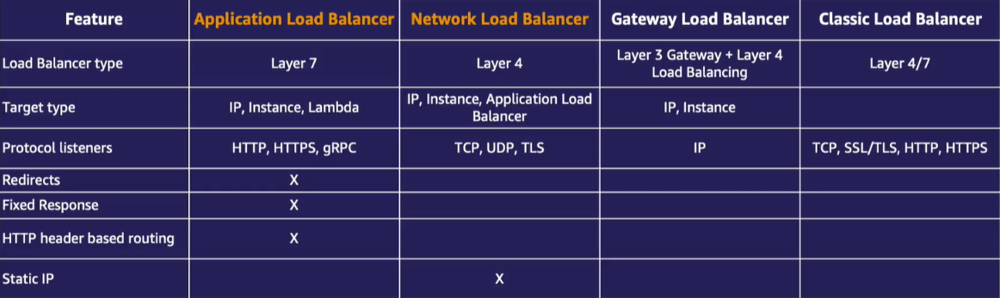

# Các dịch vụ điện toán (Compute) & AWS EC2 - Máy chủ ảo

[1. Compute - Dịch vụ điện toán](#1)

[2. Giới thiệu Amazon EC2](#2)

[3. Amazon Machine Image (AMI)](#3)

[4. Các dòng máy EC2 (Instance type)](#4)

[5. Vòng đời máy ảo EC2](#5)

[6. EC2 Princing options](#6)

[7. Cân bằng tải (Elastic Load Balancing)](#7)

[8. EC2 auto scaling](#8)

<a name="1"></a>

## 📌 1. Compute - Dịch vụ điện toán

- Compute (hay điện toán) là nhóm các dịch vụ cho phép bạn cài đặt và triển khai ứng dụng của mình.

- Compute đề cập đến các dịch vụ cung cấp khả năng tính toán và xử lý dữ liệu trên đám mây, tiêu biểu:

### 1️⃣ Amazon EC2 - dịch vụ cung cấp các máy chủ ảo (Instances) trên đám mây

- Là dịch vụ điện toán cơ bản nhất cho phép cấu hình các máy ảo này với nhiều loại tài nguyên khác nhau như CPU, RAM, dung lượng ổ cứng, và hệ điều hành.

### 2️⃣ AWS Lambda - dịch vụ điện toán phi máy chủ

- Có nghĩa là khi sử dụng bạn sẽ không cần quan tâm đến việc thiết lập, cài đặt, vận hành máy chủ và các phần mềm nền tảng để chạy ứng dụng.

- Việc của bạn là coding và update code lên lamda, dịch vụ sẽ tự động triển khai và mở rộng ứng dụng theo yêu cầu của end-user.

### 3️⃣ Amazon ECS, EKS, và Fargate - các dịch vụ Container

- Cho phép đóng góp ứng dụng và các cấu phần liên quan vào trong thùng chứa (container, ví dụ như Docker).

- Giải quyết vấn đề tính tương thích giữa các môi trường khác nhau.

<a name="2"></a>

## 📌 2. Giới thiệu Amazon EC

- Amazon EC2 (Elastic Compute Cloud) là một trong những dịch vụ điện toán phổ biến nhất của AWS.

- EC2 thuộc loại Infrastructure as a Service (IaaS) - Cơ sở hạ tầng dưới dạng dịch vụ.

- Với EC2 bao gồm các khả năng:

  - ➀ Tạo ra số lượng rất lớn các máy chủ ảo với khả năng tùy chỉnh cao để phù hợp với mọi trường hợp sử dụng.

  - ➁ Có thể tạo bất cứ thời điểm nào, chỉnh sửa cấu hình nhanh chóng và ngắt khi không sử dụng đến.

  - ➂ Cung cấp nhiều lựa chọn khác nhau để phù hợp ứng dụng của mình:

    - Hệ điều hành: Linux, Window, Mac
    - Vi xử lý, loại CPU, RAM, dung lượng lưu trữ, và điều chỉnh cấu hình mạng, v.v.

  - ➃ Hỗ trợ đa dạng loại giá (Pricing Models), tùy vào đặc tính của ứng dụng để chọn.


⚠️ Lưu ý:

- Khi khởi chạy máy ảo EC2, bạn sẽ được cấp một cặp key:

  - Public key: được lưu trữ trên máy ảo EC2

  - Private key: tải về và lưu trên máy của mình (chỉ được tải về 1 lần duy nhất khi được tạo ra):

    - Nếu không có private key sẽ không thể truy cập máy chủ ảo của mình.

    - Nếu sử dụng hệ điều hành Linux, private key đóng vai trò như là SSH key để đăng nhập vào máy ảo.

    - Nếu sử dụng Window, Private key sẽ được sử dụng để đổi lấy mật khẩu cho người dùng quản trị viên Administrator để đăng nhập vào máy chủ ảo.

<a name="3"></a>

## 📌 3. Amazon Machine Image (AMI)

- Là một mẫu chứa thông tin cấu hình cần thiết để khởi tạo một hoặc nhiều instance (máy chủ ảo) trên Amazon EC2.

- Một AMI bao gồm các yếu tố:

  - 1️⃣ Một bản sao của root volume: chứa thông tin hệ điều hành và một số ứng dụng được cài đặt sẵn.

  - 2️⃣ Block device mapping: chỉ định các ổ đĩa cứng có sẵn mà bạn sẽ gán trên máy ảo EC2 khi nó đươc tạo ra từ AMI.

  - 3️⃣ Launch permissions: chỉ định người nào có thể sử dụng AMI này

- Các loại AMI thường đến từ 3 nguồn chính:

  - 1️⃣ Public AMI: là AMI có sẵn từ AWS hoặc cộng đồng người dùng, cho phép bạn khởi tạo instance nhanh chóng mà không cần tự xây dựng AMI.

  - 2️⃣ Private AMI: là AMI do bạn tạo ra và giữ riêng trong tài khoản AWS của mình, chỉ bạn hoặc những người được cấp quyền mới có thể sử dụng.

  - 3️⃣ AWS Marketplace AMI: là AMI có sẵn từ AWS Marketplace (chợ phần mềm), thường được cung cấp bởi các bên thứ ba và thường bao gồm các ứng dụng chuyên biệt đã được cấu hình sẵn.

<a name="4"></a>

## 📌 4. Các dòng máy EC2 (Instance type)

- Amazon EC2 Instance Types (Các loại máy chủ ảo EC2) là các cấu hình phần cứng khác nhau mà AWS cung cấp.

  - Mỗi loại được tối ưu cho các nhu cầu tính toán cụ thể, chẳng hạn như CPU, bộ nhớ (RAM), lưu trữ, và băng thông mạng.

- AWS EC2 cung cấp nhiều instance types để phù hợp với nhiều mục đích sử dụng, giúp bạn lựa chọn loại máy chủ phù hợp nhất với yêu cầu của mình để tối ưu hiệu năng, chi phí.



- Ví dụ Instance type có tên:

```
c5n.xlarge

Trong đó:
    + c - Instance family: đại diện cho loại instance, chuyên dùng cho các ứng dụng sử dụng nhiều CPU.
    + 5 - Instance generation: thế hệ của máy ảo. Càng lớn thì đời càng cao (càng mới).
    + n - Attribute: là thuộc tính, n thể hiện rằng đây là máy ảo dòng c được tối ưu thêm về kết nối mạng.
    + xlarge - Instance size: kích thước của instance type. Kích thước càng lớn thì CPU, RAM, Gbps (mạng) càng lớn.
```

- Nhìn chung EC2 Instance bao gồm 5 nhóm chính:

### 1️⃣ General Purpose (Mục đích chung)

- Cân bằng giữa CPU, bộ nhớ và khả năng mạng.

- Sử dụng cho các ứng dụng phổ biến không yêu cầu tài nguyên tính toán đặc biệt lớn như máy chủ web, ứng dụng doanh nghiệp, môi trường phát triển và thử nghiệm.

### 2️⃣ Compute Optimized (Tối ưu hóa tính toán)

- Tối ưu hóa cho khả năng tính toán với tỷ lệ CPU cao hơn so với bộ nhớ.

- Sử dụng cho các ứng dụng tính toán nặng như xử lý dữ liệu, trò chơi, phân tích khoa học.

### 3️⃣ Memory Optimized (Tối ưu hóa bộ nhớ)

- Cung cấp nhiều bộ nhớ cho mỗi CPU.

- Sử dụng cho các ứng dụng đòi hỏi lượng lớn bộ nhớ như cơ sở dữ liệu, bộ nhớ cache phân tán, và phân tích dữ liệu.

### 4️⃣ Storage Optimized (Tối ưu hóa lưu trữ)

- Cung cấp dung lượng lưu trữ lớn, tốc độ đọc/ghi cao.

- Sử dụng cho các ứng dụng yêu cầu khả năng lưu trữ lớn như cơ sở dữ liệu NoSQL, hệ thống file phân tán, và các ứng dụng phân tích dữ liệu.

### 5️⃣ Accelerated Computing (Tính toán tăng cường)

- Sử dụng GPU hoặc FPGA để tăng tốc khả năng tính toán.

- Sử dụng cho trí tuệ nhân tạo (AI), học máy (ML), mô phỏng khoa học, xử lý đồ họa, mã hóa video.

### 🔥 Bổ sung:

- AWS cung cấp nhiều kích cỡ khác nhau cho các instance types, bao gồm:

  - small, medium, large, xlarge, 2xlarge, 4xlarge, 8xlarge, 16xlarge, v.v.

- Mỗi kích thước sẽ cung cấp tài nguyên khác nhau để đáp ứng nhu cầu sử dụng cụ thể của người dùng.

  👉 Nếu có thể, thay vì chạy trên 1 máy chủ lớn, có thể chạy trên 2 hoặc nhiều máy chủ nhỏ hơn và cân bằng tải giữa các máy chủ để tăng tính sẵn sàng cho trường hợp 1 máy chủ gặp sự cố.

<a name="5"></a>

## 📌 5. Vòng đời máy ảo EC2



- ❶ Vòng đời của máy ảo EC2 bắt đầu khi chúng ta tạo ra máy ảo từ AMI:

  - Sau khi khởi tạo, nó sẽ chuyển sang trạng thái <span style="color:red">**pending**</span>.

    - Đây là lúc máy ảo đang chờ cấp thiết bị phần cứng để chạy.

    - Khi một phiên bản đang chờ xử lý, việc thanh toán chưa bắt đầu.

- ❷ Ngay khi được cấp phần cứng, máy ảo sẽ chuyển sang trạng thái <span style="color:red">**running**</span> sẵn sàng sử dụng:

  - Lúc này, máy ảo sẽ khởi chạy hệ điều hành và các phần mềm bạn cài đặt.

  - Đây cũng là giai đoạn bắt đầu tính phí.

- ❸ Trong quá trình sử dụng, bạn có thể khởi động lại máy ảo nhiều lần bằng lệnh Reboot:

  - Máy lúc này sẽ chuyển sang trạng thái <span style="color:red">**rebooting**</span> và chuyển lại sang trạng thái running sau khi reboot.

- ❹ Nếu bạn tạm thời không có nhu cầu sử dụng máy ảo, có thể tạm tắt (lệnh stop) để tiết kiệm chi phí:

  - Lúc này, máy sẽ chuyển sang trạng thái <span style="color:red">**stopping**</span> rồi dừng hẳn <span style="color:red">**stopped**</span>.

    - Khi máy ở trạng thái này, bạn sẽ không cần trả chi phí cho phần compute của máy ảo.

    - Bạn chỉ cần bỏ ra một khoản chi phí cho ổ đĩa EBS (Amazon Elastic Block Store) vì các ổ đĩa này vẫn giữ lại để bảo toàn dữ liệu trên máy ảo.

  - ⚠️ Lưu ý:

    - Khi bạn stop máy, AWS sẽ thu hồi lại phần cứng của máy (ngoại trừ ổ đĩa EBS).

    - Khi bạn mở lại máy này, một số thông tin như địa chỉ IP public sẽ thay đổi.

    - Nếu muốn giữ IP public, bạn sử dụng Elastic IP để thay thế:

      - Elastic IP là một loại địa chỉ IP tĩnh, tách rời khỏi máy ảo EC2, bạn có thể mang địa chỉ Elastic IP từ máy ảo này sang máy ảo khác.

      - Elastic IP được miễn phí khi gán vào máy ảo đang chạy.

      - Nếu Elastic IP được gán vào một máy ảo đang tắt hoặc tạo ra mà không gán máy ảo nào, AWS sẽ thu một khoản phí nhỏ.

- ❺ Khi không còn muốn sử dụng máy ảo nữa và muốn xóa hoàn toàn, bạn sử dụng lệnh terminate:

  - Lúc này, máy sẽ chuyển sang trạng thái <span style="color:red">**terminated**</span>.

    - Một khi đã terminate thì không có cách nào phục hồi máy ảo, và bạn sẽ không cần phải chịu phí cho máy ảo đó nữa.

  - Bạn cũng có thể sử dụng snapshot để backup dự phòng.

### 1️⃣ EC2 Hibernate

- Tương tự stop, Hibernate là một tính năng cho phép chúng ta tạm dừng máy ảo để tiết kiệm chi phí mà vẫn bảo lưu giữ liệu.

- Tuy nhiên, Hibernate không chỉ bảo lưu dữ liệu bên trong ổ đĩa EBS mà còn có thể bảo lưu trạng thái của các ứng dụng đang hoạt động bằng cách sao lưu dữ liệu trong RAM vào ổ cứng.

- 👉 Bạn có thể khởi động các máy ảo nhanh hơn và tiếp tục công việc ngay tại thời điểm chúng ta Hibernate máy ảo.

### 2️⃣ EC2 termination protection

- Như bạn đã biết, terminate là hành động xóa máy ảo khi không cần sử dụng.

  - 👉 EC2 termination protection có cơ chế phòng trường hợp bạn lỡ nay terminate nhầm.

- Khi bật tính năng này, nếu bạn lỡ xóa máy ảo đã được bảo vệ, nó sẽ tự động ngăn chặn và báo lỗi.

- Khi thực sự muốn xóa máy ảo này, bạn có thể tắt tính năng EC2 termination protection.

<a name="6"></a>

## 📌 6. EC2 Princing options

EC2 có nhiều lựa chọn mô hình giá khác nhau phù hợp cho các loại ứng dụng khác nhau, bao gồm:

### 1️⃣ On-Demand - Sử dụng theo nhu cầu

- Là mô hình giá mặc định mà đa số người dùng sử dụng khi mới bắt đầu sử dụng AWS.

- Sau khi sử dụng và tắt máy ảo, AWS sẽ bắt đầu tính tiền theo tổng thời gian sử dụng với độ chính xác từng giây.

- Mô hình này phù hợp với các ứng dụng có nhu cầu sử dụng thay đổi liên tục hoặc các ứng dụng chỉ chạy trong một khung giờ nhất định (như giờ hành chính).

👉 Đối với các ứng dụng có độ ổn định cao, hoạt động với khối lượng tài nguyên trong một thời gian dài, ta nên xem xét sử dụng mô hình Reserved Instances hoặc Savings Plan.

### 2️⃣ Reserved Instances (Instance đặt trước)

- Với mô hình này ta sẽ cam kết thời gian sử dụng nhất định từ 1-3 năm.

  - Bạn có thể lựa chọn trả trước toàn bộ chi phí, hoặc trả trước một phân chi phí hoặc trả hàng tháng.

  - Tùy vào lựa chọn trả chi phí khi nào, bạn có thể nhận được mức giảm giá lên đến 72%.

- Mô hình này có nhược điểm là chỉ được cam kết sử dụng duy nhất 1 máy ảo.

  👉 Khi nhu cầu sử dụng thay đổi (ví dụ chuyển sang instance type lớn hơn) thì sẽ không làm được.

### 3️⃣ Savings Plan (kế hoạch tiết kiệm)

- Mô hình này cũng gần tương tự Reserved Instances, tuy nhiên sẽ linh hoạt hơn.

- Thay vì cam kết sử dụng 1 máy ảo thì bạn có thể cam kết số tiền mà bạn sử dụng (ví dụ 2$ mỗi giờ).

  👉 Chúng ta có thể sử dụng các máy ảo khác nhau, miễn sao tổng mức chi phí đúng với bạn cam kết.

### 4️⃣ Spot Instances (Các instance theo thời điểm)

- Sử dụng cho các ứng dụng có khả năng chịu lỗi vì máy ảo spot có thể bị ngắt bất cứ lúc nào.

- Tuy nhiên, đi kèm là khả năng tối ưu chi phí cao vì giá có thể thấp hơn 90% so với máy ảo On-Demand.

- Về mặt bản chất, nguyên nhân của việc hay xảy ra việc bị ngắt là do:

  - Máy ảo Spot Instance ban đầu bản chất chính là On-Demand do AWS tạo sẵn ra, tuy nhiên do khách hàng chưa sử dụng nên AWS cho thuê với giả rẻ.

  - Khi khách hàng có nhu cầu sử dụng On-Demand thì AWS sẽ thu hồi lại Spot Instances.

  - Tất nhiên, AWS sẽ thông báo trước cho khách hàng đang sử dụng Spot Instance này để khách hàng có thời gian backup.

### ⚠️ Thực tế, không nhất thiết chúng ta chỉ sử dụng 1 mô hình giá duy nhất mà có thể kết hợp các mô hình để tối ưu chi phí.

<a name="7"></a>

## 📌 7. Cân bằng tải (Elastic Load Balancing)

- Tính sẵn sàng (Availability) là một thuộc tính quan trọng chúng ta cần tính đến khi thiết kế ứng dụng.

- Tính sẵn sàng thể hiện tỷ lệ thời gian ứng dụng hoạt động bình thường mà không bị lỗi.

- Để ứng dụng có được tính sẵn sàng cao, nó cần được thiết kế để chạy song song (redundant) trên nhiều máy tính và trung tâm dữ liệu khác nhau cùng một lúc phòng trường hợp 1 máy tính hoặc trung tâm dữ liệu gặp sự cố.

  

- Khi một trong các máy gặp sự cố, bạn cũng có thể cài đặt ứng dụng lên một máy chủ mới để thay thế.

  - Bạn nên có cơ chế tự động thay thế (ví dụ như sử dụng EC2 auto scaling sẽ đề cập ở mục sau).

- Tuy nhiên, mỗi máy chủ sẽ có một địa chỉ riêng nên khi thay đổi máy chủ thì địa chỉ IP cũng thay đổi theo.

  - Để điều hướng người dùng một cách hiểu quả và chia đều tải cho các máy chủ tránh trường hớp 1 máy chủ quá tải, 1 máy chủ dư thừa tài nguyên 👉 Bạn có thể sử dụng một bộ cân bằng tải (load balancer).

- **Elastic Load Balancing (ELB)** là một công cụ được đặt trước các máy ảo EC2, có khả năng tự động nhận biết địa chỉ của các máy ảo phía sau nó và có khả năng cung cấp 1 địa chỉ chung.
  - Khi người dùng truy cập đến địa chỉ của Load Balancer, nó sẽ tự động điều khiển người dùng đến các máy chủ tương ứng phía sau nó và tự cân bằng tải.

### 📂 Các loại ELB:

### 1️⃣ Application Load Balancer (ALB)

- Phù hợp với các ứng dụng HTTP/HTTPS.

- Thích hợp cho các ứng dụng web, API, hoặc các dịch vụ microservices.

### 2️⃣ Network Load Balancer (NLB)

- Chuyên cho các ứng dụng yêu cầu hiệu suất cao và độ trễ thấp (trờ chơi thời gian thực, dịch vụ truyền tải trực tiếp).

- NLB có thể xử lý hàng triệu yêu cầu mỗi giây và hỗ trợ giao thức TCP/UDP.

### 3️⃣ Gateway Load Balancer (GLB)

- Có khả năng tính hợp với các phần mềm của bên thứ 3 và sẽ đẩy tất cả các gói tin đi qua nó vào trong các phần mềm này trước khi chuyển gói tin đến các máy ảo mục tiêu.

- Ví dụ tường lửa cung cấp bởi nhà cung cấp dịch vụ bảo mật bên ngoài AWS quét qua tất cả các gói tin để bảo vệ máy ảo EC2.

### 4️⃣ Classic Load Balancer (CLB)

- Là loại load balancer cũ, ít tính năng hơn so với ALB và NLB.

- AWS khuyến khích sử dụng ALB hoặc NLB thay cho CLB trong các ứng dụng mới.



<a name="8"></a>

## 📌 8. EC2 auto scaling

- Là một dịch vụ giúp tự động mở rộng hoặc thu hẹp số lượng máy ảo EC2 dựa trên nhu cầu thực tế của ứng dụng.

- Nó cũng giúp đảm bảo khả năng sẵn sàng cao nhờ việc triển khai ứng dụng trên nhiều máy ảo cùng lúc và tự động thay thế nếu ứng dụng trên 1 máy ảo xảy ra sự cố.

- ✅ Lợi ích:

  - ➀ Tăng khả năng chịu lỗi nhờ tính khả năng tự động thay thế máy ảo khi gặp sự cố.

  - ➁ Co giãn tài nguyên theo nhu cầu.

  - ➂ Tiết kiếm chi phí vì tài nguyên sẽ co lại theo nhu cầu sử dụng.

- 📂 Cấu trúc của EC2 Auto Scaling:

### 1️⃣ Auto Scaling Group (ASG)

- Trong quá trình sử dụng, EC2 auto scaling tự động tạo ra các máy ảo EC2 giống nhau theo cấu hình người dùng chỉ định bằng Launch Templates 👉 Tạo ra một Auto Scaling Group.

- Tại đây ta sẽ chỉ định một số cấu hình khác nhau: giới hạn dưới, giới hạn trên, số máy ảo EC2 khởi điểm.

- Bạn có thể cấu hình Health Check tự động theo dõi sức khỏe ứng dụng nhằm phát hiện lỗi và thay thế. Nó liên tục gửi các HTTP request và kiểm tra phản hồi của ứng dụng.

### 2️⃣ Launch Templates

- Launch Templates bao gồm một số thông tin cần thiết bạn phải cung cấp như khi tạo máy ảo EC2 thủ công.

- Ví dụ như: AMI, instance types, cấu hình ổ đĩa EBS, cấu hình mạng, v.v.

### 3️⃣ Scaling Policy

- Là nơi quyết định khi nào nên mở rộng hoặc thu hẹp số lượng máy ảo.

  - Ví dụ, bạn có thể thiết lập chính sách mở rộng khi CPU sử dụng vượt quá 80% trong một khoảng thời gian nhất định.

- EC2 auto scaling hỗ trợ 4 loại Scaling Policy:

  - ❶ Simple/Step Scaling:

    - Chỉ định các ngưỡng và hành động tương ứng khi đạt ngưỡng.

    - Ví dụ tăng 1 máy ảo khi CPU đạt ngưỡng 80%.

  - ❷ Target Tracking:

    - Chỉ định 1 ngưỡng thông số bạn muốn duy trì.

    - Ví dụ muốn giữ CPU trung bình của tất cả các máy ảo ở mức 70%. AWS tự động thay đổi số lượng máy ảo để giữ mức sử dụng đó.

  - ❸ Scheduled Scaling:

    - Tự động tăng/giảm số lượng máy ảo vào khung giờ nhất định theo như bạn cài đặt.

  - ❹ Predictive Scaling

    - EC2 Auto Scaling sẽ dự đoán sự thay đổi thông số trước khi nó thực sự xảy ra.

    - 👉 Có khả năng scaling nhanh hơn.
