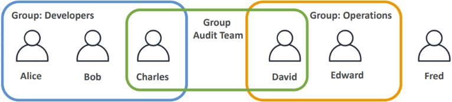
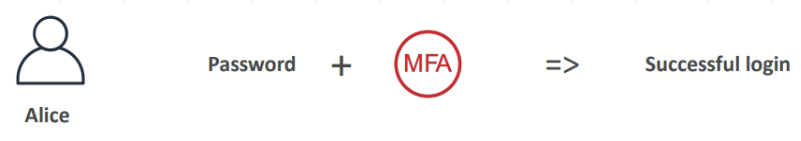
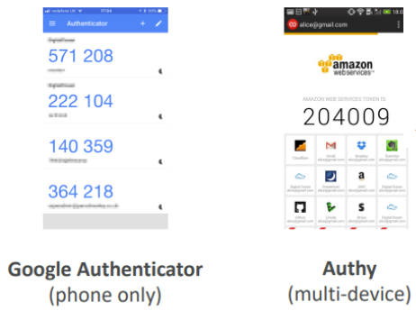
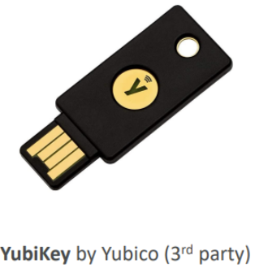

# AWS IAM (Identity and Access Management)

[1. Giới thiệu AWS IAM](#1)

[2. Các khái niệm chính](#2)

[3. Multi-Factor Authentication (MFA)](#3)

## 📌 1. Giới thiệu AWS IAM

- AWS IAM (Identity and Access Management) là dịch vụ giúp bạn quản lý quyền truy cập vào các tài nguyên AWS một cách an toàn.

- Nó cho phép bạn kiểm soát ai có thể thực hiện những hành động nào trên những tài nguyên nào trong môi trường AWS.

## 📌 2. Các khái niệm chính

|         Khái niệm         |      Giải thích      |      Ghi chú      |
| :------------------: | :-----------------: | :-----------------: |
|    Root user     | - Tài khoản mặc định được tạo khi bạn đăng ký một tài khoản AWS mới. - Tài khoản root này có toàn quyền truy cập vào tất cả các dịch vụ và tài nguyên trong tài khoản AWS. | AWS không khuyến khích chia sẻ và sử dụng root account cho các tác quản trị và vận hành hàng ngày (trừ khi thực sự cần thiết).  |
|  Users  | - Đại diện cho cá nhân (người) hoặc hệ thống (ứng dụng) có quyền truy cập vào các tài nguyên AWS. - Mỗi user có thể có thông tin đăng nhập riêng (như username, mật khẩu) và các khóa truy cập để sử dụng qua giao diện dòng lệnh hoặc API.  |   |
|    Groups    | - Cho phép gộp các user lại với nhau để áp dụng các quyền giống nhau. - Ví dụ có thể tạo nhóm “Admin” với quyền quản trị và thêm tất cả những user có vai trò quản trị vào nhóm này. | - Groups chỉ chứa các users, không chứa Gropus khác. - Các users không nhất thiết phải thuộc về 1 group, và 1 user có thể thuộc về nhiều groups.  |
| Policies | - Các quy tắc định nghĩa quyền truy cập cho mỗi user, xác định các hành động (actions) nào được cho phép hoặc không cho phép với các tài nguyên nào. - Các policies này có thể được gán cho users, groups, hoặc roles. - Policies có thể ở dạng JSON và chứa các yếu tố như Action, Resource, và Effect (Allow hoặc Deny). | AWS có sẵn nhiều Polices mà bạn có thể sử dụng ngay như: AdministratorAccess (quản trị viên), AmazonEC2FullAccess (developer). |
| Roles | - Trao quyền truy cập tạm thời cho các thực thể khác mà không cần sử dụng username hay mật khẩu. - Ví dụ, một ứng dụng chạy trên EC2 có thể assume (nhận) một role để có quyền truy cập tài nguyên mà không cần thông tin đăng nhập. | - Roles cũng bao gồm các IAM Policies. - Roles chỉ tạo ra các Access Key tạm thời để sử dụng trong thời gian ngắn. |

## 📌 3. Multi-Factor Authentication (MFA)

MFA hay xác thực nhiều lớp là phương thức bảo mật bổ sung cho mật khẩu.

Khi bật MFA, ngoài mật khẩu sẽ cần cũng cấp thêm một mã xác thực.

⚠️ AWS khuyến khích việc bật MFA để tăng cường bảo mật cho tài khoản AWS, đặc biệt là tài khoản root.

### Ví dụ các thiết bị MFA trong AWS:

#### 1️⃣ Thiết bị MFA ảo (Virtual MFA)

#### 2️⃣ Khóa bảo mật Universal 2nd Factor (U2F)

