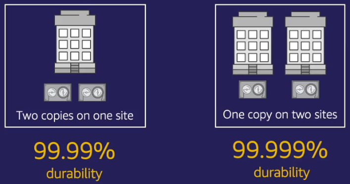
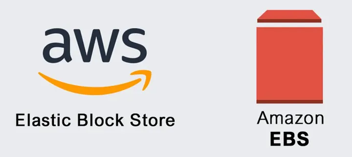
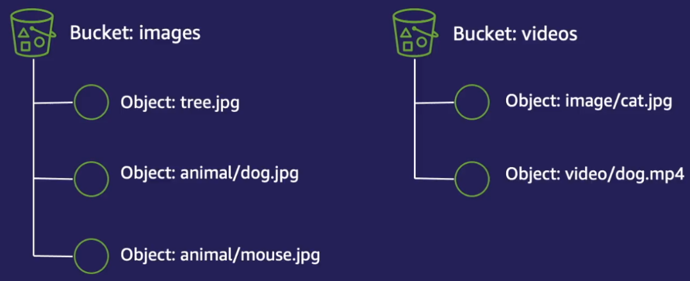
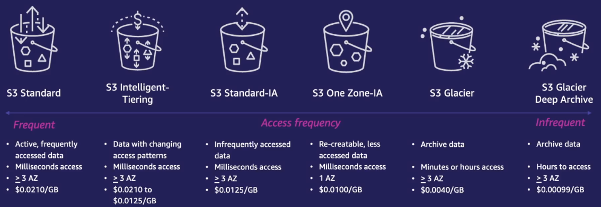

# Storage - Các dịch vụ lưu trữ (S3 & EBS)

[1. Tổng quan các dịch vụ lưu trữ Storage](#1)

[2. Các dịch vụ dịch chuyển dữ liệu](#2)

[3. Độ bền dữ liệu (durability)](#3)

[4. Amazone EBS](#4)

[5. Amazone S3](#5)

## 📌 1. Tổng quan các dịch vụ lưu trữ Storage

- Các dịch vụ lưu trữ trên AWS được chia làm 3 nhóm:
    - ❶ Block Storage (dịch vụ tiêu biểu là Amazone EBS) - Lưu trữ khối
        - ● Dữ liệu/file được chia thành các khối độc lập có kích thước bằng nhau.

        - ● Khi chỉnh sửa file, Block Storage sẽ chỉ cập nhật những khối chứa phần dữ liệu thay đổi.

        - ● Thường chỉ được sử dụng trên 1 máy tính duy nhất tại 1 thời điểm.

        - ● Khi muốn chia sẻ dữ liệu giữa các máy ảo, ta sẽ sử dụng các dịch vụ File System.

        - ● Thích hợp với lưu trữ dữ liệu yêu cầu I/O cao, cơ sở dữ liệu, hệ điều hành, và bất kỳ ứng dụng nào cần truy cập dữ liệu khối.

    - ❷ File System (dịch vụ tiêu biểu như Amazone EFS/FSx) - Lưu trữ file
        - ● Tổ chức dữ liệu dưới dạng cây thư mục, cho phép kết nối với nhiều máy ảo EC2 khác nhau một lúc.

        - ● Các dịch vụ File System trên AWS:
            - ✧ EFS: thường được dùng cho các máy chủ Linux.
            - ✧ FSx FSx for Windows File Server: thường được sử dụng cho các máy chủ Window.
            - ✧ FSx for Lustre: dùng cho các ứng dụng dữ liệu lớn, đòi hỏi hiệu năng đọc ghi lớn.

        - ● Thích hợp với nhu cầu cần chia sẻ tệp giữa nhiều ứng dụng, lưu trữ các tệp dữ liệu lớn như video hoặc hình ảnh, ứng dụng cần hệ thống tệp có khả năng chia sẻ.

    - ❸ Object Storage (dịch vụ tiêu biểu là Amazone S3) - Lưu trữ đối tượng
        - ● Lưu trữ các file dưới dạng một đơn vị duy nhất gọi là object mà không chia nhỏ.

        - ● Khi chỉnh sửa sẽ cần xóa object cũ và tải object mới. Vì vậy không thường sử dụng lưu trữ dữ liệu thay đổi thường xuyên.

        - ● Thích hợp với lưu trữ dữ liệu lâu dài, sao lưu, lưu trữ dữ liệu quy định cần giữ trong nhiều năm nhưng không yêu cầu truy cập thường xuyên với chi phí thấp.

## 📌 2. Các dịch vụ dịch chuyển dữ liệu

- Bổ trợ cho các dịch vụ lưu trữ là dịch vụ dịch chuyển dữ liệu.

- AWS cung cấp nhiều dịch vụ dịch chuyển dữ liệu khác nhau cho những trường hợp sử dụng khác nhau: backup, big data, machine learning, v.v.

- Các dịch vụ dịch chuyển dữ liệu được chia làm 2 nhóm chính:

### 1️⃣ Nhóm các dịch vụ dịch chuyển dữ liệu online (Dịch chuyển qua mạng)
- ● AWS DataSync

- ● AWS Transfer Family

- ● S3 Transfer Acceleration

### 2️⃣ Nhóm các dịch vụ dịch chuyển dữ liệu offline (Dịch chuyển ngoại tuyến)

- Thường được sử dụng khi đường truyền từ nơi phát sinh dữ liệu kém, hoặc để sao lưu dữ liệu tại nơi không có internet, hoặc khối lượng dữ liệu phát sinh quá lớn vượt quá khả năng dịch chuyển dữ liệu online.

- AWS sẽ cung cấp các thiết bị vật lý để khách hàng sao chép và gửi ngược lại cho AWS. AWS sẽ thực hiện việc sao chép dữ liệu vào các dịch vụ lưu trữ của AWS.

- Bao gồm các dịch vụ:
    - ● AWS Snowcone
    - ● AWS Snowball
    - ● AWS Snowmobile

- AWS cũng cung cấp dịch vụ đường truyền vật lý (AWS Direct Connect) kéo thẳng từ trung tâm dữ liệu của khách hàng đến Region của AWS.

## 📌 3. Độ bền dữ liệu (durability)

- Được đo bằng tỷ lệ dữ liệu không bị mất trong khoảng thời gian 1 năm.
    - Ví dụ độ bền là 99.99% có nghĩa là nếu chúng ta lưu 1 file thì sau 1 năm tỷ lệ file đó bị mất là 0.01%   .

- Bạn có thể tăng độ bên dữ liệu bằng cách sao lưu file ra nhiều kho lưu trữ khác nhau.

    

## 📌 4. Amazone EBS

- Amazon EBS (Elastic Block Store) là một dịch vụ lưu trữ thuộc nhóm Block Storage được thiết kế để sử dụng với các Amazon EC2 instance.
    - ✔️ EBS cung cấp khả năng lưu trữ khối tương tự như cách ổ cứng vật lý hoạt động trên máy chủ vật lý.
    - ✔️ EBS cung cấp hiệu năng rất cao, linh hoạt và dễ mở rộng.
    - ✔️ EBS rất dễ sử dụng, linh hoạt và dễ mở rộng.
    - ✔️ EBS đảm bảo độ bền dữ liệu lên tới 99.999%.

    

- Các trường hợp sử dụng của EBS bao gồm:
    - ➀ Lưu trữ dùng cho các ứng dụng doanh nghiệp: SAP ERP, Oracle ERP, Microsoft SharePoint, Microsoft Exchange.
    - ➁ Dùng cho các hệ cơ sở dữ liệu: MySQL, PostgreSQL, Oracle DB, SQL Server hay phi quan hệ như MongoDB.
    - ➂ Ứng dụng phân tích dữ liệu lớn.

### 📂 Các dòng ổ đĩa EBS

- ❶ HDD: Hiệu năng kém hơn, giá thành thấp hơn SSD.

- ❷ SSD: Hiệu năng tốt hơn, giá thành cao hơn HDD.

### 🛠 Bảo vệ dữ liệu với EBS snapshot

- Là tính năng sao lưu dữ liệu tại một thời điểm nào đó để backup.
    - Bạn có thể snapshot thủ công từ AWS Console hay AWS CLI hoặc viết các đoạn mã script hoặc sử dụng các công cụ tự động để định kỳ thực hiện snapshot ổ đĩa EBS.

- EBS thực hiện việc snapshot theo cơ chế Incremental, có nghĩa là:
    - ● Lần đầu snapshot sẽ sao lưu toàn bộ dữ liệu.
    - ● Những lần snapshot sau sẽ chỉ sao lưu dữ liệu bị thay đổi.

- Các bản snapshot này sau đó sẽ được chuyển đến dịch vụ Object Storage Amazone S3 để lưu trữ để đảm bảo độ bền dữ liệu cao.

- Data Lifecycle Manager (DLM):
    - ● Là tính năng quản lý vòng đời các phiên bản snapshot tự động.
    - ● DLM cho phép tự động luân chuyển các bản snapshot cũ vào các lớp ít truy cập dữ liệu của Amazone S3, cũng như xóa các bản snapshop quá cũ 1 cách tự động để tiết kiệm chi phí.

### 🧐 So sánh EBS và Instance Storage

- Về bản chất, những ổ đĩa EBS sẽ nằm trên thiết bị vật lý hoàn toàn độc lập với máy ảo EC2 và được kết nối đến máy ảo EC2 thông qua mạng nội bộ.
    - ✔️ Ưu điểm: linh hoạt và khả năng mở rộng cao
    - ❌ Nhược điểm: độ trễ khi thực hiện tác vụ đọc ghi sẽ tăng lên
    - ⚠️ Dù thực chất độ trễ EBS cũng sẵn đang là rất thấp, nhưng trong trường hợp cần độ trễ thấp hơn nữa thì chúng ta cần thiết bị lưu trữ kết nội trực tiếp đến máy ảo EC2 ở mức vật lý mà không cần thông qua mạng nội bộ.
    - 👉 Để giải quyết vấn đề đó, chúng ta có EC2 Instance Storage.

- EC2 Instance Storage:
    - ✔️ Ưu điểm: là loại ổ đĩa gắn liền với thiết bị vật lý của EC2.
    - ❌ Nhược điểm: không phải tất cả các loại máy ảo EC2 đều hỗ trợ Instane Storage.
    - ⚠️ Do gắn liền với thiết bị thiết bị vật lý của EC2. Nên khi cần di chuyển sang máy ảo khác (ví dụ do sự cố) thì Instance Storage không thể di chuyển theo => bị mất dữ liệu trong Instance Storage.
    - 👉 Chỉ nên sử dụng để lưu trữ các loại dữ liệu tạm thời.

## 📌 5. Amazone S3

- Simple Storage Service (S3) là một dịch vụ lưu trữ Object Storage mạnh mẽ được dùng cho nhiều trường hợp lưu trữ khác nhau như:
    - File tĩnh, ảnh, video, v.v. làm kho lưu trữ cho các hệ thống lữ trữ dữ liệu lớn hoặc kho lưu trữ dữ liệu ít truy cập với giá rẻ hoặc dữ liệu backup.

    

- ✅ Điểm mạnh của S3:
    - ● Dễ sử dụng, được vận hành hoàn toàn bởi AWS.
    - ● Do lưu trữ dưới dạng Object nên có khả năng mở rộng vô hạn, tự động co giãn.
    - ● Chi phí lưu trữ rẻ.

- Khi sử dụng S3 sẽ tạo ra các thùng chứa dữ liệu (Bucket).
    - ● Một Bucket như là một folder tổng chứa file (các file khi được upload lên còn gọi là các Object).

    

    - ● Mỗi Object được lưu dưới dạng key-value:
        - ✧ Key: tên file
        - ✧ Value: dữ liệu bên trong file

- S3 đảm bảo độ bền dữ liệu lên tới 99.999999999% (lưu trữ 10 triệu file thì trung bình 10 nghìn năm sẽ mất 1 file).
    - Lý do là mỗi khi tải dữ liệu lên S3 nó sẽ sao lưu ra nhiều thiết bị lưu trữ khác nhau ở trên 3 Availability Zones khác nhau trong cùng Region.

### 🔨 Mã hóa dữ liệu trong S3

- Để bảo vệ dữ liệu, S3 hỗ trợ cả việc mã hóa trên đường truyền (Encryption in transit) và mã hóa tại nơi lưu trữ (Encryption at rest).

#### 1️⃣ Encryption in transit
- S3 sử dụng HTTPS/TLS.

#### 2️⃣ Encryption at rest
- Gồm 2 phương thức:
    - ❶ Mã hóa Server side: mã hóa phía máy chủ (phía Amazone S3)
        - ● Chúng ta sẽ tải file lên ở dạng chưa mã hóa và S3 sẽ tự động mã hóa trước khi đẩy vào kho lưu trữ.

        - ● Một số lựa chọn khóa mã hóa:
            - ✧ SSE-S3 (Server side Encryption S3): khóa mã hóa được quản lý hoàn toàn bởi S3.

            - ✧ SSE-KMS: khóa mã hóa do chúng ta tạo ra và quản lý nó trên dịch vụ KMS (key management service).Người dùng muốn tải file lên S3 hoặc lấy file về, ngoài quyền truy cập S3 còn phải có quyền sử dụng khóa mã hóa trên KMS.

            - ✧ SSE-C (customer-provided keys): sử dụng các công cụ quản lý khóa mã hóa của riêng chúng ta. Người dùng muốn tải file lên S3 hoặc tải file về sẽ cần đính kèm khóa mã hóa.

    - ❷ Mã hóa client side: chúng ta tự thực hiện quản lý khóa mã hóa và mã hóa dữ liệu phía client trước khi tải lên S3.
        - AWS hỗ trợ Encryption SDK để hỗ trợ loại mã hóa này.

### 👀 Access Control - Kiểm soát truy cập vào S3

- ● Chúng ta có thể cấp quyền cho người dùng truy cập vào S3 bằng các IAM Policy.

- ● Ngoài ra, S3 cũng có các cơ chế quản lý truy cập của riêng: Amazone S3 bucket policy, Amazone S3 access control lists.

#### 1️⃣ Amazone S3 bucket policy
- ● Tương tự IAM Policy, S3 bucket policy cũng là một tài liệu JSON chỉ định những tác vụ có thể hoặc không thể làm.

- ● Điểm khác biệt là Policy này sẽ gắn vào Bucket thay vì người dùng (User), và nó sẽ chỉ định những người dùng nào bị ảnh hưởng bởi Policy này.

#### 2️⃣ Amazone S3 access control lists

- ● Là một cơ chế phân quyền cũ của S3, được định nghĩa dưới dạng XML với độ linh hoạt kém hơn Bucket Policy.

- ● AWS khuyên dùng Bucket Policy.

### 📊 S3 Access Points

- S3 bucket policy là cơ chế tốt để quản lý tập trung việc truy cập vào các S3 Bucket và Object.

- Tuy nhiên, nếu chúng ta có 1 bucket được chia sẻ cho rất nhiều người dùng và ứng dụng khác nhau với quyền hạn khác nhau thì Bucket Policy vẫn có một vài nhược điểm:
    - ● Mỗi nhóm người dùng có chính sách phân quyền khác nhau. Khi có sự thay đổi cách phân quyền của 1 nhóm mà chỉnh sửa policy chung thì sẽ gây ảnh hưởng đến các nhóm người dùng khác.

    - ● Bucket Policy có giới hạn độ dài. Nếu có quá nhiều người dùng thì có thể vượt quá độ dài cho phép.

🔥 Sử dụng S3 Access Points để giải quyết vấn đề trên.

- Về cơ bản, mỗi access point là một endpoint riêng biệt có địa chỉ và Access Point Policy riêng:
    - ● Access Point Policy cũng tương tự Bucket Policy.

    - ● Access Point Policy cho phép phân nhóm người dùng mà vẫn đảm bảo quản lý truy cập tập trung.

### 📂 S3 Storage Classes - Các lớp lưu trữ trong S3

- S3 có các lớp lưu trữ khác nhau phù hợp với các loại file với tần suất truy cập khác nhau với chi phí khác nhau. Việc hiểu rõ sẽ giúp tối ưu chi phí.

    

#### 1️⃣ S3 Standard
- Là lớp lưu trữ mặc định trong S3.

- Được tối ưu cho việc lưu trữ thường xuyên và truy cập nhanh.

- Không có yêu cầu tối thiểu về thời gian lưu trữ hay phí truy cập

- ✔️ Phù hợp lưu trữ dữ liệu mà bạn cần truy cập thường xuyên và đòi hỏi hiệu suất cao, như website, ứng dụng di động, hoặc các dịch vụ streaming.

#### 2️⃣ S3 Standard-IA (Infrequent Access)
- Lớp lưu trữ chi phí thấp hơn cho các dữ liệu truy cập không thường xuyên, nhưng vẫn cần truy cập nhanh khi cần.

- Chi phí lưu trữ thấp, và chi phí cho mỗi lượt truy cập cao hơn.

- ✔️ Phù hợp lưu trữ dữ liệu không cần truy cập thường xuyên nhưng cần khả năng truy cập nhanh khi có yêu cầu, như dữ liệu backup hoặc các bản ghi cũ.

#### 3️⃣ S3 One Zone-IA
- Giống như S3 Standard-IA nhưng lưu trữ dữ liệu chỉ trong một Availability Zone (AZ) thay vì nhiều AZ.

- Chi phí thấp hơn so với S3 Standard-IA.

- Độ bền và tính sẵn sàng kém hơn (không có tính dự phòng trong nhiều AZ).

- ✔️ Phù hợp lưu trữ dữ liệu không cần mức độ chịu lỗi cao hoặc có thể dễ dàng khôi phục lại, chẳng hạn như các bản sao lưu thứ cấp hoặc dữ liệu đã có thể tái tạo.

#### 4️⃣ S3 Glacier
- Lớp lưu trữ chi phí thấp được thiết kế cho dữ liệu lưu trữ dài hạn, ít khi truy cập.

- Khi cần truy cập, dữ liệu có thể mất từ vài phút đến vài giờ để phục hồi.

- Chi phí rất thấp, độ bền cao.

- ✔️ Phù hợp lưu trữ dữ liệu lâu dài mà không cần truy cập nhanh, chẳng hạn như dữ liệu cũ, hay các bản backup rất ít khi dùng đến.

#### 5️⃣ S3 Glacier Deep Archive
- Là lớp lưu trữ có chi phí thấp nhất, dành cho dữ liệu ít truy cập nhất và cần lưu trữ trong thời gian rất dài.

- Chi phí rẻ hơn Glacier thông thường.

- Phù hợp lưu trữ dữ liệu rất cũ, rất rất ít khi dùng đến.

#### 🚀 Luân chuyển dữ liệu giữa các lớp lưu trữ:
- Cách cơ bản nhất là thực hiện thủ công bằng cách cấu hình trên từng Object. 

- ❌ Tuy nhiên cách trên không hiệu quả khi khối lượng dữ liệu lớn.

- ✔️ Tính năng S3 lifecircle sẽ giúp tự động luân chuyển các lớp lưu trữ:
    - ● Cho phép chúng ta thay đổi lớp lưu trữ hoặc xóa từng object theo một mốc thười gian nhất định.

    - ● Ví dụ:
        - ✧ Video của camera an ninh thường được truy cập nhiều trong 1 tháng đầu tiên. Ít truy cập hơn trong 1 năm tiếp theo. Trong các năm tiếp theo, hầu như ta sẽ không truy cập vào nữa nhưng vẫn cần lưu trữ dữ phòng trong 10 năm.

        - ✧ Khi các video được tạo ra ta lưu chứng vào S3 Standard. Sau đó cấu hình lifecircle để chuyển các video vào S3 Standard-IA sau 1 tháng. Tiếp túc đẩy vào S3 Glacier Deep Archive sau 1 năm và tự động xóa video sau 10 năm.
    
    - ● Trường hợp chúng ta không nắm rõ sự thay đổi về tần suất, có thể sử dụng lớp lưu trữ cuối cùng S3 Intelligent-Tiering:
        - ✧ Về bản chất, đây không phải 1 lớp lưu trữ riêng biệt.

        - ✧ Khi Object đẩy vào lớp này, nó sẽ tự động giám sát lượt truy cập object đó và tự động luân chuyển vào các lớp lưu trữ khác của S3 để tối ưu chi phí.

        - ✧ Giúp tối ưu chi phí tự động mà không cần quản lý thủ công.
