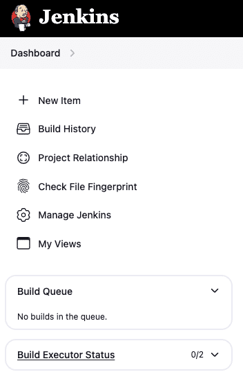

# Từ CI/CD đến Jenkins – Hành trình tự động hóa DevOps

Trong thế giới phát triển phần mềm hiện đại, tốc độ và độ ổn định là hai yếu tố sống còn. Những thao tác thủ công như build code, test, hay deploy không chỉ tốn thời gian mà còn dễ phát sinh lỗi.

Đó là lý do mô hình CI/CD (Continuous Integration – Continuous Delivery/Deployment) ra đời: giúp đội ngũ phát triển tự động hóa toàn bộ quy trình từ khi code được commit cho đến khi ứng dụng sẵn sàng chạy trên môi trường thật.

Và công cụ phổ biến nhất trong mô hình này chính là Jenkins.

[1. Nền tảng CI/CD](#1)

[2. Jenkins căn bản](#2)

[3. Jenkins Pipeline](#3)

<a name="1"></a>

## 📌 1. Nền tảng CI/CD

### 1️⃣ Trước khi có CI/CD: Nỗi đau của deploy thủ công

- Hãy tưởng tượng một nhóm dev đang phát triển web app:

  - ✧ Mỗi người làm trên máy riêng, push code khi xong.

  - ✧ Khi đến ngày release, cả team gom code, build thủ công, rồi copy file lên server.

  - ✧ Tester kiểm tra, nếu lỗi thì rollback cũng bằng tay.

- ❌ Vấn đề xảy ra:

  - Mỗi người có môi trường khác nhau → “chạy trên máy tôi thì được”.

  - Mỗi lần deploy là một lần “cầu nguyện”.

- 👉 Khi dự án lớn hơn, team có nhiều người và nhiều môi trường (dev, staging, production), sự thủ công trở thành rào cản cho tốc độ và độ tin cậy.

### 2️⃣ CI/CD là gì?

#### 🔹 CI - Tích hợp liên tục (Continuous Integration)

- Là việc mỗi khi developer commit code lên repository (GitHub/GitLab...), hệ thống sẽ tự động build và chạy test để đảm bảo code mới không phá vỡ hệ thống hiện có.

- ✅ CI giúp:

  - ➀ Phát hiện lỗi sớm.

  - ➁ Giảm rủi ro “merge cuối kỳ”.

  - ➂ Đảm bảo mọi người luôn làm việc trên nền code ổn định.

#### 🔹 CD - Triển khai liên tục (Continuous Deployment)

- Là bước tự động deploy thẳng ra production sau khi test pass.
  - ✅ Không còn bước chờ người kiểm duyệt, mọi thay đổi trong code được đưa đến tay người dùng trong vài phút.

### 3️⃣ CI/CD pipeline hoạt động như thế nào?

- Một pipeline cơ bản gồm các bước:

  ```
  [Developer Commit]
        ↓
     [Build Code]
        ↓
     [Run Tests]
        ↓
     [Package Artifact]
        ↓
     [Deploy to Environment]
        ↓
     [Notify Result]
  ```

  | Stage   | Mô tả                                     | Công cụ thường dùng          |
  | ------- | ----------------------------------------- | ---------------------------- |
  | Build   | Compile mã nguồn, cài dependency          | Maven, Gradle, npm           |
  | Test    | Chạy unit/integration test                | JUnit, pytest, Jest          |
  | Package | Đóng gói thành artifact hoặc Docker image | Docker, Maven                |
  | Deploy  | Triển khai lên môi trường (staging/prod)  | Jenkins, Ansible, Kubernetes |
  | Notify  | Gửi thông báo trạng thái                  | Slack, Email, Dashboard      |

### 4️⃣ Lợi ích khi áp dụng CI/CD

| Lợi ích                         | Ý nghĩa thực tế                                |
| ------------------------------- | ---------------------------------------------- |
| 🧠 Phát hiện lỗi sớm            | Code sai sẽ được cảnh báo ngay khi commit      |
| ⚡ Tăng tốc release             | Mỗi bản build có thể release nhanh chóng       |
| 🧩 Giảm lỗi con người           | Mọi thao tác build/test/deploy tự động hóa     |
| 🔁 Dễ rollback                  | Lưu lịch sử bản build, dễ quay lại bản ổn định |
| 📈 Nâng cao chất lượng phần mềm | Test, lint, và static check diễn ra liên tục   |

<a name="2"></a>

## 📌 2. Jenkins căn bản

- Jenkins là một trong những công cụ mạnh nhất để hiện thực hóa CI/CD.

- Jenkins là một công cụ mã nguồn mở giúp tự động hóa các bước trong quy trình phát triển phần mềm, đặc biệt là build, test, và deploy.

### ✅ Ưu điểm

- ➀ Thiết lập các job (nhiệm vụ) như build code, chạy test, copy file, triển khai ứng dụng.

- ➁ Theo dõi kết quả qua giao diện web thân thiện.

- ➂ Mở rộng tính năng bằng hơn 1800 plugin (Git, Docker, Slack, AWS, Kubernetes…).

- ➃ Định nghĩa pipeline bằng code (Jenkinsfile) để version-control được.

### 1️⃣ Kiến trúc cơ bản của Jenkins

- Jenkins có thiết kế theo mô hình Master-Agent (hoặc Controller-Agent trong bản mới):
  ```scss
   ┌──────────────────────────────────────────────┐
   │                  Jenkins Master              │
   │  - Web UI                                    │
   │  - Quản lý job & pipeline                    │
   │  - Lên lịch, phân phối build                 │
   └───────────────┬──────────────────────────────┘
                   │
        ┌──────────┴───────────┐
        │                      │
  ┌────────────┐        ┌────────────┐
  │ Build Agent│        │ Build Agent│
  │ (Node #1)  │        │ (Node #2)  │
  └────────────┘        └────────────┘
  ```

#### 🔹 Jenkins Master (Controller):

- ✧ Là trung tâm điều phối.

- ✧ Quản lý giao diện web, lưu cấu hình job, theo dõi kết quả build.

- ✧ Phân phối tác vụ đến các agent.

#### 🔹 Jenkins Agent (Node):

- ✧ Là nơi thực thi job (build/test/deploy).

- ✧ Có thể chạy trên máy khác (tách biệt với master).

- ✧ Giúp chia tải, tận dụng nhiều môi trường build khác nhau.

### 2️⃣ Các khái niệm quan trọng trong Jenkins

| Khái niệm         | Mô tả                                                                    |
| ----------------- | ------------------------------------------------------------------------ |
| **Job / Project** | Đơn vị cơ bản trong Jenkins – chứa cấu hình build/test/deploy            |
| **Build**         | Một lần thực thi của job                                                 |
| **Workspace**     | Thư mục Jenkins dùng để lưu source code, artifact                        |
| **Pipeline**      | Tập hợp nhiều stage (build, test, deploy…) được định nghĩa bằng code     |
| **Jenkinsfile**   | File script định nghĩa pipeline, thường lưu chung với source code        |
| **Plugin**        | Thành phần mở rộng để Jenkins làm việc với Git, Docker, AWS, Slack, v.v. |

### 3️⃣ Cài đặt Jenkins

#### ⚠️ Điều kiện tiên quyết

- ➀ Jenkins được viết hoàn toàn bằng Java nên khi cài hãy đảm bảo bạn đã cài JDK (phiên bản 11 trở lên - khuyến nghị JDK 17).

- ➁ Một hệ thống có RAM 4 GB trở lên và dung lượng lưu trữ 50 GB trở lên là lý tưởng cho các nhóm nhỏ.

#### ❶ Windows

- Tải .war hoặc .msi từ [jenkins.io](https://www.jenkins.io/download/).

- Sau khi chạy, mở trình duyệt:

  ```
  http://localhost:8080
  ```

  và làm theo hướng dẫn để:

  - ✧ Mở khóa Jenkins (dùng mật khẩu trong terminal hoặc log).

  - ✧ Cài plugin gợi ý.

  - ✧ Tạo tài khoản admin đầu tiên.

#### ❷ Linux (Ubuntu)

- ```bash
  sudo apt update
  sudo apt install openjdk-11-jdk
  wget https://get.jenkins.io/war-stable/latest/jenkins.war
  java -jar jenkins.war
  ```

#### ❸ Docker

- ```bash
  docker run -p 8080:8080 -p 50000:50000 jenkins/jenkins:lts
  ```

### 4️⃣ Tạo job đầu tiên

- 

- ❶ Vào `Dashboard` → `New Item`.

- ❷ Chọn `Freestyle Project`, đặt tên ví dụ `Hello Jenkins`.

- ❸ Trong phần `Build Steps`, chọn `Execute Shell` (Linux) hoặc `Execute Windows Batch Command`.

- ❹ Nhập nội dung:

  ```bash
  echo "Hello from Jenkins!"
  ```

- ❺ Nhấn Save → Build Now.
  - Kết quả: Jenkins sẽ chạy job, hiện log trong console output.

### 5️⃣ Trigger build tự động khi push code

- Đây là điểm nối giữa Git và CI:

  - ❶ Vào cấu hình job → `Source Code Management` → chọn Git, nhập repo URL.

  - ❷ Trong phần `Build Triggers`, chọn `Poll SCM` hoặc `GitHub hook trigger`.

  - ❸ Cấu hình webhook trong GitHub để Jenkins nhận event mỗi khi có commit mới.

- 👉 Từ nay, mỗi lần push code → Jenkins tự build → bạn xem kết quả ngay.

<a name="3"></a>

## 📌 3. Jenkins Pipeline

- Các job truyền thống của Jenkins chỉ chạy tuần tự từng bước cấu hình bằng tay.

- **Pipeline** cho phép định nghĩa toàn bộ quy trình `Build → Test → Deploy` bằng code, lưu lại trong repository cùng với source.

- 👉 Đây chính là nền tảng giúp Jenkins trở thành công cụ CI/CD hiện đại và linh hoạt.

### 1️⃣ Jenkins Pipeline là gì?

- **Jenkins Pipeline** là một tập hợp các bước (steps) mô tả cách Jenkins thực hiện build, test và deploy ứng dụng.

- Có 2 kiểu định nghĩa chính:

  - ➀ **Declarative Pipeline** – dễ đọc, cú pháp rõ ràng, phù hợp cho hầu hết dự án hiện nay.

  - ➁ **Scripted Pipeline** – linh hoạt, cho phép viết logic phức tạp bằng Groovy (thường dùng trong dự án nâng cao).

- **Jenkins Pipeline** thường được lưu trong file có tên Jenkinsfile tại gốc repo.

### 2️⃣ Ví dụ Declarative Pipeline

- ```groovy
  pipeline {
      agent any
      stages {
          stage('Build') {
              steps {
                  echo 'Building application...'
                  bat 'mvn clean package'
              }
          }
          stage('Test') {
              steps {
                  echo 'Running tests...'
                  bat 'mvn test'
              }
          }
          stage('Deploy') {
              steps {
                  echo 'Deploying to staging...'
              }
          }
      }
  }
  ```

- Trong đó:
  - `agent any`: Cho phép pipeline chạy trên bất kỳ agent nào.
  - `stage`: Đại diện cho một bước lớn trong quy trình.
  - `steps`: Các lệnh cụ thể mà Jenkins sẽ thực hiện.
