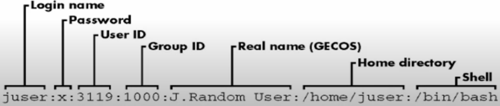
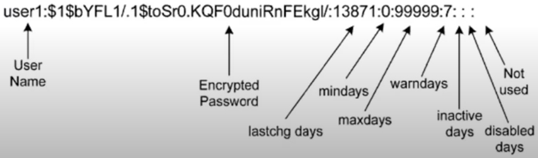
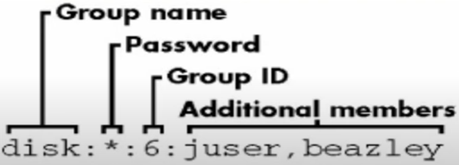

# Intermediate

[1. Quản trị Người Dùng & Quyền Hạn](#1)

[2. Quản lý Mạng](#2)

<a name="1"></a>

## 📌 1. Quản trị Người Dùng & Quyền Hạn

- Linux là hệ điều hành đa người dùng, nên việc quản lý tài khoản và quyền hạn rất quan trọng.

- Trên Linux có 2 loại tài khoản user:

  - Tài khoản user hệ thống: thực thi các module, script cần thiết phục vụ hệ điều hành.
  - Tài khoản user người dùng: là những tài khoản để login sử dụng hệ điều hành. Tài khoản root là tài khoản có quyền cao nhất và được tự động tạo khi cài đặt Linux.

- Đặc điểm của mỗi user:

  - Tên user là duy nhất, chỉ đặt tên chữ thường, chữ hoa
  - Mỗi user có mã định danh duy nhất (uid)
  - Mỗi user có thể thuộc về nhiều nhóm (group).
  - User root có uid = gid = 0.

- File /etc/passwd:

  - Là file văn bản chưa thông tin về các tài khoản user trên máy. Mọi user đều có thể xem nhưng chỉ có root mới có quyền thay đổi.
  - Để xem nội dung file:
    ```bash
    cat /etc/passwd
    ```
  - Cấu trúc mỗi dòng:
    

- File /etc/shadow:
  - Là file văn bản chứa thông tin về mật khẩu của các tài khoản trên máy.
  - Chỉ root mới có quyền xem file này
  - User root có quyền reset mật khẩu bất cứ ai.
  - Cấu trúc mỗi dòng:
    

### 🔹 Quản lý Tài Khoản Người Dùng

- Tạo, xóa và sửa Người Dùng:

  ```bash
  # Tạo người dùng mới (mặc định thư mục /home sẽ được tạo)
  sudo useradd -m username

  # Đặt mật khẩu cho user
  sudo passwd username

  # Tạo user với shell mặc định
  sudo useradd -m -s /bin/bash username

  # Xóa user nhưng giữ lại thư mục home
  sudo userdel username


  # Xóa user và thư mục home
  sudo userdel -r username

  # Chỉnh sửa thông tin user
  sudo usermod -l new_username old_username  # Đổi tên user
  ```

### 🔹 Quản lý Nhóm

- Linux sử dụng hệ thống nhóm (group) để phân quyền.

- Nhóm là tập hợp nhiều user, có tên duy nhất với mã định danh gid.

- Khi tạo user mà chưa chỉ định nhóm cho user thì mặc định một nhóm sẽ được tạo ra.

- File /etc/group:

  - Là file văn bản chứa thông tin các nhóm trên máy.
  - Mọi user đều có thể xem nhưng chỉ root mới có thể thay đổi.
  - Cấu trúc mỗi dòng:
    

- Tạo và xóa nhóm:

  ```bash
  # Tạo nhóm mới
  sudo groupadd groupname

  # Xóa nhóm
  sudo groupdel groupname
  ```

- Quản lý Thành Viên Nhóm:

  ```bash
  # Thêm user vào nhóm
  sudo usermod -aG groupname username

  # Xóa user khỏi nhóm
  sudo gpasswd -d username groupname

  # Xem nhóm của user
  groups username
  ```

### 🔹 Phân Quyền File & Thư Mục

Trong Linux, mỗi file hoặc thư mục có 3 quyền cơ bản:

|  Quyền  | Ký hiệu | Giá trị số |               Mô tả                |
| :-----: | :-----: | :--------: | :--------------------------------: |
|  Read   |    r    |     4      |     Đọc nội dung file/thư mục      |
|  Write  |    w    |     2      |  Ghi hoặc chỉnh sửa file/thư mục   |
| Execute |    x    |     1      | Thực thi file như một chương trình |

- Xem quyền hạn:

  ```bash
  ls -l filename
  ```

  📝 Kết quả:

  ```bash
  -rw-r--r--  1 user group  1234 Feb 20 12:34 file.txt
  ```

  - Cột đầu: rw-r--r-- (quyền của user, group, others)
  - user group là chủ sở hữu và nhóm của file

- Thay đổi quyền hạn:

  ```bash
  # Dùng số (chmod octal mode)
  chmod 755 filename
  ```

  - 7 = rwx (chủ sở hữu)
  - 5 = r-x (nhóm)
  - 5 = r-x (người khác)

  ```bash
  # Dùng ký tự
  chmod u+x filename  # Thêm quyền thực thi cho chủ sở hữu
  chmod g-w filename  # Xóa quyền ghi của nhóm
  chmod o+r filename  # Thêm quyền đọc cho người khác
  ```

- Thay đổi chủ sở hữu:

  ```bash
  # Đổi chủ sở hữu của file
  sudo chown user:group filename

  # Đổi quyền sở hữu cho thư mục và toàn bộ file bên trong
  sudo chown -R user:group directory/
  ```

<a name="2"></a>

## 📌 2. Quản lý Mạng

Quản lý mạng trong Linux bao gồm việc:

- Kiểm tra cấu hình mạng
- Thiết lập địa chỉ IP
- Quản lý firewall, kiểm tra kết nối và xử lý sự cố mạng
