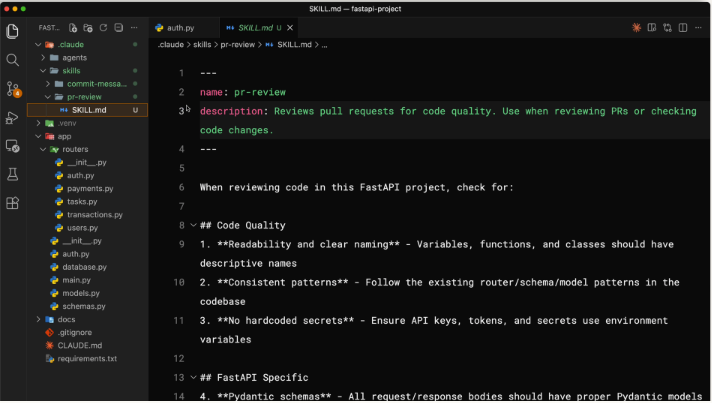

# Giới thiệu về Agent Skills

- Tham khảo: *https://anthropic.skilljar.com/introduction-to-agent-skills*

## Nội dung chính

[1. Skills là gì?](#1)

[2. Tạo thử một Skill](#2)

[3. Configuration & multi-file skills](#3)

[4. Chia sẻ Skills](#4)

[5. Skills và Subagents](#5)

---

<a name="1"></a>

## 📌 1. Skills là gì?

- Skills bản chất là các tệp Markdown có thể tái sử dụng, dạy cho Claude Code cách xử lý các tác vụ cụ thể một cách tự động.
  - Ví dụ: Thay vì lặp lại hướng dẫn mỗi khi bạn yêu cầu Claude review Pull Request hoặc viết commit message, bạn chỉ cần viết skill một lần và Claude sẽ áp dụng nó bất cứ khi nào tác vụ đó được thực hiện.

### 1️⃣ Những điểm chính cần nhớ

- Skills là các thư mục chứa hướng dẫn mà Claude Code có thể khám phá và sử dụng để xử lý các nhiệm vụ chính xác hơn.
  - Mỗi kỹ năng nằm trong một têp `SKILL.md` có **name** (tên) và **description** (mô tả) ở phần đầu tệp.
  - Bên dưới bạn viết các hướng dẫn thực tế, hoặc bất cứ điều gì Claude cần biết cho nhiệm vụ đó.

  - 

- Claude sử dụng **description** để đối chiếu skill với yêu cầu.
  - Khi bạn yêu cầu Claude làm điều gì đó, hệ thống sẽ so sánh yêu cầu của bạn với các mô tả kỹ năng có sẵn và kích hoạt những kỹ năng phù hợp.

### 2️⃣ Nơi đặt Skills

- Skills cá nhân đặt ở `~/.claude/skills` sẽ theo bạn suốt tất cả các dự án.

- Skills dự án sẽ được lưu trữ tại `.claude/skills` trong repository dự án và được chia sẻ với bất kỳ ai clone repository đó.

### 3️⃣ Skills vs. `CLAUDE.md` vs. Slash Commands

- Skills chỉ được tải khi cần thiết — không giống như `CLAUDE.md` (được tải trong mọi cuộc hội thoại) hoặc slash commands (cần gọi tên rõ ràng khi có yêu cầu). Skills tự động kích hoạt khi Claude nhận ra tình huống.

### 4️⃣ Khi nào cần đến Skills?

- Nếu bạn thấy mình phải giải thích cùng một điều cho Claude nhiều lần, đó là một Skills cần được trau dồi.

### ⚠️ Quan trọng

- GitHub Copilot hiện cũng đã hỗ trợ Agent Skills từ cuối năm 2025 rồi.
  - Bạn giờ có thể tạo skill riêng cho project qua `.github/skills` hoặc `.claude/skills` (Copilot đọc luôn).

---

<a name="2"></a>

## 📌 2. Tạo thử một Skill

- Giả sử bạn cần xây dựng một kỹ năng dạy Claude cách viết Pull Request Description theo format nhất quán.

### 1️⃣ Tạo dựng một skill

- ❶ Tạo một thư mục cho skill của bạn. Tên thư mục phải trùng với tên skill:

  ```bash
  mkdir -p ~/.claude/skills/pr-description
  ```

- ❷ Tạo một file `SKILL.md` bên trong thư mục đó:

  ```markdown
  ---
  name: pr-description
  description: Writes pull request descriptions. Use when creating a PR, writing a  PR, or when the user asks to summarize changes for a pull request.
  ---

  When writing a PR description:

  1. Run `git diff main...HEAD` to see all changes on this branch
  2. Write a description following this format:

  ## What

  One sentence explaining what this PR does.

  ## Why

  Brief context on why this change is needed

  ## Changes

  - Bullet points of specific changes made
  - Group related changes together
  - Mention any files deleted or renamed
  ```

  - Trong đó:
    - `name` - tên skill.
    - `description` - mô tả cho Claude biết khi nào nên sử dụng nó.
    - Mọi thứ sau dấu gạch ngang thứ hai (`---`) là các chỉ dẫn mà Claude tuân theo khi skill được kích hoạt.

### 2️⃣ Kiểm tra skill

- Claude Code tải các skill khi khởi động, vì vậy hãy khởi động lại phiên làm việc (session) sau khi tạo một skill mới.

- Bạn có thể kiểm tra xem skill vừa tạo có sẵn hay chưa bằng cách chat hỏi Claude Code show danh sách các skills khả dụng.
  - Nếu thấy skill của mình được liệt kê, **Congratulations**!

### 3️⃣ Cách skill hoạt động

- Khi Claude Code khởi chạy, nó quét tìm các skills nhưng chỉ tải tên và mô tả chứ không phải toàn bộ nội dung.

- Khi bạn gửi yêu cầu, Claude sẽ so sánh tin nhắn của bạn với mô tả của tất cả các skills có sẵn.
  - Nếu phù hợp với mô tả của skill nào thì Claude sẽ xác nhận lại với bạn việc load skill đó.

- Sau khi bạn xác nhận, Claude mới đọc toàn bộ nội dung file `SKILL.md` và làm theo hướng dẫn trong đó.

### 4️⃣ Skill ưu tiên

- Giả sử bạn clone một repo có skill cùng tên với một trong những skill cá nhân của bạn, skill nào sẽ được ưu tiên?

- Thứ tự ưu tiên cụ thể sẽ là:
  - ➀ Enterprise — Skill cấp tổ chức áp dụng cho toàn bộ team / công ty
  - ➁ Personal (Cá nhân) — home directory của bạn (`~/.claude/skills`)
  - ➂ Project — thư mục bên trong repo (`.claude/skills`)
  - ➃ Plugin — skill đến từ plugin / extension đã cài đặt

- Để tránh xung đột, hãy sử dụng tên skill mô tả rõ ràng. Thay vì chỉ dùng từ "review", hãy dùng những từ như "frontend-review" hoặc "backend-review".

### 5️⃣ Update và xóa skill

- Để cập nhật skill, hãy chỉnh sửa file `SKILL.md` của kỹ năng đó.

- Để xóa skill, hãy xóa thư mục chứa nó. Khởi động lại Claude Code sau khi thực hiện bất kỳ thay đổi nào để các thay đổi có hiệu lực.

---

<a name="3"></a>

## 📌 3. Configuration & multi-file skills

### 1️⃣ Các trường Skill Metadata

- Agent Skills hỗ trợ một số trường khác trong phần đầu của file `SKILL.md`:
  - `name` — Xác định tên skill của bạn. Chỉ sử dụng chữ cái thường, số và dấu gạch ngang. Tối đa 64 ký tự. Phải trùng khớp với tên thư mục của bạn.

  | Field                      | Ý nghĩa                                                                | Tiêu chuẩn                                                                                                     |
  | -------------------------- | ---------------------------------------------------------------------- | -------------------------------------------------------------------------------------------------------------- |
  | `name` (bắt buộc)          | Tên skill                                                              | Chỉ sử dụng chữ cái thường, số và dấu gạch ngang<br>Tối đa 64 ký tự<br>Phải trùng khớp với tên thư mục của bạn |
  | `description` (bắt buộc)   | Mô tả khi nào nên sử dụng skill                                        | Tối đa 1.024 ký tự                                                                                             |
  | `allowed-tools` (tùy chọn) | Giới hạn các tools mà Claude có thể sử dụng khi skill được kích hoạt |                                                                                                                |
  | `model` (tùy chọn)         | Chỉ định mô hình Claude nào sẽ được sử dụng cho skill                |                                                                                                                |

### 2️⃣ Cách viết `description` hiệu quả

- `description` phải trả lời được cho 2 câu hỏi:

  - ❶ Skill này có tác dụng gì?

  - ❷ Claude nên sử dụng nó khi nào?

### 3️⃣ Giới hạn tools sử dụng bằng `allowed-tools`

- Đôi khi trong bối cảnh quy trình làm việc đòi hỏi bảo mật, bạn cần một skill chỉ có thể đọc file chứ không chỉnh sửa chúng.

  ```markdown
  ---
  name: codebase-onboarding
  description: Helps new developers understand the system works.
  allowed-tools: Read, Grep, Glob, Bash
  model: sonnet
  ---
  ```

  - Trong trường hợp này, Claude chỉ có thể sử dụng các tools `Read, Grep, Glob, Bash` mà không cần xin phép — nhưng không bao gồm được chỉnh sửa, viết.

- Nếu bạn bỏ qua `allowed-tools` hoàn toàn, skill này sẽ không hạn chế bất cứ điều gì.

### 4️⃣ Tổ chức thư mục skill mở rộng

- Như đã biết, khi Claude kích hoạt một skill, nó sẽ tải nội dung của tệp `SKILL.md` đó vào context.

- Nhưng đôi khi, bạn cần các tài liệu tham khảo, rõ ràng không thể nhét mọi thứ vào một file `CLAUDE.md` dài hàng nghìn dòng.
  - Bởi nó chiếm nhiều không gian Context Windows và việc bảo trì nó cũng không dễ dàng.

- Phương pháp lúc này là chỉ giữ các hướng dẫn thiết yếu trong tệp `SKILL.md` và đặt tài liệu tham khảo chi tiết vào các tệp riêng biệt mà Claude chỉ đọc khi cần thiết.

- Thư mục kỹ năng lúc này có thể tổ chức thành:
  ```
  scripts/ — Mã thực thi, dùng để Claude chạy thay vì đọc
  references/ — Tài liệu bổ sung
  assets/ — Hình ảnh, template hoặc các tệp dữ liệu khác
  ```

- Sau đó, trong `SKILL.md`, hãy liên kết đến các tệp hỗ trợ với hướng dẫn rõ ràng về thời điểm tải chúng.

- Một nguyên tắc chung hữu ích: giữ cho tệp `SKILL.md` dưới 500 dòng. Nếu vượt quá con số đó, hãy xem xét liệu có nên chia nội dung thành các tệp tham chiếu riêng biệt hay không.

---

<a name="4"></a>

## 📌 4. Chia sẻ Skills

- Các skills tạo ra sẽ trở nên có giá trị hơn nhiều khi được chia sẻ trong team hoặc tổ chức.

- Cách đơn giản nhất là commits skill của bạn vào thư mục `.claude/skills` trên repo của bạn để mọi người nhận được chúng khi clones repo.

-  Thư mục này sẽ chứa cả các agent, hook, skill và settings của bạn.

---

<a name="5"></a>

## 📌 5. Skills và Subagents

- Các Subagents sẽ không tự động nhận biết được skill của bạn.

- Tuy nhiên, các custom subagents do bạn định nghĩa có thể sử dụng skill, nhưng chỉ khi bạn liệt kê chúng một cách rõ ràng. Và nó được load ngay khi subagents đó bắt đầu, khác với cách load như trong cuộc hội thoại chính.
