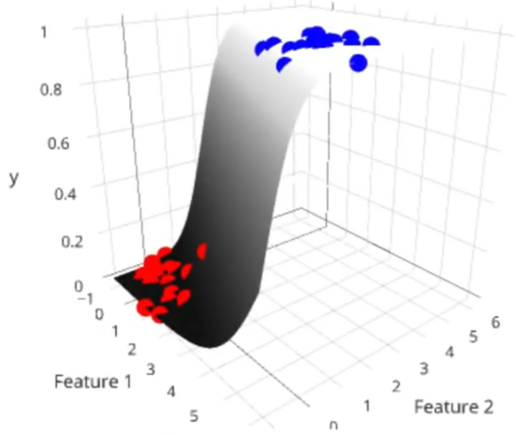
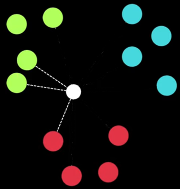

# Nền tảng AI

[1. AI là gì?](#1)

[2. Machine Learning là gì?](#2)

[3. Deep Learning là gì?](#3)

[4. Mô hình (Model) trong AI](#4)

[5. Các khái niệm nền tảng](#5)

[6. Các thuật toán cơ bản trong ML](#6)

[7. Framework cơ bản cho ML](#7)

<a name="1"></a>

## 📌 1. AI là gì?

AI (Artificial Intelligence) = Máy có khả năng bắt chước hành vi thông minh của con người.

Ví dụ:

- ✦ Chatbot trả lời tự nhiên.

- ✦ Xe tự lái.

- ✦ Nhận diện hình ảnh.

- ✦ Đề xuất sản phẩm.

AI là khái niệm rộng, bao gồm rất nhiều nhánh, trong đó Machine Learning và Deep Learning là 2 nhánh quan trọng nhất.

<a name="2"></a>

## 📌 2. Machine Learning là gì?

**Machine Learning (ML) = Máy tự học từ dữ liệu.**

Ví dụ trước đây (cách truyền thống): Muốn lọc email spam → bạn phải tự viết các rule: “nếu có chữ free, money, xxx thì đánh spam”.

Bây giờ (ML):

- ✦ Bạn đưa cho máy 10.000 email spam + 10.000 email sạch

- ✦ Máy tự học ra “mẫu” để phân biệt → bạn không cần viết rule nữa.

👉 ML thay thế rule thủ công bằng khả năng tự học từ dữ liệu.

<a name="3"></a>

## 📌 3. Deep Learning là gì?

**Deep Learning = ML đặc biệt mạnh, sử dụng Neural Network (mạng nơ-ron nhân tạo).**

Nếu ML là “máy học từ dữ liệu”, thì Deep Learning là:

- ✦ Máy học bằng nhiều tầng nơ-ron.

- ✦ Khả năng tự học feature phức tạp.

- ✦ Hoạt động giống não người ở mức khái niệm.

Deep Learning phù hợp với:

- ✦ Nhận diện hình ảnh (OCR, phân biệt mèo/chó).

- ✦ Nhận diện giọng nói.

- ✦ ChatGPT (dùng Transformer, thuộc Deep Learning).

- ✦ Vision, NLP (Natural Language Processing - xử lý ngôn ngữ tự nhiên), recommendation…

### Khác nhau giữa AI - ML - DL

```bash
AI                      # AI là cái “vũ trụ” lớn
│
└── Machine Learning    # ML là 1 hành tinh trong vũ trụ đó
    │
    └── Deep Learning   # Deep Learning là 1 khu vực siêu phát triển trong hành tinh ML
```

<a name="4"></a>

## 📌 4. Mô hình (Model) trong AI

**Mô hình = “hộp đen” được huấn luyện để làm một việc.**

Bạn chỉ cần nhớ:

- Model = file .pth / .bin / .onnx… chứa "điều máy đã học".

<a name="5"></a>

## 📌 5. Các khái niệm nền tảng

|   Khái niệm    |                 Giải thích                  |                                                              Ghi chú                                                              |
| :------------: | :-----------------------------------------: | :-------------------------------------------------------------------------------------------------------------------------------: |
|    Dataset     | Tập dữ liệu dùng để dạy và kiểm tra mô hình |                                                                                                                                   |
|  Training set  |            Dữ liệu để dạy model             |                                           Đơn giản như việc: Training - bạn làm bài tập                                           |
| Validation set |        Kiểm tra trong quá trình học         |                                               Validation - làm bài kiểm tra giữa kỳ                                               |
|    Test set    | Kiểm tra cuối cùng, không dính vào training |                                                      Test - kiểm tra cuối kỳ                                                      |
|     Epoch      |   Mô hình “đi qua toàn bộ dataset 1 lần”    | Nếu bạn có dataset 10.000 records, train 20 epochs → mô hình đã nhìn 200.000 samples (nhưng các sample lặp lại trong nhiều epoch) |
|      Loss      |      Độ sai của mô hình so với thực tế      |                                        Mục tiêu của training: Giảm loss càng thấp càng tốt                                        |

<a name="6"></a>

## 📌 6. Các thuật toán cơ bản trong ML

### 1️⃣ Linear Regression – Vẽ một đường thẳng tốt nhất

Dùng khi output là giá trị số

Ví dụ:

- ✦ Dự đoán giá nhà.

- ✦ Dự đoán sales.

- ✦ Dự đoán chiều cao.

Là thuật toán hồi quy tuyến tính, chủ yếu quan tâm đến việc giảm thiểu sai sót của mô hình hoặc đưa ra các dự đoán chính xác nhất có thể.

#### 💡 Ý tưởng:

- ```
  Y = mx + b

  Trong đó:
    (Y) là biến phụ thuộc
    (x) là biến độc lập
    (m) là độ dốc của đường thẳng và (b) là điểm cắt trục y
  ```

#### 🎯 Mục tiêu:

- Tìm ra các giá trị của (m) và (b) phù hợp nhất với dữ liệu.

#### 🧐 Phân tích ví dụ dễ hiểu:

- ```
  Dự đoán giá nhà dựa trên diện tích của ngôi nhà.
  ```

  - ✧ Diện tích của ngôi nhà (biến độc lập) trở thành (x)

  - ✧ Giá của ngôi nhà (biến phụ thuộc) trở thành (Y)

Chúng ta có một đống dữ liệu dạng các điểm:

- ```
  40m² → 2.2 tỷ
  50m² → 2.8 tỷ
  65m² → 3.6 tỷ
  75m² → 4.1 tỷ
  ```

Khi plot lên biểu đồ, nó trông như sau:

- ```
  Giá ^
      |        *
      |     *
      |   *
      | *
      +------------------> Diện tích
  ```

👉 Linear Regression sẽ tìm đường thẳng đi qua đám điểm đó sao cho sát nhất có thể (bình phương khoảng cách từ đường thẳng đến các điể dữ liệu là nhỏ nhất):

- 

Ví dụ tìm ra phương trình hồi quy là:

```
Y = 200x + 50
```

👉 Cho thấy cứ mỗi mét vuông tăng thêm, giá nhà sẽ tăng thêm 200 đô la, và giá ban đầu (khi diện tích bằng 0) là 50 đô la.

### 2️⃣ Logistic Regression – Phân loại Yes/No bằng đường cong

Dùng khi output 0 (No) hoặc 1 (Yes).

Ví dụ:

- ✦ Email spam? → yes/no.

- ✦ Ảnh có con mèo không?

#### 🧐 Phân tích ví dụ dễ hiểu:

- ```
  Chúng ta có dữ liệu:
    Lương 15 triệu → mua laptop (1)
    Lương 12 triệu → mua (1)
    Lương 7 triệu → không mua (0)
    Lương 6 triệu → không mua (0)

  → Muốn phân loại mua hay không mua.
  ```

Logistic Regression vẫn tìm một đường "phân chia", nhưng dùng đường cong S (sigmoid) thay vì thẳng như Linear Regression.

- Đường cong phân chia các điểm nằm trên 2 vùng 0 hoặc 1.

- 

  - ✧ Trục ngang (x): giá trị input (lương)

  - ✧ Trục dọc (y): xác suất (0 → 1)

Sau khi có phương trình đường cong, dựa vào giá trị x (lương) sẽ tìm được giá trị y (xác suất 0 → 1):

- Sau đó dựa vào Decision rule (quy tắc quyết định - thường dùng threshold = 0.5):

  - ✧ Nếu `y ≥ 0.5` ⇒ kết quả là 1

  - ✧ Nếu `y < 0.5` ⇒ kết quả là 0

Dữ liệu đầu vào của Logistic Regression cung giống như Linear Regression, có thể là 1 con số hoặc 1 vector chứa nhiều con số.

- Ví dụ căn nhà đắt hay rẻ dựa vào kích thước, số tầng, vị trí, v.v.

  - 👉 Khi đó, chúng ta sẽ không tìm được cong nữa, mà là một mặt phẳng cong trong không gian:

    - 

### 3️⃣ KNN (K-Nearest Neighbors) - nhìn hàng xóm gần nhất để quyết định

`"Một điểm sẽ giống với những điểm gần nó nhất."`

Ví dụ sử dụng:

- ✦ Phân loại đối tượng mới xem đa số thuộc loại nào

  - 👉 Quyết định theo đa số.

#### 🧐 Phân tích ví dụ dễ hiểu:

- ```
  Ta có bộ dữ liệu phân loại:
    Red = trái táo
    Green = trái lê
    Blue = trái đào

  → Một điểm X cần xác định nó là quả gì?
  ```

Giả sử ta lấy 3 điểm gần X nhất (K = 3):

- ✧ 2 điểm là Green
- ✧ 1 điểm Red

- 

  - 👉 X được dự đoán là Green (trái lê).

#### ⚠️ Chọn K như thế nào?

- ✦ K nhỏ (1,3): nhạy cảm với nhiễu → dễ overfit.

- ✦ K lớn quá: quá “mềm”, dễ bỏ qua ranh giới → underfit.

- 👉 Thường K = 5 hoặc 7 thường là bắt đầu tốt.

Tuy nhiên thực tế, việc loại khoảng cách giữa 2 điểm được xác định như thế nào, hay K bằng bao nhiêu sẽ thông qua 1 tập dữ liệu test chứa bộ dữ liệu mà mô hình chưa thấy trước đó.

- Sau đó, sử dụng các loại khoảng cách cùng các giá trị K khác nhau và đo độ chính xác.

  - 👉 Sự kết hợp giữa giá trị K và loại khoảng cách mang lại độ chính xác cao nhất chính là giá trị K mà chúng ta mong muốn

### 4️⃣ Decision Tree - cây quyết định

Là một loại thuật toán quan trọng cho mô hình tiên đoán machine learning.

- **Decision Tree** giống như bạn đặt câu hỏi “Có/Không” liên tiếp (gốc → nhánh → lá) để đi đến kết luận.

- 

Ví dụ phân loại người có mua laptop hay không:

- ```
  Nếu tuổi > 30?
    ├─ Nếu thu nhập cao → mua
    └─ Thu nhập thấp → không mua

  Nếu tuổi <= 30?
    ├─ sinh viên → không mua
    └─ đi làm → mua
  ```

Câu hỏi Decision Tree chọn dựa theo chỉ số "độ sạch" dữ liệu:

- ✦ Cây tìm câu hỏi sao cho:

  - ✧ Hai nhóm sau khi tách thuần nhất nhất (purest)
  - ✧ Ít lộn xộn nhất (Gini Impurity thấp nhất)

- ✦ Ví dụ câu hỏi phân dữ liệu thành 2 nhóm:

  - ✧ 7 Pass
  - ✧ 1 Fail
  - 👉 Nhóm rất “sạch”, impurity thấp

- ✦ Còn nhóm:
  - ✧ 4 Pass
  - ✧ 4 Fail
  - 👉 Hỗn độn → impurity cao.

### 5️⃣ Random Forest

Là việc tập hợp nhiều Decision Tree.

#### 💡 Ý tưởng:

- ```
  Train 100 cây nhỏ, mỗi cây dự đoán.
  Lấy kết quả số đông (classification).
  Hoặc lấy trung bình (regression).
  ```

- 👉 Mạnh, ổn định, nhưng nặng.

<a name="7"></a>

## 📌 7. Framework cơ bản cho ML

### 1️⃣ NumPy

- Thư viện xử lý ma trận, số học.

- Ví dụ:

- ```python
  import numpy as np

  a = np.array([1,2,3])
  b = np.array([4,5,6])

  print(a + b)  # [5 7 9]
  ```

### 2️⃣ Pandas

- Xử lý bảng dữ liệu (dataset dạng CSV, Excel).

- Làm việc giống Excel nhưng mạnh hơn nhiều.

### 3️⃣ Matplotlib

- Vẽ biểu đồ để xem dữ liệu và loss.

### 4️⃣ Scikit-learn

- Thư viện ML chính dành cho người mới.

- Dùng trong tất cả các bài tập ML cơ bản.
