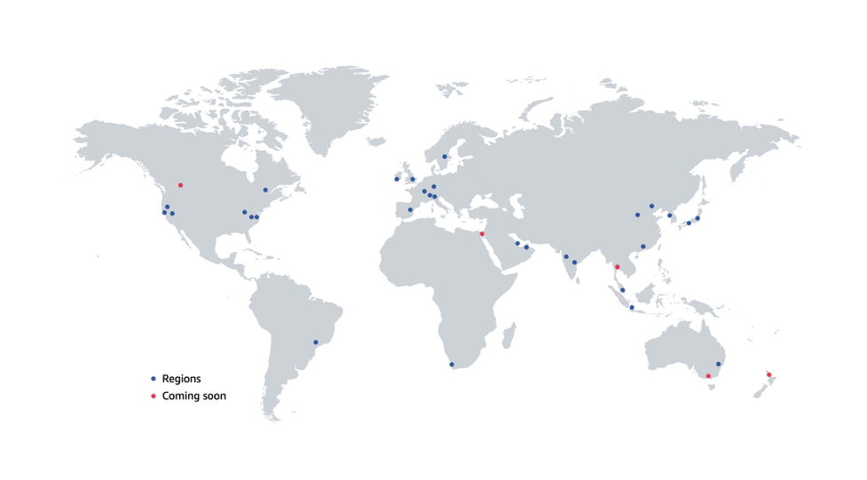
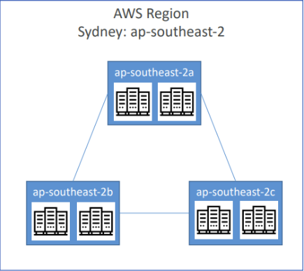
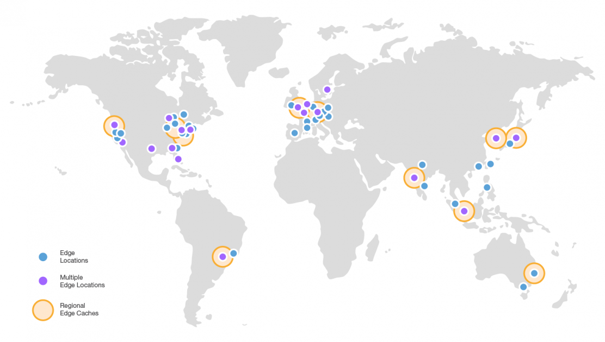

# Giới thiệu về Amazon Web Services (AWS)

[1. AWS Cloud là gì?](#1)

[2. Các trường hợp cần dùng AWS Cloud](#2)

[3. AWS Global Infrastructure - Cơ sở hạ tầng toàn cầu AWS](#3)

[4. Shared responsibility model - Mô hình chia sẻ trách nhiệm](#4)

## 📌 1. AWS Cloud là gì?

AWS Cloud chính là 1 nền tảng điện toán đám mây do Amazon cung cấp.

AWS Cloud luôn tiên phong và dẫn đầu trong các nhà cung cấp điện toán đám mây với hơn 200 dịch vụ khác nhau.

## 📌 2. Các trường hợp cần dùng AWS Cloud

- AWS cho phép xây dựng các ứng dụng phức tạp và có khả năng mở rộng.
    - Ví dụ: Một trang web thương mại điện tử có thể xử lý hàng triệu người truy cập cùng lúc nhờ vào khả năng scalability (mở rộng) của AWS mà không lo về hiệu suất.

- Phù hợp với nhiều ngành công nghiệp khác nhau : tài chính, y tế, giáo dục, giải trí, v.v.
    - Ví dụ: Ngành tài chính có thể dùng AWS để phân tích dữ liệu, ngành y tế có thể sử dụng AWS để lưu trữ và quản lý hồ sơ bệnh nhân.

- Các trường hợp sử dụng AWS bao gồm:
    - Enterprise IT - Công nghệ thông tin doanh nghiệp
    - Backup & Storage - Sao lưu và lưu trữ
    - Big Data analytics - Phân tích dữ liệu lớn
    - Website hosting - Lưu trữ website
    - Mobile & Social Apps - Ứng dụng di động và mạng xã hội
    - Gaming

## 📌 3. AWS Global Infrastructure - Cơ sở hạ tầng toàn cầu AWS

Cơ sở hạ tầng toàn cầu mà AWS sử dụng để cung cấp các dịch vụ đám mây của mình cho khách hàng trên toàn thế giới bao gồm:

### 1️⃣ AWS Regions

- Là một khu vực địa lý cụ thể, nơi AWS đặt các trung tâm dữ liệu của mình.

- Mỗi Region là một thực thể hoàn toàn độc lập với các Region khác để đảm bảo tính cô lập, nhằm tăng cường độ an toàn và tính khả dụng.

- Việc chọn AWS Region đem lại các lợi ích:

    - ➀ Độ trễ thấp:
        - Chọn Region gần với người dùng hoặc ứng dụng để giảm độ trễ khi truy cập dịch vụ.

    - ➁ Tuân thủ quy định:
        - Một số ứng dụng phải tuân thủ các quy định về bảo mật hoặc lưu trữ dữ liệu trong một quốc gia cụ thể.
        - Việc chọn đúng Region có thể giúp đảm bảo điều này.

    - ➂ Đảm bảo dịch vụ khả dụng:
        - Các dịch vụ và tính năng mới có thể không khả dụng ở mọi khu vực.
    
    - ➃ Giá cả:
        - Giá cả thay đổi tùy theo khu vực và minh bạch trong trang giá dịch vụ.

### 2️⃣ AWS Availability Zones - Vùng khả dụng (AZs)

- Là các trung tâm dữ liệu độc lập nằm trong cùng một Region.
    - Mỗi Region có nhiều vùng khả dụng (thường là 3, tối thiểu 2, tối đa là 6).

- Mỗi Availability Zones (AZ) có kết nối mạng tốc độ cao và cách ly vật lý với các AZ khác.
    
    - 👉 Đảm bảo nếu có sự cố xảy ra ở một AZ, các AZ còn lại vẫn tiếp tục hoạt động.

- Với đặc điểm đó, AZs mang lại lợi ích:
    - Khả năng khôi phục sau thảm họa (disaster recovery) và tính sẵn sàng cao (high availability).

    

### 3️⃣ AWS Data Centers - Trung tâm dữ liệu của AWS

- Là các cơ sở vật lý nơi AWS đặt máy chủ, thiết bị mạng, và lưu trữ.
    - Một Availability Zone có thể bao gồm một hoặc nhiều trung tâm dữ liệu.

- Data Centers là nơi cung cấp hạ tầng để chạy các dịch vụ đám mây của AWS, đảm bảo tính sẵn sàng và bảo mật dữ liệu.

### 4️⃣ AWS Points of Presence (Edge Locations) - Vị trí biên

- Là các điểm mạng mà AWS sử dụng để cache nội dung và cung cấp dịch vụ với độ trễ thấp cho người dùng cuối.
    - Dữ liệu được lưu trữ tạm thời (cached) tại các Edge Locations để giảm thiểu việc truy cập dữ liệu từ trung tâm dữ liệu chính.

    

- Các Edge Locations được phân bổ trên khắp thế giới để đảm bảo người dùng luôn nhận được nội dung từ vị trí gần nhất.

## 📌 4. Shared responsibility model - Mô hình chia sẻ trách nhiệm

Mô hình này giúp phân định rõ ràng trách nhiệm giữa AWS (cung cấp dịch vụ đám mây) và khách hàng (người sử dụng dịch vụ đám mây) để đảm bảo bảo mật và tuân thủ.

### 1️⃣ Trách nhiệm của AWS (Security of the Cloud)

- AWS chịu trách nhiệm bảo mật hạ tầng đám mây mà họ cung cấp cho khách hàng, bao gồm:

    - ➀ Dịch vụ nền tảng để chạy ứng dụng:
        - Điện toán (Compute), lưu trữ (Storage), dữ liệu (Database), mạng (Networking)

    - ➁ Cơ sở hạ tầng:
        - Bảo vệ các trung tâm dữ liệu AWS (data centers) khỏi sự xâm nhập vật lý và thảm họa thiên nhiên.

### 2️⃣ Trách nhiệm của khách hàng (Security in the Cloud)

- Khách hàng chịu trách nhiệm bảo mật những gì họ triển khai và vận hành trong môi trường đám mây của AWS, bao gồm:

    - ➀ Quản lý truy cập:
        - Cài đặt và cấu hình các quyền truy cập thông qua IAM (Identity and Access Management) để kiểm soát ai có quyền truy cập và làm gì với tài nguyên AWS.

    - ➁ Bảo vệ dữ liệu:
        - Mã hóa dữ liệu, quản lý khóa mã hóa, và bảo vệ dữ liệu nhạy cảm lưu trữ trên hệ thống AWS (bằng cách sử dụng các dịch vụ như S3, RDS).

    - ➂ Cấu hình bảo mật ứng dụng:
        - Đảm bảo rằng các ứng dụng và hệ điều hành mà họ triển khai trên AWS được bảo mật (cập nhật, vá lỗi hệ thống).

    - ➃ Bảo mật mạng:
        - Thiết lập các biện pháp bảo mật cho các ứng dụng, mạng riêng ảo (VPC) và các tầng ứng dụng chạy trên EC2, ví dụ như firewall và security groups.

- Có thể thấy những trách nhiệm này thuộc về khách hàng, AWS không trực tiếp thay khách hàng đảm nhiệm.
    - Tuy nhiên, AWS vẫn cung cấp các công cụ hỗ trợ và tài liệu hướng dẫn cho khách hàng.
