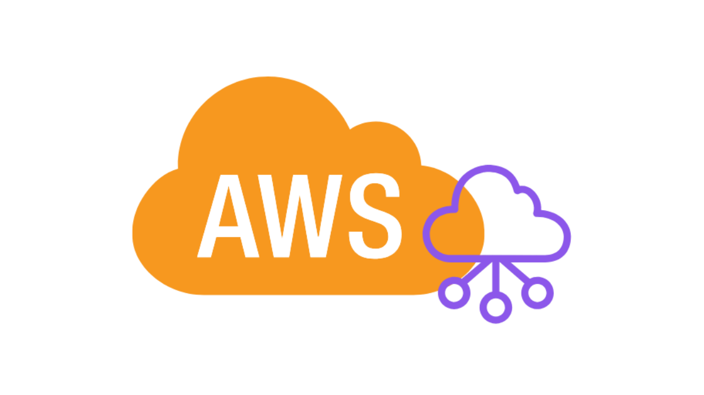
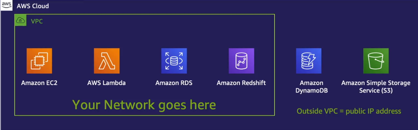
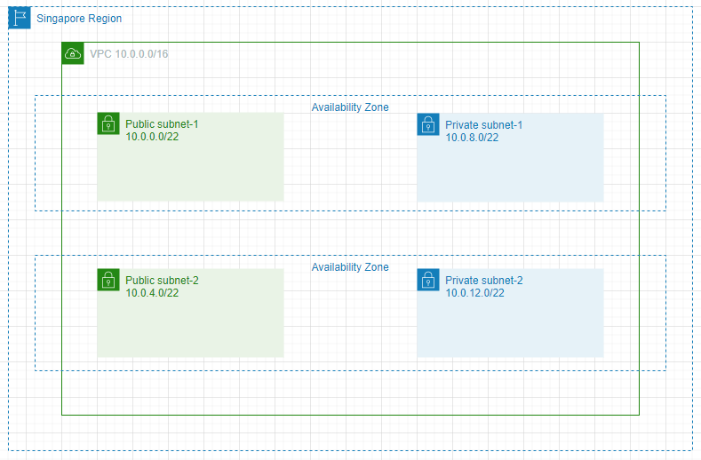
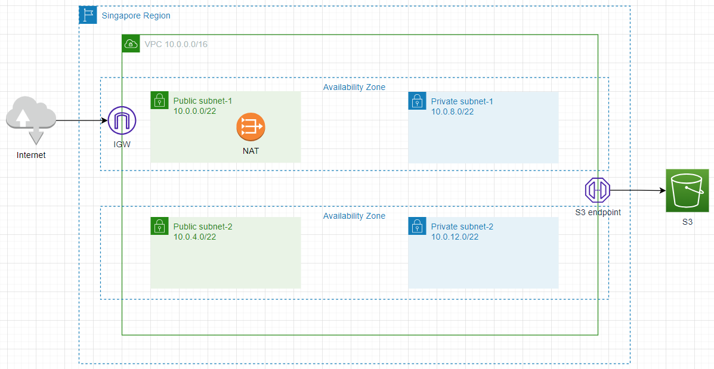
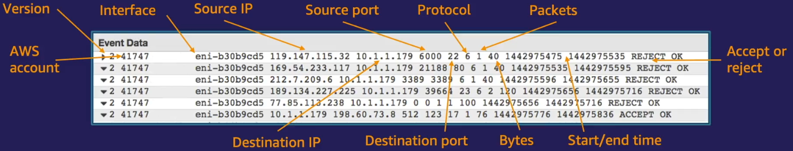
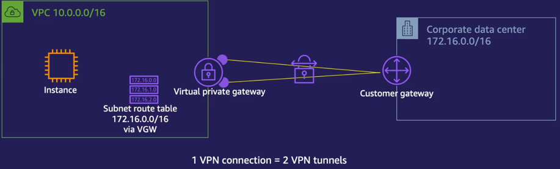
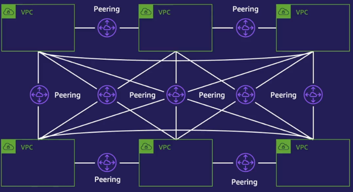
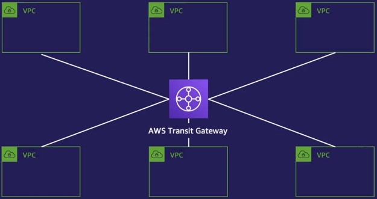
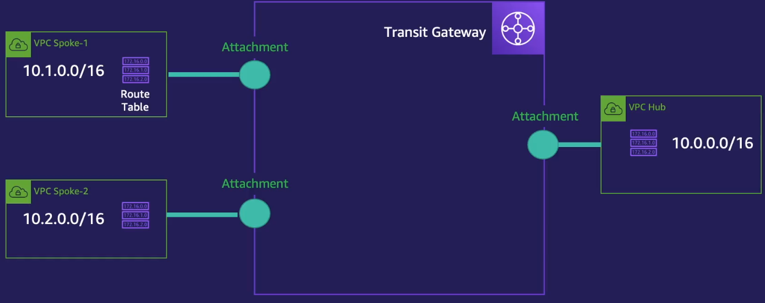

# Networking trong AWS



- ✦ AWS cung cấp một loạt các dịch vụ mạng để giúp bạn xây dựng và quản lý mạng trên đám mây, đảm bảo kết nối, bảo mật, và khả năng mở rộng.

- ✦ Networking trong AWS thường xoay quanh việc:
  - ✧ Cấu hình và quản lý tài nguyên mạng.
  - ✧ Đảm bảo các tài nguyên mạng có thể liên lạc với nhau một cách an toàn và hiệu quả.

[1. Tổng quan về Amazone VPC](#1)

[2. Thực hành thiết kế VPC đơn giản](#2)

[3. VPC Flow Logs](#3)

[4. VPC Peering](#4)

[5. Site-to-site VPN - Mở rộng mạng tại chỗ lên đám mây](#5)

[6. Direct Connect](#6)

[7. Transit Gateway](#7)

<a name="1"></a>

## 📌 1. Tổng quan về Amazone VPC

- ✦ VPC là công cụ cho phép chúng ta tạo ra các vùng mạng riêng ảo của mình bên trong hạ tầng chia sẻ của AWS.

- ✦ VPC giúp bạn kiểm soát toàn bộ môi trường mạng, giống như có một trung tâm dữ liệu riêng trên AWS.

- ✦ Mỗi VPC là hoàn toàn độc lập, các tài nguyên bên trong cùng VPC mới có thể nói chuyện với nhau.

  - Các tài nguyên bên ngoài muốn truy cập thì phải cần cấp phép.

  

- ✦ Có thể kết hợp các VPC với nhau để tạo thành mô hình Network Topology cho những hệ thống phức tạp.

### 🔹 Các thành phần chính của VPC

- Chúng ta sẽ giới thiệu trước qua các thành phần chính của VPC. Sau đó để dễ hình dung thì sẽ lấy ví dụ khi triển khai thực tế.

#### 🏠 VPC (Virtual Private Cloud)

- ✦ Đây chính là mạng riêng ảo bạn tạo trên AWS.

- ✦ Khi tạo một VPC, bạn phải chọn một CIDR Block (ví dụ: 10.0.0.0/16), nghĩa là bạn có thể có khoảng 65.536 địa chỉ IP.

- **Note:**

  - CIDR (Classless Inter-Domain Routing) là một phương pháp phân chia địa chỉ IP thành các mạng con, cấu trúc như sau:

    ```nginx
    IP_ADDRESS / SUBNET_MASK
    # Ví dụ
    # 10.0.0.0/16
    # 192.168.1.0/24
    ```

    Trong đó:

    - ✦ IP_ADDRESS là địa chỉ mạng.
    - ✦ SUBNET_MASK (độ dài tiền tố - Prefix Length) là số bit dùng để xác định phần mạng.

    Ví dụ: 10.0.0.0/16

    - ✦ Độ dài subnet mask: 16 bit → Phần network chiếm 16 bit, phần host chiếm 16 bit còn lại.
    - ✦ Số lượng IP có thể sử dụng:
      - ✧ Công thức: 2^(32-16) = 2^16 = 65,536 địa chỉ IP.
      - ✧ Dải IP từ 10.0.0.0 đến 10.0.255.255.

#### 📦 Subnet

- ✦ Là tập hợp các địa chỉ IP trong VPC được chia thành các mạng nhỏ hơn (được hiểu là mạng con ảo).

- ✦ Có hai loại subnet:

  - ❶ Public Subnet: Kết nối trực tiếp với Internet thông qua Internet Gateway.
  - ❷ Private Subnet: Không kết nối trực tiếp với Internet, chỉ dùng để chạy các dịch vụ nội bộ.

  🚀 Ví dụ:

  - ❶ Public Subnet: Chứa EC2 chạy website.
  - ❷ Private Subnet: Chứa database (RDS), chỉ có thể truy cập từ EC2 trong public subnet.

- ✦ Thường sẽ tạo ra 1 public subnet và 1 private subnet trên mỗi Availability Zone.

#### 🌐 Internet Gateway (IGW)

- ✦ Cho phép các tài nguyên trong public subnet truy cập Internet.

- ✦ Nếu không có IGW, các instance trong VPC sẽ không thể giao tiếp với bên ngoài.

#### 🔄 Route Table (RTB)

- ✦ Là bảng định tuyến, được sử dụng để xác định đường đi, nơi đến của các gói tin từ mạng con hay gateway.

- ✦ Route Table sẽ quyết định một subnet là Private hay Public.

#### 🛡️ Network ACL (NACL)

- ✦ Là một lớp tường lửa hoạt động ở tầng subnet, kiểm soát luồng traffic vào/ra subnet ở mức subnet.

- ✦ Hoạt động theo nguyên tắc stateless (cần có định nghĩa riêng các rules cho cả lưu lượng inbound và outbound).

  - ✧ Tức là khi một gói tin được cho phép vào subnet, nó không tự động được phép ra ngoài trừ khi có quy tắc tương ứng.

- ✦ Mỗi rule trong NACL được đánh một số thứ tự từ 1 đến 32766:
  - ✧ AWS đánh giá các quy tắc theo thứ tự tăng dần.
  - ✧ Quy tắc nào khớp trước sẽ được áp dụng (số thứ tự càng nhỏ, độ ưu tiên càng cao).
  - ✧ Nếu không có quy tắc nào khớp, NACL sẽ sử dụng quy tắc mặc định cuối cùng (default action - deny/lưu lượng sẽ bị chặn).

#### 🔐 Security Group (SG)

- ✦ Là loại tường lửa kiểm soát luồng traffic vào/ra EC2 ở mức instance.

- ✦ Hoạt động theo nguyên tắc stateful (nếu có inbound rule, thì outbound tự động mở).

  - ✧ Tức là nếu bạn cho phép một kết nối inbound (vào) trên một cổng cụ thể, thì các phản hồi tương ứng với kết nối đó sẽ tự động được phép ra ngoài (outbound).

- ✦ Mặc dù stateful, Security Group vẫn cho phép bạn có thể kiểm soát chi tiết lưu lượng ra bằng cách tạo các quy tắc outbound.

#### So sánh NACL và Security Groups:

|        Tiêu chí        |                                                        NACL                                                         |                                             Security Groups                                              |
| :--------------------: | :-----------------------------------------------------------------------------------------------------------------: | :------------------------------------------------------------------------------------------------------: |
|     Cấp độ bảo mật     |                          Subnet (áp dụng cho tất cả các instance) - hoạt động ở mức subnet                          |                      Instance (áp dụng cho từng instance) - hoạt động ở mức máy ảo                       |
| Stateful hay Stateless |                               Stateless (quy tắc inbound và outbound phải riêng biệt)                               |                            Stateful (inbound được tự động cho phép outbound)                             |
|          Rule          | Có cả ALLOW và DENY rules. Các rules đánh số thứ tự, ưu tiên theo số rule và dừng lại ngay khi có 1 rule ALLOW/DENY | Chỉ có ALLOW rules. Các rules không có thứ tự ưu tiên, đánh giá tất cả và cho qua nếu có 1 rule cho phép |
|        Mặc định        |                      Mặc định cho phép tất cả (default NACL) hoặc từ chối tất cả (custom NACL)                      |                             Từ chối tất cả inbound, cho phép tất cả outbound                             |

#### 🚪 NAT Gateway

- ✦ Ta đã biết, private subnet được thiết kế để các tài nguyên bên trong nó không thể bị truy cập từ Internet nhằm bảo vệ các tài nguyên này.

- ✦ NAT giúp các instance trong private subnet có thể truy cập Internet (ví dụ: để cập nhật phần mềm) mà vẫn giữ bảo mật (ngăn không cho Internet kết nối đến các tài nguyên này được).

### 🔹 Ví dụ triển khai website với AWS VPC

Giả sử bạn muốn triển khai một ứng dụng web trên AWS với yêu cầu:

✅ Có một web server chạy trên EC2 để phục vụ người dùng.

✅ Cơ sở dữ liệu (RDS) được đặt trong môi trường an toàn, không tiếp xúc trực tiếp với Internet.

✅ Các tài nguyên private (ví dụ: database) vẫn có thể truy cập Internet để cập nhật.

#### 1️⃣ Tạo VPC

- Chúng ta sẽ tạo một VPC với CIDR Block:

  ```
  10.0.0.0/16
  ```

- Cho phép sử dụng 65.536 địa chỉ IP

- Dải IP từ 10.0.0.0 → 10.0.255.255

#### 2️⃣ Chia Subnet

- VPC này sẽ có hai loại subnet:

  - ❶ Public Subnet chứa web server, có thể truy cập Internet.

    - CIDR: 10.0.1.0/24 (256 IP)

  - ❷ Private Subnet chứa database, không trực tiếp kết nối Internet.
    - CIDR: 10.0.2.0/24 (256 IP)

#### 3️⃣ Thêm Internet Gateway (IGW)

- Gắn một Internet Gateway vào VPC.

- Điều này cho phép các instance trong Public Subnet có thể giao tiếp với Internet.

#### 4️⃣ Cấu hình Route Table

- Route Table của Public Subnet sẽ có:

  ```yaml
  Destination: 0.0.0.0/0 → Target: Internet Gateway (IGW)
  ```

  👉 Điều này giúp các EC2 trong Public Subnet có thể truy cập Internet.

- Route Table của Private Subnet sẽ không có route tới IGW, nghĩa là không truy cập Internet trực tiếp.

#### 5️⃣ NAT Gateway cho Private Subnet

- Nếu database hoặc server trong Private Subnet cần truy cập Internet (ví dụ: để cập nhật phần mềm), ta cần NAT Gateway.

#### 6️⃣ Security Group (SG) & NACL

- ✦ Security Group (SG) của Web Server (EC2)

  - ➀ Inbound Rule:

    - ✧ Cho phép HTTP/HTTPS từ 0.0.0.0/0 (mọi nơi).
    - ✧ Cho phép SSH chỉ từ IP của Admin.

  - ➁ Outbound Rule:
    - ✧ Mở toàn bộ (0.0.0.0/0), vì SG là stateful.

- ✦ Security Group (SG) của Database (RDS)

  - ➀ Inbound Rule:

    - ✧ Chỉ chấp nhận kết nối từ Web Server (10.0.1.0/24).

  - ➁ Outbound Rule:
    - ✧ Cho phép toàn bộ outbound.

- ✦ Network ACL (NACL): có thể dùng NACL để chặn các địa chỉ IP hoặc dịch vụ không mong muốn ở mức subnet.

<a name="2"></a>

## 📌 2. Thực hành thiết kế VPC đơn giản

### 🔹 Yêu cầu

- Thiết kế VPC như sau:

  - ➀ VPC CIDR: 10.0.0.0/16

  - ➁ Có 2 loại subnet Public, Private. Mỗi subnet chứa ít nhất 1024 IPs.

  - ➂ Mỗi loại subnet nằm ở ít nhất 2 AZs.

  - ➃ Có 1 Internet Gateway, cấu hình route table tới Internet Gateway.

  - ➄ Có 1 NAT Gateway, cấu hình route table tới NAT Gateway.

  - ➅ Thiết kế Security Group cho 4 nhóm đối tượng:

    - ✧ Application Load Balancer: expose port HTTPS 443.

    - ✧ App Server cho phép port 80 từ ALB, 22 từ Bastion server.

    - ✧ Database Server sử dụng MySQL sử dụng port 3306. Elasstic Search sử dụng port 9200.

    - ✧ Bastion Server: SSH port 22 từ IP công ty.

  - ➆ Tạo VPC Endpoint cho S3 service.

### 🔹 Phân tích yêu cầu

#### 1️⃣ VPC và CIDR Block

- VPC CIDR: 10.0.0.0/16

  - 👉 Điều này có nghĩa là chúng ta có 65.536 địa chỉ IP (2^16), đủ để chia subnet thoải mái.

#### 2️⃣ Chia Subnet

- ✦ Mỗi subnet cần tối thiểu 1024 (2^10) IPs 👉 /22 subnet mask (2^10 = 1024).

- ✦ Mỗi loại subnet trải rộng trên ít nhất 2 AZs để đảm bảo High Availability.

- ✦ Chia subnet như sau:
  | Subnet | CIDR | Availability Zone |
  | :--------------: | :----------: | :---------------: |
  | Public Subnet 1 | 10.0.0.0/22 | AZ1 |
  | Public Subnet 2 | 10.0.4.0/22 | AZ2 |
  | Private Subnet 1 | 10.0.8.0/22 | AZ1 |
  | Private Subnet 2 | 10.0.12.0/22 | AZ2 |

📝 Giải thích cách chia subnet:

- ➀ Với Public subnet 1 thì ta sẽ chọn bắt đầu từ `10.0.0.0/22`

  - 👉 Subnet 1 sẽ có Ips từ `10.0.0.0` → `10.0.3.255` (có thể truy cập các công cụ tính [IPs online](https://www.ipaddressguide.com/cidr) để xác định)

- ➁ Vì `10.0.3.255` là IP cuối của subnet trước, do đó, Subnet 2 phải bắt đầu từ `10.0.4.0`.

- ➂ Tiếp tục cho các subnet còn lại.

  

#### 3️⃣ Internet Gateway & NAT Gateway

- ✦ Internet Gateway (IGW): Kết nối Public Subnet với Internet (đặt ngay rìa VPC).

- ✦ NAT Gateway giúp Private Subnet truy cập Internet (đặt trong Public Subnet và ánh xạ vào Private Subnet).

#### 4️⃣ Security Group


Có 4 nhóm cần thiết kế Security Group:

- ➀ **Application Load Balancer (ALB)**: nhận request từ người dùng và phân phối đến App Server.

  - ✦ Mở cổng 443 (HTTPS) cho tất cả (0.0.0.0/0) vì ALB phải nhận request từ client trên Internet.
  - ✦ ALB chỉ forward request tới App Server qua HTTP (port 80).

- ➁ **App Server (EC2 instances chạy ứng dụng web)**: chạy backend của ứng dụng web.

  - ✦ Có thể dùng ECS thay vì EC2 nếu muốn chạy backend theo mô hình containerized.
  - ✦ Chỉ nhận request từ ALB (port 80).
  - ✦ Không mở HTTP (80) hoặc SSH (22) trực tiếp cho Internet để tránh bị tấn công.
  - ✦ Cần SSH (22) nhưng chỉ từ Bastion Server, không mở public.

- ➂ **Database Server (RDS chạy MySQL, Elasticsearch)**: lưu trữ dữ liệu ứng dụng.

  - ✦ Database không bao giờ mở public, chỉ nhận kết nối từ App Server.
  - ✦ MySQL sử dụng port 3306, Elasticsearch sử dụng port 9200.
  - ✦ Cho phép admin kết nối MySQL từ Bastion để quản trị Database.

- ➃ **Bastion Server (EC2 để SSH vào hệ thống)**: cho phép admin SSH vào Private Subnet để quản lý hệ thống.
  - ✦ Bastion Server là điểm duy nhất để SSH vào App Server.
  - ✦ Chỉ cho phép SSH (port 22) từ IP công ty, không mở 0.0.0.0/0 để tránh bị tấn công.
  - ✦ Cho phép SSH (22) tới App Server để quản lý.

|             Nhóm              |         Port         |  Ai được truy cập?   |              Ghi chú               |
| :---------------------------: | :------------------: | :------------------: | :--------------------------------: |
|        ALB (Public-SG)        |     443 (HTTPS)      |      0.0.0.0/0       | Cho phép toàn bộ Internet truy cập |
|      App Server (App-SG)      |      80 (HTTP)       |       Chỉ ALB        |      Chỉ nhận request từ ALB       |
|                               |       22 (SSH)       |     Chỉ Bastion      |         Chỉ SSH từ Bastion         |
| Database Server (Database-SG) |     3306 (MySQL)     | App Server & Bastion |          Không mở public           |
|                               | 9200 (Elasticsearch) |    Chỉ App Server    |          Không mở public           |
|  Bastion Server (Bastion-SG)  |       22 (SSH)       |    Chỉ IP công ty    |        Để quản lý hệ thống         |

#### 5️⃣ VPC Endpoint cho S3

- Dùng VPC Endpoint giúp các instance trong VPC có thể truy cập Amazon S3 mà không cần đi qua Internet.

- 

### 🔹 Triển khai trên AWS Console

- 🔥 Thứ tự tạo resources:

  ```
  VPC → Subnets → IGW → NAT → Route Tables → VPC Endpoint → Security Groups
  ```

- AWS cũng hỗ trợ option cho phép tạo từ VPC → VPC Endpoint chỉ trong 1 step.

- ⚙️ Cấu hình Route Tables:

  - ✦ Tạo 1 Route Table cho Public Subnet và cấu hình Internet Gateway.

    ```yaml
    Destination: 0.0.0.0/0 → Target: Internet Gateway
    ```

  - ✦ Tạo 1 Route Table cho Private Subnet và cấu hình NAT Gateway.

    ```yaml
    Destination: 0.0.0.0/0 → Target: NAT Gateway
    ```

<a name="3"></a>

## 📌 3. VPC Flow Logs

- ✦ Là một công cụ để phát hiện ra các vấn đề bảo mật cũng như hỗ trợ việc gỡ lỗi kết nối đến VPC.

  - VPC Logs ghi nhận lại thông tin các gói tin đến/đi từ các ENI hay các card mạng gắn vào máy ảo.

- ✦ Các thông tin quan trọng được ghi lại bao gồm:
  

- ✦ Mặc định, tính năng VPC Logs không được mở mà phải tạo ra các Flow Logs để bắt đầu sử dụng.

<a name="4"></a>

## 📌 4. VPC Peering

- ✦ Như ta đã biết, mặc định, tất cả các VPC ta tạo ra trên AWS là độc lập.

  - 👉 Các tài nguyên bên trong VPC khác nhau không thể nói chuyện với nhau

- ✦ VPC Peering là tính năng cho phép kết nối 2 VPC lại với nhau.

  - Sau khi kết nối, tài nguyên bên trong 2 VPC có thể kết nối với nhau bằng private IP như mạng nội bộ.

- 🔥 **Peering** có thể kết nối các VPC trong cùng Region, trên Region khác nhau hoặc thậm chí là trên các account khác nhau.

  - Điều kiện là 2 dải IP của chúng không được trùng lặp lên nhau.

<a name="5"></a>

## 📌 5. Site-to-site VPN - Mở rộng mạng tại chỗ của bạn lên đám mây

- ✦ Để kết nối VPC trên AWS với data center (hoặc chi nhánh) của chúng ta ở môi trường on-premises (mạng tại chỗ), cách cơ bản nhất là sử dụng Site-to-site VPN.

- ✦ VPN là 1 dạng kết nối được mã hóa nhằm tạo ra một đường truyền riêng ảo chạy trên Internet để bảo vệ dữ liệu dịch chuyển trên đường truyền này.

  - AWS Site-to-site VPN là dịch vụ VPN được quản lý hoàn toàn bởi AWS.

- ✦ Kết nối VPN bao gồm các thành phần sau:

  

  - ➀ Customer Gateway (CGW):

    - ✧ Là thiết bị hoặc phần mềm nằm trong mạng on-premises của doanh nghiệp.

    - ✧ Có nhiệm vụ thiết lập và duy trì kết nối với AWS VPC qua Internet.

  - ➁ Virtual Private Gateway (VGW):

    - ✧ Là thiết bị được AWS quản lý và cài đặt tại AWS VPC để kết nối với Customer Gateway từ mạng on-premises.

  - ➂ VPN Tunnel:

    - ✧ Kết nối giữa Customer Gateway và Virtual Private Gateway là một đường hầm bảo mật, thường được mã hóa theo tiêu chuẩn IPsec (Internet Protocol Security) để bảo vệ dữ liệu.

    - ✧ Phía VGW của AWS sẽ có 2 endpoints độc lập. Route ở data center sẽ tự động mở 2 Tunnels tới 2 endponts này để đảm bảo tính sẵn sàng cao.

<a name="6"></a>

## 📌 6. Direct Connect

- ✦ Sử dụng Site-to-site VPN giúp giảm thiểu rủi ro về mặt bảo mật nhưng có những hạn chế về băng thông và độ ổn định đường truyền.

  - 👉 Dịch vụ Direct connect có thể thiêt lập một đường truyền ổn định với tốc độ cao từ data center lên AWS Region.

- ✦ Direct connect là một kênh truyền vật lý, ta sẽ có một đường truyền riêng tốc độ cao nối thẳng từ trung tâm dữ liệu của chúng ta đến Region của AWS mà không cần thông qua Internet.

  - ➀ Kết nối này được thực hiện trung gian thông qua một Direct Connect location.

  - ➁ AWS đã có sẵn đường truyền từ Direct Connect location đến AWS Region.

  - ➂ Khi khách hàng đăng ký dịch vụ Direct Connect, AWS hoặc đối tác của AWS chỉ cần kéo thêm đường truyền vật lý từ trung tâm dữ liệu của khách hàng đến Direct Connect location.

  - ➃ Ở Việt Nam, việc kéo các đường truyền Direct Connect thường được thực hiện bởi các đối tác là các công ty viễn thông lớn trong nước.

- ✦ Để dự phòng trong trường hợp đường truyền này gặp trục trặc, cách tốt nhất là kéo 2 (hoặc 4) đường truyền Direct Connect khác nhau qua tối thiểu 2 Direct Connect location khác nhau.

  - ✧ Tuy nhiên, vì là đường truyền vật lý nên chí phí sẽ rất cao

  - 👉 Một cách tiết kiệm hơn là sử dụng Site-to-site VPN để phòng trường hợp Direct Connect gặp sự cố.

<a name="7"></a>

## 📌 7. Transit Gateway

- ✦ Như ta đã biết, ta có thể dùng VPC Peering để kết nối các VPC với nhau hay dùng Site-to-ste VPN hoặc Direct Connect để kết nối AWS với các trung tâm dữ liệu tại chỗ.

  - Tuy nhiên khi số lượng vùng mạng tăng lên, việc kết nối tăng theo, việc quản lý sẽ vô cùng phức tạp.

  - 👉 Để đơn giản hóa việc quản trị này, AWS cung cấp Transit Gateway, đóng vai trò như route tổng điều hướng tất cả các kết nối trong tổ chức.

- ❌ Ví dụ VPC Peering:

  

- ✔️ Dùng Transit Gateway:

  

- ✦ Transit Gateway hoạt động như một hub trung tâm để các spoke (như VPC, mạng on-premises, hoặc các tài nguyên khác) kết nối vào.

  

  - ➀ Attachments:

    - Là kết nối giữa Transit Gateway và các tài nguyên như VPC, VPN, hoặc Direct Connect Gateway.
    - Mỗi kết nối giữa một spoke (VPC hoặc mạng on-premises) với Transit Gateway được gọi là một attachment.

  - ➁ Route Tables (khác với khái niệm route table của VPC):

    - Cho phép bạn kiểm soát tuyến đường giữa các attachments.
    - Ví dụ, bạn có thể tạo một route table để cho phép chỉ một số VPC có thể giao tiếp với nhau, trong khi các VPC khác không thể truy cập vào nhau.

  - ➂ Propagation:
    - Khi một route table nhận được tuyến đường từ một attachment, nó có thể tự động phân phối (propagate) tuyến đường này tới các route table khác.
    - Điều này giúp tối ưu hóa việc quản lý các tuyến đường giữa các VPC và mạng on-premises.

- ⚠️ Mặc dù Transit Gateway giúp đơn giản hóa quản lý, nhưng việc sử dụng dịch vụ này có thể tăng chi phí so với các giải pháp như VPC Peering, đặc biệt khi số lượng kết nối tăng lên.
