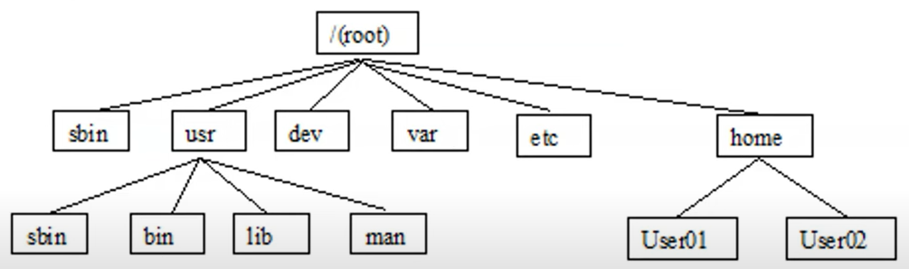

# Thao tác & Khái niệm Cơ Bản

[1. Giới thiệu về Linux](#1)

[2. Cài Đặt Linux](#2)

[3. Làm quen với Terminal](#3)

[4. Thao tác với trình soạn thảo Vim](#4)

<a name="1"></a>

## 📌 1. Giới thiệu về Linux

### 🔹 Linux là gì?

- Linux là một hệ điều hành mã nguồn mở (open-source OS).

- Được sử dụng rộng rãi trong máy chủ, máy tính cá nhân, thiết bị IoT, hệ thống nhúng và cả điện thoại (Android chạy trên nền Linux).

- Đặc điểm nổi bật:
  - Mã nguồn mở: Ai cũng có thể xem, chỉnh sửa và phân phối lại.
  - Bảo mật cao: Hạn chế virus, ít bị tấn công hơn Windows.
  - Ổn định: Thường dùng trong máy chủ do ít lỗi và hoạt động lâu dài.
  - Miễn phí: Hầu hết các bản phân phối Linux đều miễn phí.
  - Linh hoạt: Có thể tùy chỉnh theo nhu cầu (từ desktop đến server, IoT, embedded system).

### 🔹 Các bản phân phối phổ biến (Linux Distros)

Linux không có một phiên bản duy nhất như Windows hay macOS mà có nhiều bản phân phối (distro) khác nhau, phù hợp với từng nhu cầu cụ thể:

- Ubuntu – Dễ dùng, phổ biến nhất, phù hợp cho người mới.
- Debian – Ổn định, được sử dụng trong server.
- CentOS / Rocky Linux – Hướng tới doanh nghiệp.
- Arch Linux – Linh hoạt, dành cho người thích tùy chỉnh hệ thống.
- Kali Linux – Chuyên về bảo mật & pentesting.

### 🔹 Linux vs Windows

| Đặc điểm  |                 Linux                  |       Windows        |
| :-------: | :------------------------------------: | :------------------: |
|    Giá    |                Miễn phí                |       Trả phí        |
|  Bảo mật  |             Cao, ít virus              |     Nhiều virus      |
| Tùy chỉnh | Cao (có thể thay đổi kernel, GUI, ...) |       Hạn chế        |
|  Dễ dùng  |            Khó hơn ban đầu             |     Dễ tiếp cận      |
| Hiệu suất |            Nhẹ, tối ưu tốt             | Nặng, tốn tài nguyên |

🔥 Tóm lại, nên chọn Linux khi chúng ta làm việc với lập trình, server hay DevOps

<a name="2"></a>

## 📌 2. Cài đặt Linux

Bạn có thể:

- Cài đặt Linux trên máy thật (dual boot)
- Chạy Linux trên máy ảo (VMWare, VirtualBox)

Hoặc để nhanh chóng thì có thể sử dụng WSL (Windows Subsystem for Linux) do Windows đã hỗ trợ sẵn Linux Subsystem.

Tham khảo hướng dẫn Cài Đặt Ubuntu trên Windows Nhanh Chóng với WSL [tại đây](https://viblo.asia/p/cai-dat-ubuntu-tren-windows-11-nhanh-chong-voi-wsl-5OXLAvpZVGr).

<a name="3"></a>

## 📌 3. Làm quen với Terminal

### 🔹 Cấu trúc thư mục trong Linux

Trong Windows, chúng ta có thể thấy thường bắt đầu bằng các ổ cứng, ví dụ ở C:\\, ổ D:\\, v.v.

Trong Linux sẽ có sự khác biệt khi tất cả các tệp và thư mục đều được tổ chức theo dạng cây, bắt đầu từ thư mục gốc / (root).

Dưới đây là các thư mục quan trọng trong hệ thống Linux:


#### 🌳 Thư mục gốc (/):

Đây là thư mục cao nhất trong hệ thống Linux, mọi thứ khác đều nằm bên trong nó.

📁 Các thư mục con quan trọng:

| Thư mục |                               Chức năng                               |
| :-----: | :-------------------------------------------------------------------: |
|  /bin   |  Chứa các tệp lệnh cần thiết cho việc khởi động và sử dụng hệ thống   |
|  /boot  |        Chứa các tệp hệ thống cần thiết cho quá trình khởi động        |
|  /etc   |     Chứa file cấu hình hệ thống (ví dụ: /etc/passwd, /etc/hosts)      |
|  /home  |            Chứa thư mục cá nhân của từng user (/home/user)            |
|  /root  |              Thư mục home của user root (quản trị viên)               |
|  /var   | Chứa dữ liệu thay đổi liên tục như log (/var/log), cache (/var/cache) |
|  /tmp   |               Thư mục tạm, bị xóa sau khi khởi động lại               |
|  /usr   |           Chứa phần mềm cài thêm (/usr/bin, /usr/lib, ...)            |
|  /lib   |          Chứa thư viện hệ thống (tương tự .dll trên Windows)          |
|  /dev   |        Chứa các thiết bị như ổ cứng, USB (/dev/sda, /dev/tty)         |
|  /proc  | Chứa thông tin về tiến trình hệ thống (/proc/cpuinfo, /proc/meminfo)  |
|  /mnt   |                     Thư mục mount các ổ đĩa ngoài                     |
|  /opt   |               Chứa phần mềm bên thứ ba cài đặt thủ công               |

### 🔹 Các lệnh cơ bản

#### 1️⃣ Lệnh làm việc với thư mục

| Lệnh  |         Chức năng         |      Ví dụ      |
| :---: | :-----------------------: | :-------------: |
|  pwd  | Hiển thị thư mục hiện tại |                 |
|  ls   |      Liệt kê thư mục      |                 |
|  cd   |     Di chuyển thư mục     |    cd /home     |
| mkdir |        Tạo thư mục        | mkdir newfolder |
| rmdir |     Xóa thư mục rỗng      | rmdir myfolder  |

#### 2️⃣ Lệnh làm việc với file

| Lệnh  |             Chức năng             |          Ví dụ          |
| :---: | :-------------------------------: | :---------------------: |
| touch |           Tạo file rỗng           |     touch file.txt      |
|  cp   |       Sao chép file/thư mục       |    cp file.txt /tmp/    |
|  mv   |      Di chuyển/đổi tên file       | mv file.txt newfile.txt |
|  rm   |         Xóa file/thư mục          |       rm file.txt       |
|  cat  |      Hiển thị nội dung file       |     cat /etc/passwd     |
| less  | Xem nội dung file theo từng trang |  less /var/log/syslog   |
| head  |     Xem 10 dòng đầu của file      |      head file.txt      |
| tail  |     Xem 10 dòng cuối của file     |      tail file.txt      |

#### 3️⃣ Lệnh quản lý người dùng & quyền

|  Lệnh  |       Chức năng        | Ví dụ |
| :----: | :--------------------: | :---: |
| whoami | Kiểm tra user hiện tại |       |
|   id   |      Xem UID, GID      |       |
| passwd |      Đổi mật khẩu      |       |

#### 4️⃣ Lệnh quản lý tiến trình & hệ thống

|  Lệnh  |          Chức năng          |   Ví dụ   |
| :----: | :-------------------------: | :-------: |
|   ps   |   Kiểm tra user hiện tại    |           |
|  top   | Theo dõi tài nguyên CPU/RAM |           |
|  kill  |  Dừng tiến trình theo PID   | kill 1234 |
|   df   |  Kiểm tra dung lượng ổ đĩa  |   df -h   |
|  free  |  Kiểm tra RAM đang sử dụng  |  free -m  |
| uptime | Xem thời gian hệ thống chạy |           |

#### 5️⃣ Lệnh định hướng nhập xuất và các lệnh đường ống

| Lệnh |                                                  Chức năng                                                   |                   Ví dụ                    |
| :--: | :----------------------------------------------------------------------------------------------------------: | :----------------------------------------: |
|  >   |                                           Ghi đè nội dung vào file                                           |      echo "Hello Linux" > output.txt       |
|  >>  |                                  Thêm nội dung vào cuối file (không ghi đè)                                  |       echo "Dòng mới" >> output.txt        |
|  <   |                                 Lấy nội dung trong file làm đầu vào cho lệnh                                 |              sort < names.txt              |
|  2>  |                                          Lưu lỗi của lệnh vào file                                           |        ls /invalid_path 2> error.lo        |
| 2>>  |                                   Ghi lỗi vào file mà không xóa dữ liệu cũ                                   |       ls /invalid_path 2>> error.log       |
|  &>  |                                      Ghi cả output và lỗi vào cùng file                                      | ls /valid_path /invalid_path &> output.log |
|      |                                Kết hợp định hướng nhập và xuất trong một lệnh                                |    sort < names.txt > sorted_names.txt     |
|  \|  | Lệnh đường ống, cho phép kết hợp nhiều lệnh lại với nhau, dùng output của lệnh trước làm input cho lệnh sau. |                                            |

#### 6️⃣ Lệnh tìm kiếm tệp tin

##### 🔍 find - Tìm kiếm tệp theo thư mục

Lệnh find giúp tìm kiếm file hoặc thư mục theo tên, kích thước, ngày sửa đổi, v.v.

|             Lệnh             |               Chức năng               |
| :--------------------------: | :-----------------------------------: |
| find /path -name "file.txt"  | Tìm file có tên chính xác là file.txt |
| find /path -iname "file.txt" |  Tìm file không phân biệt hoa thường  |
|      find /path -type d      |          Tìm tất cả thư mục           |
|      find /path -type f      |            Tìm tất cả file            |
|    find /path -size +10M     |         Tìm file lớn hơn 10MB         |
|     find /path -mtime -7     |   Tìm file sửa đổi trong 7 ngày qua   |
| find /path -exec rm -f {} \; |         Xóa các file tìm thấy         |

##### 🔍 grep - Tìm kiếm nội dung trong file

Lệnh grep giúp tìm kiếm dòng chứa từ khóa trong file.

|            Lệnh            |                 Chức năng                 |
| :------------------------: | :---------------------------------------: |
|   grep "error" file.txt    |    Tìm dòng chứa error trong file.txt     |
|  grep -i "error" file.txt  |        Không phân biệt hoa thường         |
| grep -r "error" /var/log/  | Tìm error trong tất cả file của /var/log/ |
| grep -v "warning" file.txt |        Tìm dòng không chứa warning        |
|  grep -n "error" file.txt  |        Hiển thị số dòng chứa error        |

#### 7️⃣ Lệnh nén và giải nén

Trong Linux, có nhiều công cụ giúp nén và giải nén file như tar, gzip, bzip2, zip.

##### 📄 tar - Nén và giải nén file/tệp tin

|                 Lệnh                 |                 Chức năng                 |
| :----------------------------------: | :---------------------------------------: |
|   tar -cvf archive.tar file1 file2   | Đóng gói file1 và file2 thành archive.tar |
|      tar -cvf archive.tar dir/       | Đóng gói cả thư mục dir/ vào archive.tar  |
|         tar -xvf archive.tar         |           Giải nén archive.tar            |
| tar -xvf archive.tar -C /path/to/dir |        Giải nén vào thư mục cụ thể        |

##### 📄 gzip & bzip2 - Nén file đơn lẻ

gzip & bzip2 không nén được thư mục, chỉ nén file tại một thời điểm.

|         Lệnh         |      Chức năng      |
| :------------------: | :-----------------: |
|    gzip file.txt     | Nén file thành .gz  |
|  gunzip file.txt.gz  | Giải nén file gzip  |
|    bzip2 file.txt    | Nén file thành bz2  |
| bunzip2 file.txt.bz2 | Giải nén file bzip2 |

##### 📄 zip - Nén file như trên Windows

Lệnh zip hỗ trợ nén nhiều file hoặc thư mục vào một file .zip, giống như trên Windows.

|               Lệnh                |              Chức năng               |
| :-------------------------------: | :----------------------------------: |
|    zip archive.zip file1 file2    | Nén file1 và file2 thành archive.zip |
|      zip -r archive.zip dir/      | Nén cả thư mục dir/ vào archive.zip  |
|         unzip archive.zip         |      Giải nén toàn bộ nội dung       |
| unzip archive.zip -d /path/to/dir |     Giải nén vào thư mục cụ thể      |

<a name="4"></a>

## 📌 4. Thao tác với trình soạn thảo Vim

### 🔹 Giới thiệu về Vim

Vim (Vi IMproved) là một trình soạn thảo văn bản mạnh mẽ trong Linux, thường được sử dụng để chỉnh sửa file cấu hình, lập trình và thao tác trên terminal.

Để mở Vim:

```bash
vim filename  # Mở file trong Vim (tạo mới nếu chưa có)
```

### 🔹 Các chế độ trong Vim

Vim có 3 chế độ chính:

|       Chế độ       |                    Mô tả                     |         Chuyển đổi         |
| :----------------: | :------------------------------------------: | :------------------------: |
| Normal (Mặc định)  |        Dùng để điều hướng và thao tác        | Nhấn Esc để vào chế độ này |
| Insert (Chỉnh sửa) | Nhập văn bản như trình soạn thảo bình thường |   Nhấn i, a, o, I, A, O    |
|   Command (Lệnh)   |  Gõ lệnh để lưu, thoát, tìm kiếm, thay thế   | Nhấn : trong chế độ Normal |

### 🔹 Chế độ Normal - Điều hướng & chỉnh sửa

Khi mở Vim, chúng ta sẽ ở chế độ Normal.

- Điều hướng con trỏ:

  | Lệnh |         Chức năng         |
  | :--: | :-----------------------: |
  |  h   |         Sang trái         |
  |  l   |         Sang phải         |
  |  j   |        Xuống dưới         |
  |  k   |         Lên trên          |
  |  w   | Nhảy đến đầu từ tiếp theo |
  |  b   |   Nhảy về đầu từ trước    |
  |  gg  |        Về đầu file        |
  |  G   |      Xuống cuối file      |

- Xóa, sao chép, dán:

  | Lệnh |          Chức năng           |
  | :--: | :--------------------------: |
  |  x   | Xóa ký tự tại vị trí con trỏ |
  |  dd  |      Xóa dòng hiện tại       |
  |  yy  |    Sao chép dòng hiện tại    |
  |  p   |   Dán nội dung đã sao chép   |

- Hoàn tác & làm lại:

  |   Lệnh   |          Chức năng           |
  | :------: | :--------------------------: |
  |    u     |  Hoàn tác thao tác vừa làm   |
  | Ctrl + r | Làm lại thao tác bị hoàn tác |

### 🔹 Chế độ Insert - Nhập văn bản

| Lệnh |               Chức năng               |
| :--: | :-----------------------------------: |
|  i   |        Chèn tại vị trí con trỏ        |
|  I   |             Chèn đầu dòng             |
|  a   |           Chèn sau con trỏ            |
|  A   |            Chèn cuối dòng             |
|  o   | Tạo dòng mới bên dưới và nhập văn bản |
|  O   | Tạo dòng mới bên trên và nhập văn bản |

🔥 Nhấn Esc để quay lại chế độ Normal.

### 🔹 Chế độ Command - Lệnh lưu, thoát, tìm kiếm

- Lệnh lưu & thoát:

  |    Lệnh     |          Chức năng          |
  | :---------: | :-------------------------: |
  |     :w      |          Lưu file           |
  |     :q      | Thoát nếu không có thay đổi |
  | :wq hoặc :x |        Lưu và thoát         |
  |     :q!     |     Thoát mà không lưu      |

- Tìm kiếm & thay thế:

  |     Lệnh      |         Chức năng          |
  | :-----------: | :------------------------: |
  |     /text     |   Tìm từ text trong file   |
  |       n       | Tìm tiếp kết quả tiếp theo |
  |       N       | Tìm tiếp kết quả trước đó  |
  | :%s/old/new/g | Thay tất cả old thành new  |

### 🔹 Một số phím tắt hữu ích

|     Lệnh      |        Chức năng        |
| :-----------: | :---------------------: |
|   Ctrl + d    | Cuộn xuống nửa màn hình |
|   Ctrl + u    |  Cuộn lên nửa màn hình  |
|   Ctrl + g    |   Xem thông tin file    |
|  :set number  |    Hiển thị số dòng     |
| :set nonumber |       Ẩn số dòng        |
