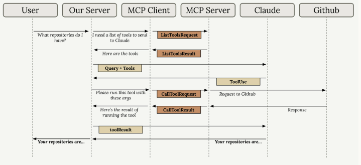

# Giới thiệu về Model Context Protocol (MCP)

Hướng dẫn xây dựng MCP client và server để mở rộng khả năng cho các ứng dụng AI tích hợp Claude.

[1. Giới thiệu MCP](#1)

[2. MCP Client](#2)

[3. Cấu hình dự án học tập](#3)

[4. Định nghĩa Tools với MCP](#4)

[5. MCP Server Inspector](#5)

[6. Triển khai MCP Client](#6)

[7. Định nghĩa Resources](#7)

[8. Truy cập Resources từ Client](#8)

[9. Định nghĩa Prompts](#9)

[10. Prompts trong Client](#10)

[11. Tổng quan ba Primitives của MCP](#11)

---

<a name="1"></a>

## 📌 1. Giới thiệu MCP

**MCP (Model Context Protocol)** = lớp giao tiếp cung cấp context và công cụ cho Claude mà không đòi hỏi developer phải viết code thủ công cho từng tích hợp.

### Kiến trúc cốt lõi:

```
MCP Client  ←→  MCP Server
                   ├── Tools
                   ├── Resources
                   └── Prompts
```

### Vấn đề MCP giải quyết:

- Giả sử bạn đang xây dựng một giao diện trò chuyện cho phép người dùng hỏi Claude về dữ liệu GitHub của họ. Một người dùng có thể hỏi "Hiện có bao nhiêu yêu cầu kéo (pull request) đang mở trên tất cả các kho lưu trữ của tôi?". Để xử lý điều này, Claude cần các công cụ để truy cập API của GitHub.

- Cách tiếp cận truyền thống yêu cầu developer phải **tự viết thủ công** toàn bộ tool schemas và hàm xử lý cho từng service (ví dụ: GitHub API). Với các dịch vụ phức tạp có nhiều tính năng, điều này tạo ra gánh nặng bảo trì lớn.

### Giải pháp MCP:

- MCP **chuyển dịch** trách nhiệm định nghĩa và thực thi tool từ server của developer sang một **MCP server chuyên dụng**. MCP server đóng vai trò là giao diện với dịch vụ bên ngoài, đóng gói các chức năng thành công cụ có sẵn.

### Lợi ích chính:
- Loại bỏ nhu cầu developer phải tự viết và duy trì tool schemas

- Người khác (thường là nhà cung cấp dịch vụ) tạo và đóng gói tools trong MCP server

- MCP và tool use **bổ sung cho nhau**, không phải thay thế nhau — MCP tập trung vào **ai là người tạo ra tools**

### Câu hỏi thường gặp:

| Câu hỏi | Trả lời |
|---------|---------|
| **Ai tạo MCP servers?** | Bất kỳ ai, nhưng thường là nhà cung cấp dịch vụ tạo implementations chính thức |
| **Khác gì direct API calls?** | Tiết kiệm thời gian dev bằng cách cung cấp tool schemas/hàm có sẵn thay vì phải tự viết |
| **Quan hệ với tool use?** | MCP không thay thế tool use — MCP giải quyết câu hỏi "ai làm việc tạo tools" |

---

<a name="2"></a>

## 📌 2. MCP Client

**MCP Client** = giao diện giao tiếp giữa server của bạn và MCP server, cung cấp quyền truy cập vào các tools của server.

### Transport agnostic:
Client và server có thể giao tiếp qua nhiều giao thức: `stdin/stdout`, HTTP, WebSockets, v.v. Cấu hình phổ biến nhất: chạy cả máy khách và máy chủ MCP trên cùng một máy, dùng `stdin/stdout` (đầu vào/đầu ra tiêu chuẩn).

### Các loại message chính:

| Message | Mô tả |
|---------|--------|
| **list tools request/result** | Client hỏi server có tool gì, server trả về danh sách |
| **call tool request/result** | Client yêu cầu server chạy tool với arguments, server trả về kết quả |

### Luồng hoạt động điển hình:

```
Người dùng gửi câu hỏi của họ đến máy chủ của bạn
    ↓
Máy chủ của bạn cần biết những công cụ nào có sẵn để gửi cho Claude
    ↓
Máy chủ của bạn yêu cầu MCP Client cung cấp các công cụ có sẵn
    ↓
MCP Client gửi một yêu cầu `ListToolsRequest` đến máy chủ MCP Server và nhận lại `ListToolsResult`
    ↓
Máy chủ của bạn gửi yêu cầu của người dùng cùng với các công cụ có sẵn đến Claude
    ↓
Claude quyết định cần phải gọi một công cụ để trả lời câu hỏi
    ↓
Máy chủ của bạn yêu cầu MCP Client chạy công cụ mà Claude đã chỉ định
    ↓
MCP Client gửi yêu cầu `CallToolRequest` đến MCP Server, MCP Server sẽ thực hiện call API GitHub
    ↓
GitHub phản hồi bằng dữ liệu kho lưu trữ, dữ liệu này sẽ được truyền ngược trở lại thông qua MCP Server `CallToolResult`
    ↓
Máy chủ của bạn gửi kết quả công cụ trở lại cho Claude
    ↓
Claude đưa ra câu trả lời cuối cùng dựa trên dữ liệu trong kho lưu trữ
    ↓
Máy chủ của bạn chuyển phản hồi của Claude trở lại cho người dùng
```



> **Vai trò MCP Client**: Đóng vai trò trung gian — không tự thực thi tools mà chỉ điều phối giao tiếp giữa server của bạn và MCP server thực sự chạy tools.

---

<a name="3"></a>

## 📌 3. Cấu hình dự án học tập

**Dự án MCP học tập** = chatbot dạng CLI xây dựng cả MCP client lẫn MCP server để phục vụ mục đích học tập.

### Cấu trúc dự án:

```
CLI Project
├── main.py          ← Entry point (chatbot CLI)
├── .env             ← API key
├── mcp_client.py    ← MCP Client tùy chỉnh
└── mcp_server.py    ← MCP Server tùy chỉnh
```

### Đặc điểm:
- **Document System**: Tài liệu giả lưu trong bộ nhớ, không có persistence
- **Server Tools**: Hai tool — đọc nội dung tài liệu và cập nhật nội dung tài liệu
- ⚠️ Thực tế, các dự án thường chỉ triển khai **client HOẶC server**, không phải cả hai. Dự án này làm cả hai vì mục đích học tập.

### Yêu cầu cài đặt:
1. Tải `CLI_project.zip`, giải nén
2. Cấu hình `.env` với API key
3. Cài đặt dependencies

### Chạy dự án:
```bash
uv run main.py      # Nếu dùng UV
python main.py      # Nếu không dùng UV
```

**Kiểm tra**: Dấu nhắc chat xuất hiện, phản hồi các câu hỏi cơ bản.

---

<a name="4"></a>

## 📌 4. Định nghĩa Tools với MCP

**MCP Python SDK** đơn giản hóa việc tạo tool so với việc viết JSON schemas thủ công.

### Cú pháp định nghĩa tool:

```python
from mcp.server import Server
from pydantic import Field

mcp = Server("my-server")

@mcp.tool()
def read_doc_contents(doc_id: str = Field(description="ID của tài liệu cần đọc")) -> str:
    if doc_id not in docs:
        raise ValueError(f"Tài liệu '{doc_id}' không tồn tại")
    return docs[doc_id]

@mcp.tool()
def edit_document(
    doc_id: str = Field(description="ID tài liệu cần chỉnh sửa"),
    old_string: str = Field(description="Chuỗi cần thay thế"),
    new_string: str = Field(description="Chuỗi thay thế mới")
) -> str:
    if doc_id not in docs:
        raise ValueError(f"Tài liệu '{doc_id}' không tồn tại")
    docs[doc_id] = docs[doc_id].replace(old_string, new_string)
    return "Cập nhật thành công"
```

### Hai tools của dự án:

| Tool | Tham số | Mô tả |
|------|---------|--------|
| **read_doc_contents** | `doc_id` | Trả về nội dung tài liệu từ dictionary `docs` |
| **edit_document** | `doc_id`, `old_string`, `new_string` | Thực hiện find/replace trên nội dung tài liệu |

### Lợi ích của MCP Python SDK:
- **Tự động sinh JSON schema** từ các decorated functions
- Khởi tạo server chỉ với một dòng code
- Loại bỏ hoàn toàn việc viết schema thủ công

### Pattern triển khai:
```
Decorator → Định nghĩa hàm → Type parameters → Validation → Logic cốt lõi
```

---

<a name="5"></a>

## 📌 5. MCP Server Inspector

**MCP Inspector** = công cụ debug trên trình duyệt để kiểm thử MCP server mà không cần kết nối vào ứng dụng thực.

### Khởi động:
```bash
mcp dev server_file.py   # Cần kích hoạt môi trường Python trước
```
Sau đó truy cập địa chỉ `localhost` được cung cấp trong terminal.

### Giao diện:

```
[Connect]  |  Resources  |  Prompts  |  Tools
           |                         |
           |    Danh sách tools      |  Panel kiểm thử
           |    (click để mở)        |  (bên phải)
```

### Quy trình kiểm thử:
1. Nhấn **Connect** để kết nối với server
2. Chọn tab **Tools** → xem danh sách tools có sẵn
3. Click vào tool → nhập tham số (ví dụ: document ID)
4. Nhấn **Run Tool** → kiểm tra output/thông báo thành công

### Đặc điểm:
- Kiểm thử live trong quá trình phát triển
- Mô phỏng việc gọi tool với tham số thực
- Hiển thị phản hồi thành công/thất bại rõ ràng
- ⚠️ Inspector đang trong giai đoạn phát triển tích cực — giao diện có thể thay đổi nhưng chức năng cốt lõi giữ nguyên

> **Khuyến nghị**: Dùng Inspector như bước **bắt buộc** trước khi triển khai MCP server ra production.

---

<a name="6"></a>

## 📌 6. Triển khai MCP Client

**MCP Client** = lớp wrapper bao quanh client session, quản lý kết nối đến MCP server và dọn dẹp tài nguyên.

### Các thành phần chính:

| Thành phần | Mô tả |
|------------|--------|
| **Client Session** | Kết nối thực tế đến MCP server từ MCP Python SDK |
| **Resource Cleanup** | Quá trình dọn dẹp khi tắt, xử lý bởi `connect`/`cleanup`/`__aenter__`/`__aexit__` |
| **Client Purpose** | Expose chức năng MCP server ra phần còn lại của codebase |

### Hai hàm cốt lõi:

```python
class MCPClient:
    async def list_tools(self):
        result = await self.session.list_tools()
        return result.tools

    async def call_tool(self, tool_name: str, tool_input: dict):
        return await self.session.call_tool(tool_name, tool_input)
```

### Luồng tích hợp:
1. Ứng dụng yêu cầu danh sách tools cho Claude
2. Client gọi `list_tools()` để lấy tools từ server
3. Claude chọn tool và cung cấp tham số
4. Client gọi `call_tool()` để thực thi trên server
5. Kết quả trả về cho Claude

### Kiểm thử:
- Chạy trực tiếp `mcp_client.py` với test harness để xác minh kết nối và listing tools
- Sau khi tích hợp: chatbot CLI có thể dùng Claude với tools (ví dụ: `"Nội dung file report.pdf là gì?"`)

> **Best practice**: Bọc client session trong class lớn hơn thay vì dùng trực tiếp để quản lý tài nguyên tốt hơn.

---

<a name="7"></a>

## 📌 7. Định nghĩa Resources

**Resources** = tính năng của MCP server để **expose dữ liệu** cho clients dùng các thao tác đọc.

### Hai loại Resource:

| Loại | URI ví dụ | Mô tả |
|------|-----------|--------|
| **Direct/Static** | `docs://documents` | URI cố định, không tham số |
| **Templated** | `documents/{doc_id}` | URI có tham số động (wildcard) |

### Luồng hoạt động:
```
Client gửi read resource request (kèm URI)
    ↓
MCP Server khớp URI với resource function
    ↓
Server thực thi hàm, trả về kết quả
    ↓
Client nhận dữ liệu qua read resource result message
```

### Triển khai:

```python
@mcp.resource("docs://documents", mime_type="application/json")
def list_documents():
    return list(docs.keys())

@mcp.resource("documents/{doc_id}", mime_type="text/plain")
def get_document(doc_id: str):
    return docs.get(doc_id, "Không tìm thấy tài liệu")
```

### Lưu ý quan trọng:
- Tham số URI trong templated resources → tự động thành **keyword arguments** của hàm
- MCP Python SDK **tự động serialize** giá trị trả về thành string
- **MIME types** = gợi ý cho client về định dạng dữ liệu để deserialize đúng cách
- Pattern phổ biến: **một resource cho một thao tác đọc riêng biệt** (liệt kê items vs lấy một item)

---

<a name="8"></a>

## 📌 8. Truy cập Resources từ Client

**MCP Resource Access** = phương thức để client lấy dữ liệu từ server resources.

### Triển khai phía Client:

```python
from pydantic import AnyUrl
import json

async def read_resource(self, uri: str):
    result = await self.session.read_resource(AnyUrl(uri))
    resource = result.contents[0]

    if resource.mime_type == "application/json":
        return json.loads(resource.text)
    else:
        return resource.text
```

### Logic xử lý phản hồi:
- Truy cập `result.contents[0]` → resource đầu tiên trong danh sách trả về
- Kiểm tra `resource.mime_type` để xác định định dạng dữ liệu
- `application/json` → parse với `json.loads()`
- Các loại khác → trả về dạng plain text

### Tích hợp trong ứng dụng:
- Hàm MCP client được gọi bởi các thành phần khác trong ứng dụng
- Cho phép chọn tài liệu qua CLI với phím mũi tên + spacebar
- Nội dung resource được chọn **tự động đưa vào LLM prompt**
- Loại bỏ nhu cầu dùng tools để đọc nội dung tài liệu trong lúc chat

---

<a name="9"></a>

## 📌 9. Định nghĩa Prompts

**Prompts** = các hướng dẫn được viết sẵn và kiểm thử kỹ lưỡng mà MCP server expose cho clients dùng cho các tác vụ chuyên biệt.

### Tính năng MCP Prompts:
- Server định nghĩa các prompts **chất lượng cao**, phù hợp với domain của mình
- Client có thể truy cập qua slash commands (ví dụ: `/format`)
- Thay thế cho việc người dùng phải tự viết prompts

### Triển khai:

```python
from mcp.server.prompts import prompt
from mcp.server.prompts.base import user_message

@prompt(name="format", description="Định dạng lại tài liệu theo Markdown")
def format_document(doc_id: str) -> list:
    prompt_text = f"""Hãy đọc tài liệu có ID '{doc_id}' và định dạng lại
    nội dung theo chuẩn Markdown, sau đó lưu lại thay đổi."""
    return [user_message(prompt_text)]
```

### Workflow thực tế:
```
Người dùng gõ /format
    ↓
Chọn tài liệu
    ↓
Server trả về prompt chuyên biệt (có doc_id)
    ↓
Client gửi cho Claude
    ↓
Claude dùng tools để đọc/định dạng/lưu tài liệu
```

### Lợi ích chính:
- Server authors tạo prompts được **tối ưu và kiểm thử** thay vì để chất lượng prompt phụ thuộc vào end users
- **Đóng gói domain expertise** vào prompt engineering bên trong MCP server chuyên dụng

---

<a name="10"></a>

## 📌 10. Prompts trong Client

**Triển khai Prompts phía MCP Client**:

### Hai hàm cốt lõi:

```python
async def list_prompts(self):
    result = await self.session.list_prompts()
    return result.prompts

async def get_prompt(self, prompt_name: str, arguments: dict) -> list:
    result = await self.session.get_prompt(prompt_name, arguments)
    return result.messages
```

### Luồng hoạt động của Prompts:

```
Client yêu cầu prompt theo tên
    ↓
Truyền arguments dưới dạng keyword parameters
    ↓
MCP Server nội suy arguments vào prompt template
    ↓
Trả về messages đã được format cho AI model
```

### Luồng arguments:
```
Arguments từ Client
    → Keyword arguments của hàm prompt
    → Nội suy vào nội dung prompt
      (ví dụ: tham số document_id được chèn vào template)
    → Trả về mảng Messages
```

### Kết quả trả về:
- **Mảng Messages** dùng làm conversation input cho AI model
- Tin nhắn cuối cùng từ Claude là kết quả của toàn bộ workflow

### Ví dụ sử dụng trong CLI:
```
/format → chọn tài liệu → prompt với doc_id gửi cho Claude
    → Claude dùng tools lấy tài liệu → trả về kết quả đã định dạng
```

> **Khái niệm then chốt**: Prompts là các template do server định nghĩa, client có thể gọi với tham số — cho phép tái sử dụng hướng dẫn AI với nội dung động.

---

<a name="11"></a>

## 📌 11. Tổng quan ba Primitives của MCP

MCP Server có **3 loại primitives**, mỗi loại phục vụ một đối tượng khác nhau:

### Ba Primitives:

| Primitive | Kiểm soát bởi | Mục đích | Ví dụ thực tế |
|-----------|--------------|----------|---------------|
| **Tools** | Model (Claude) | Thêm khả năng cho Claude | Thực thi JavaScript, gọi API |
| **Resources** | Ứng dụng | Đưa dữ liệu vào app | Autocomplete, danh sách tài liệu từ Google Drive |
| **Prompts** | Người dùng | Quy trình định sẵn | Nút chat starter trong Claude interface |

### Chi tiết từng loại:

#### 🔧 Tools — Phục vụ Model
- Claude **tự quyết định** khi nào thực thi tool
- Dùng khi cần **thêm khả năng** cho Claude (ví dụ: thực thi code JavaScript để tính toán)

#### 📦 Resources — Phục vụ Ứng dụng
- **Code ứng dụng quyết định** khi nào lấy dữ liệu
- Dùng để đưa dữ liệu vào app cho hiển thị UI hoặc augment prompt
- Ví dụ: tùy chọn autocomplete, danh sách tài liệu từ Google Drive

#### 💬 Prompts — Phục vụ Người dùng
- Được kích hoạt bởi **hành động người dùng** như click button hoặc slash commands
- Dùng cho **quy trình định sẵn** (ví dụ: nút chat starter trong giao diện Claude)

### Nguyên tắc lựa chọn:

```
Cần thêm khả năng cho Claude?  →  Dùng Tools
Cần dữ liệu cho app?           →  Dùng Resources
Cần quy trình cho người dùng?  →  Dùng Prompts
```

---

## 📝 Tổng kết

Khóa học MCP cung cấp kiến thức toàn diện để xây dựng và tích hợp MCP client/server:

| Phần | Nội dung chính |
|------|----------------|
| **Nền tảng** | Hiểu MCP là gì, kiến trúc client-server, vấn đề MCP giải quyết |
| **Tools** | Định nghĩa tool với Python SDK, decorator, type parameters |
| **Resources** | Static và templated resources, MIME types, client access |
| **Prompts** | Server-defined prompts, dynamic arguments, slash commands |
| **Thực hành** | Dự án CLI chatbot, MCP Inspector, kiểm thử và debug |

**Nguyên tắc xuyên suốt**: MCP **không thay thế** tool use mà **bổ sung** cho nó — MCP giải quyết câu hỏi *"ai tạo ra tools"* bằng cách cho phép nhà cung cấp dịch vụ đóng gói tools có sẵn, giúp developer tiết kiệm thời gian và tập trung vào logic nghiệp vụ.