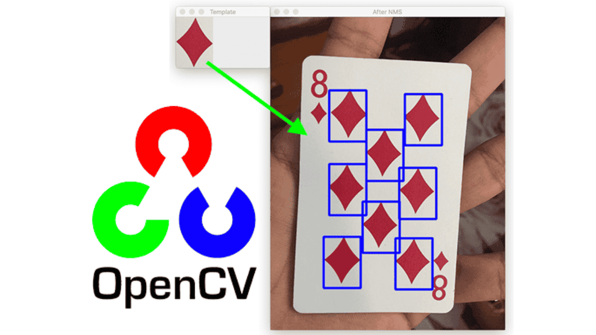

# Template Matching - Giải pháp hỗ trợ nhận diện ký tự khó OCR

- Template Matching là một phương pháp so khớp hình ảnh đơn giản nhưng hiệu quả, thường được sử dụng như giải pháp bổ trợ cho OCR trong các trường hợp ký tự nhỏ, mờ hoặc khó đọc mà Tesseract chưa nhận diện chính xác.

- Dù không linh hoạt bằng các mô hình OCR dựa trên AI, Template Matching vẫn rất hữu ích trong các ứng dụng công nghiệp và hệ thống nhận diện ký tự chuyên biệt.

[1. Giới thiệu](#1)

[2. Bản chất của Template Matching](#2)

[3. Quy trình triển khai Template Matching](#3)

[4. Ví dụ code minh họa (Python + OpenCV)](#4)

## 📌 1. Giới thiệu

- Việc sử dụng mô hình học máy để phân tích và chuyển đổi hình ảnh thành văn bản đôi khi gặp khó khăn khi ký tự trên ảnh bị nhỏ, mờ, méo, hoặc có nhiễu nền.

- 💡 Trong những tình huống này, một phương pháp đơn giản nhưng hiệu quả có thể hỗ trợ OCR là **Template Matching** (so khớp mẫu).

### 🎯 Ý tưởng chính:

- ⏳ **Bài toán**: Đọc các giá trị số hiển thị trong Textbox.

- ❶ Ta chuẩn bị sẵn bộ ảnh mẫu (template) cho từng ký tự cần nhận dạng (ví dụ: 0–9).

- ❷ Khi cần đọc ảnh đầu vào, ta cắt ra vùng ký tự và so sánh trực tiếp với các template để tìm ký tự khớp nhất.

### 👀 Template Matching hoạt động tốt khi nào?

- ✧ Vị trí vùng OCR cố định (biết trước vùng OCR).

- ✧ Bộ font hoặc kiểu hiển thị ít thay đổi.

- ✧ Chỉ cần nhận dạng tập ký tự hạn chế (ví dụ: chỉ số 0–9).

- ✧ Các ký tự không đứng dính quá sát liền nhau.

### ✅ Ưu điểm:

- Dù không thay thế được OCR toàn diện, nhưng Template Matching mang lại ưu điểm riêng:

  - ✧ Nhanh. Nếu bạn đã từng đo thời gian OCR với Tesseract rồi thì thời gian khi dùng phương pháp này sẽ khiến bạn ngạc nhiên khi có thể giảm hơn nửa thời gian.

  - ✧ Dễ triển khai.

  - ✧ Độ tin cậy cao (lên đến 100% nếu trong điều kiện hoạt động tốt nhất như đã đề cập phía trên).

## 📌 2. Bản chất của Template Matching

- Template Matching trong OpenCV là kỹ thuật so sánh hình ảnh, cụ thể là:

  - ✦ So sánh một mẫu (template) nhỏ với toàn bộ ảnh gốc, để tìm vị trí trong ảnh giống mẫu nhất.

  - ✦ Template Matching không hiểu ý nghĩa của hình (như số mấy), chỉ biết so sánh điểm ảnh.

    - ✧ Do vậy, để xác định giá trị số mấy thì cách hay dùng nhất là gán "ý nghĩa" cho từng template bằng chính tên ảnh mẫu.

    - ✧ Ví dụ: Ảnh template `5.png` nếu giống ảnh gốc nhất thì số trong ảnh gốc là tên ảnh template, tức số `5`.

### 🧠 Cơ chế hoạt động

- ✦ Giả sử:

  - ✧ Ảnh gốc: hình chụp từ máy test.
  - ✧ Template: ảnh số 5 (cắt ra từ ảnh thật).

- ✦ Bước thực hiện:
  - ❶ OpenCV trượt template qua từng vị trí của ảnh gốc (giống như trượt cửa sổ).
  - ❷ Tại mỗi vị trí, nó tính toán độ tương đồng (similarity score) giữa vùng ảnh đó và template.
  - ❸ Kết quả là một ma trận giá trị tương đồng → chỗ nào điểm cao nhất là vị trí giống template nhất.

### 🚀 Phương pháp so khớp phổ biến (OpenCV)

- Trong OpenCV hỗ trợ nhiều phương pháp tính độ khớp. Một số phương pháp hay dùng:

#### 1️⃣ cv2.TM_SQDIFF

- 🧠 Nguyên lý: Tính tổng bình phương sai khác giữa template và ảnh tại từng vị trí.

- 🎯 Giá trị tốt nhất: Càng nhỏ càng tốt (0 nghĩa là trùng khớp tuyệt đối).

- 👀 Khi nào dùng:

  - ✧ Khi ảnh và template có độ tương phản cao.

  - ✧ Khi bạn muốn phát hiện sự giống nhau tuyệt đối về pixel.

  - ✧ Template nhỏ: Hiệu quả với template kích thước nhỏ như của bạn (8x16).

  - ✧ Khi cần phân biệt rõ ràng: Phân biệt số 6 vs 8, 0 vs O.

- ✅ Ưu điểm: Đơn giản, nhanh.

- ❌ Nhược điểm: Nhạy cảm với thay đổi ánh sáng, nhiễu, scale.

#### 2️⃣ cv2.TM_CCORR

- 🧠 Nguyên lý: Tính tích chập (correlation) giữa template và ảnh.

- 🎯 Giá trị tốt nhất: Càng lớn càng tốt (1 là khớp hoàn toàn).

- 👀 Khi nào dùng:

  - ✧ Khi ảnh và template có cường độ pixel tương quan tuyến tính.

  - ✧ Template lớn hơn: Khi template có nhiều detail.

- ✅ Ưu điểm: Ổn hơn so với SQDIFF khi ánh sáng thay đổi một chút.

- ❌ Nhược điểm: Vẫn nhạy với nhiễu và thay đổi tương phản.

#### 3️⃣ cv2.TM_CCOEFF

- 🧠 Nguyên lý: Loại bỏ ảnh hưởng của trung bình cường độ pixel trước khi tính tương quan.

- 🎯 Giá trị tốt nhất: Càng lớn càng tốt.

- 👀 Khi nào dùng:

  - ✧ Khi ảnh đầu vào có độ sáng hoặc độ tương phản thay đổi.

  - ✧ Phù hợp với OCR trong môi trường sản xuất, nơi ánh sáng có thể thay đổi theo ca.

- ✅ Ưu điểm: Ổn định hơn SQDIFF và CCORR.

## 📌 3. Quy trình triển khai Template Matching

### ❶ Chuẩn bị dữ liệu

- ✦ Ảnh gốc (input image): Là ảnh chứa vùng giá trị cần nhận diện.

- ✦ Template: Tập hợp ảnh mẫu của từng giá trị (Ví dụ: 0–9, A–Z, v.v.)

- ✦ Tiền xử lý:
  - ✧ Chuyển sang ảnh grayscale để giảm nhiễu màu.
  - ✧ Áp dụng thresholding hoặc adaptive thresholding để tách nền – ký tự.
  - ✧ Cân nhắc resize ảnh về cùng kích thước với template.

### ❷ Chạy thuật toán so khớp

- ✦ Sử dụng hàm `cv2.matchTemplate(image, template, method)` với một trong các phương pháp so khớp:
  - ✧ `cv2.TM_SQDIFF` hoặc `cv2.TM_SQDIFF_NORMED`
  - ✧ `cv2.TM_CCOEFF` hoặc `cv2.TM_CCOEFF_NORMED`
  - ✧ `cv2.TM_CCORR` hoặc `cv2.TM_CCORR_NORMED`

### ❸ Tìm vị trí và kết quả khớp

- ✦ Dùng `cv2.minMaxLoc()` để lấy giá trị min/max (tùy phương pháp).

- ✦ So sánh với một ngưỡng tin cậy (threshold) để quyết định ký tự có được nhận diện hay không.

### ❹ Hậu xử lý kết quả

- ✦ Nếu có nhiều vị trí trùng khớp, chọn vị trí có giá trị tốt nhất (min hoặc max).

- ✦ Nếu kết quả nằm dưới ngưỡng tin cậy → có thể gán nhãn “không xác định” để tránh sai sót.

## 📌 4. Ví dụ code minh họa (Python + OpenCV)

- TODO...
